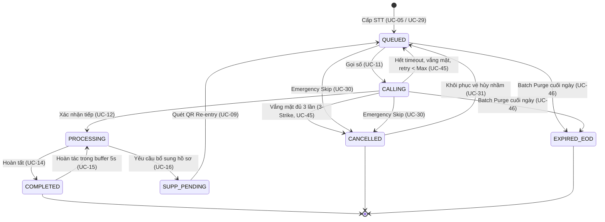

# Tổng quan Use Case — Hệ thống Hành chính công Một cửa Thông minh

Tài liệu này phân rã toàn bộ chức năng của hệ thống (theo mã nguồn thực tế trong
`src/routes/*`, `src/services/*`, `src/middleware/auth.js`, `db/schema.sql`) thành các
Use Case (UC) chi tiết, mỗi UC trình bày theo mẫu thống nhất: Mô tả, Actor, Priority,
Trigger, Precondition, Validate on form, Post-condition, Basic flow, Alternative flow,
Biểu đồ hoạt động (Activity Diagram) và Biểu đồ tuần tự (Sequence Diagram) — vẽ bằng
Mermaid, xem trực tiếp trong VSCode (preview Markdown) hoặc GitHub.

Danh sách UC được chia thành 12 file theo module nghiệp vụ, đặt cùng thư mục này.

## 1. Danh mục Actor

| Actor | Mô tả | Vai trò DB tương ứng (`staff.role`) |
|---|---|---|
| **Công dân** | Người dân đến giao dịch tại quầy hoặc thao tác trên Kiosk/Trang chủ công khai | Không có tài khoản (khách vãng lai) |
| **Cán bộ Quầy (Officer)** | Nhân viên trực tiếp tiếp nhận/xử lý hồ sơ tại 1 quầy được phân công | `OFFICER` |
| **Cán bộ Điều phối (Supervisor)** | Giám sát realtime, can thiệp điều phối quầy, khôi phục/ưu tiên vé | `SUPERVISOR` |
| **Trưởng Trung tâm (Manager)** | Như Supervisor + xem báo cáo/KPI/Audit | `MANAGER` |
| **Quản trị viên (Super Admin)** | Toàn quyền: cấu hình tham số, quản lý tài khoản cán bộ, mọi quyền của Manager/Supervisor/Officer | `SUPER_ADMIN` |
| **Trợ lý AI (Chatbot)** | Tác nhân phần mềm trả lời hỏi-đáp, gọi Gemini API khi cần | — |
| **Hệ thống (System)** | Các tiến trình nền tự động chạy theo lịch/điều kiện, không do người dùng kích hoạt trực tiếp | — |
| **Bảng LED / Loa PA (Display)** | Thiết bị hiển thị/phát âm thanh công khai tại sảnh chờ | — |

Ghi chú Ma trận RBAC (`src/middleware/auth.js`, `PERMISSION_GROUPS`):

| Nhóm quyền | SUPER_ADMIN | MANAGER | SUPERVISOR | OFFICER |
|---|---|---|---|---|
| MONITOR (Giám sát) | ✔ | ✔ | ✔ | ✘ |
| DISPATCH (Điều phối) | ✔ | ✔ | ✔ | ✘ |
| PRIORITY_RESTORE (VIP/Khôi phục) | ✔ | ✔ | ✔ | ✘ |
| REPORTS (Báo cáo/Audit) | ✔ | ✔ | ✘ | ✘ |
| CONFIG (Cấu hình tham số) | ✔ | ✘ | ✘ | ✘ |
| STAFF_MANAGEMENT (Tài khoản cán bộ) | ✔ | ✘ | ✘ | ✘ |
| COUNTER_OPS (Vận hành quầy) | ✔ | ✘ | ✘ | ✔ (chỉ quầy mình phụ trách) |

## 2. Danh sách file & module

| File | Module | Actor chính | Số UC |
|---|---|---|---|
| [01-Xac-thuc.md](01-Xac-thuc.md) | Xác thực | Cán bộ (mọi vai trò), Hệ thống | UC-01 → UC-02 |
| [02-Kiosk-CongDan.md](02-Kiosk-CongDan.md) | Tự phục vụ công khai | Công dân, Hệ thống | UC-03 → UC-09 |
| [03-Quay-CanBo.md](03-Quay-CanBo.md) | Vận hành quầy | Cán bộ Quầy | UC-10 → UC-17 |
| [04-Admin-GiamSat.md](04-Admin-GiamSat.md) | Giám sát Realtime | Supervisor/Manager/Super Admin | UC-18 → UC-21 |
| [05-Admin-DieuPhoi.md](05-Admin-DieuPhoi.md) | Điều phối & Quản lý quầy | Supervisor/Manager/Super Admin | UC-22 → UC-28 |
| [06-Admin-UuTien-KhoiPhuc.md](06-Admin-UuTien-KhoiPhuc.md) | Ưu tiên/VIP & Khôi phục | Supervisor/Manager/Super Admin | UC-29 → UC-31 |
| [07-Admin-CauHinh.md](07-Admin-CauHinh.md) | Cấu hình tham số động | Super Admin | UC-32 → UC-33 |
| [08-Admin-BaoCao.md](08-Admin-BaoCao.md) | Báo cáo & Audit | Manager/Super Admin | UC-34 → UC-37 |
| [09-Admin-NhanSu.md](09-Admin-NhanSu.md) | Quản lý tài khoản cán bộ | Super Admin | UC-38 → UC-41 |
| [10-Chatbot.md](10-Chatbot.md) | Trợ lý AI | Công dân, Chatbot | UC-42 |
| [11-Display.md](11-Display.md) | Bảng LED / Loa PA | Display, Hệ thống | UC-43 → UC-44 |
| [12-HeThong-TuDong.md](12-HeThong-TuDong.md) | Tiến trình nền tự động | Hệ thống | UC-45 → UC-47 |

## 3. Máy trạng thái vé (Ticket State Machine) — tham chiếu chung

## 4. Cách đọc mỗi UC

Mỗi UC trong các file con tuân theo đúng khung sau (không đảo thứ tự):

1. **Mã UC** — định danh duy nhất, dùng để tham chiếu chéo (VD: UC-11).
2. **Mô tả** — UC dùng để làm gì, giá trị nghiệp vụ mang lại.
3. **Actor** — danh sách actor tham gia trực tiếp.
4. **Priority** — Cao / Trung bình / Thấp, dựa trên mức ảnh hưởng tới vận hành lõi.
5. **Trigger** — sự kiện làm UC bắt đầu.
6. **Precondition** — điều kiện bắt buộc phải đúng trước khi UC được phép chạy (bao gồm ràng buộc dữ liệu/quyền).
7. **Validate on form** — quy tắc kiểm tra dữ liệu đầu vào (định dạng, bắt buộc, giới hạn) trước khi xử lý nghiệp vụ.
8. **Post-condition** — trạng thái hệ thống sau khi UC kết thúc, tách rõ nhánh Thành công/Thất bại (điều hướng, session/token, dữ liệu thay đổi, realtime broadcast).
9. **Basic flow** — luồng chính (happy path), đánh số bước.
10. **Alternative flow** — các nhánh rẽ/luồng ngoại lệ, đánh số theo bước gốc (VD: 4a, 4b).
11. **Biểu đồ hoạt động** — Mermaid `flowchart`.
12. **Biểu đồ tuần tự** — Mermaid `sequenceDiagram`.
