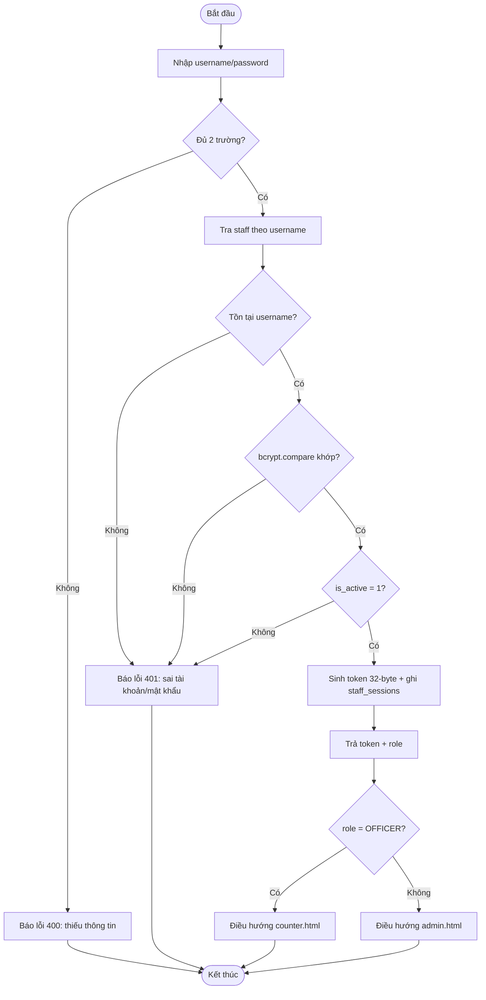
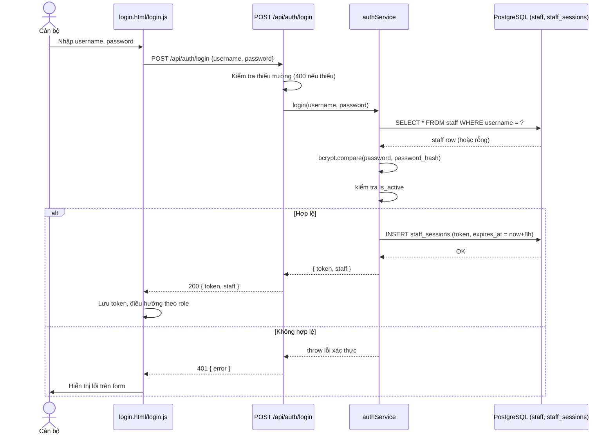
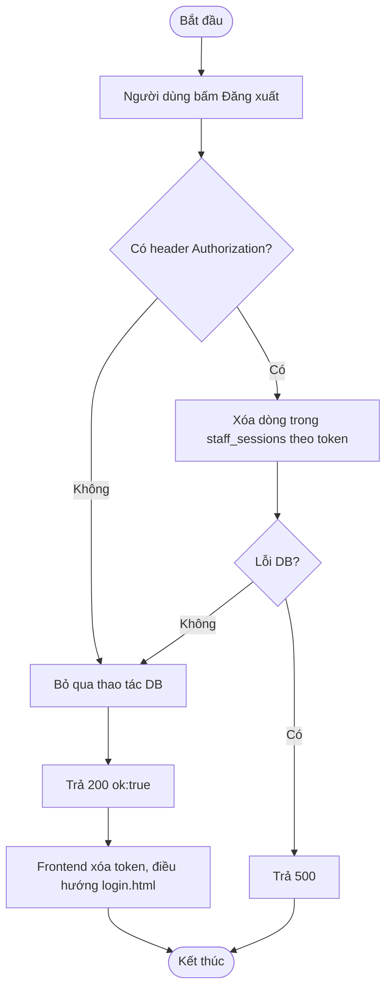
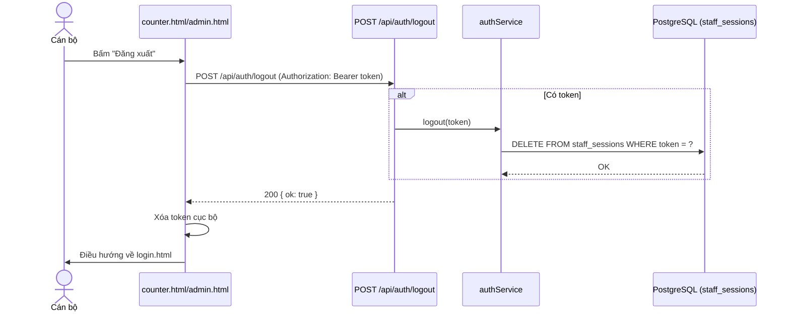

# Module 01 — Xác thực (Auth)

Nguồn: `src/routes/authRoutes.js`, `src/services/authService.js`, `src/middleware/auth.js`.
Xem tổng quan actor/RBAC tại [00-Tong-quan.md](00-Tong-quan.md).

---

## UC-01 — Đăng nhập

**Mô tả:** Cho phép Cán bộ (Officer/Supervisor/Manager/Super Admin) xác thực bằng
username/password để nhận token phiên, làm điều kiện truy cập mọi API nội bộ
(`counter*`, `admin*`).

**Actor:** Cán bộ Quầy, Cán bộ Điều phối, Trưởng Trung tâm, Quản trị viên.

**Priority:** Cao (chức năng cổng vào, mọi module nội bộ phụ thuộc vào nó).

**Trigger:** Người dùng mở `login.html`, nhập thông tin và bấm nút "Đăng nhập".

**Precondition:**
- Tài khoản đã tồn tại trong bảng `staff` và `is_active = 1`.
- `login.html` không được liên kết từ bất kỳ trang công khai nào (chỉ truy cập bằng URL trực tiếp) — tách biệt khu vực nội bộ/công khai.

**Validate on form:**
- `username` và `password` không được rỗng (400 `Thieu username/password.` nếu thiếu).
- Mật khẩu so khớp bằng `bcrypt.compare()` với hash lưu trong `staff.password_hash` — không so sánh plaintext.
- Tài khoản phải có `is_active = 1`, nếu không xác thực thất bại dù đúng mật khẩu.

**Post-condition:**
- *Thành công:* tạo 1 dòng mới trong `staff_sessions` (token ngẫu nhiên 32-byte, hết hạn sau 8 giờ); trả về `{ token, staff: { staffId, fullName, role } }`; frontend lưu token vào `localStorage`/`sessionStorage` và điều hướng theo `role` (`OFFICER` → `counter.html`, còn lại → `admin.html`).
- *Thất bại:* trả HTTP 401 kèm thông báo lỗi chung ("Sai tài khoản hoặc mật khẩu") — **không** phân biệt rõ "sai username" hay "sai password" để tránh dò tài khoản (user enumeration); không tạo session nào.

**Basic flow:**
1. Người dùng nhập `username`, `password` trên `login.html`.
2. Frontend gọi `POST /api/auth/login` với body `{ username, password }`.
3. `authService.login()` tra `staff` theo `username`.
4. So khớp `password` với `password_hash` bằng bcrypt.
5. Kiểm tra `is_active = 1`.
6. Sinh token 32-byte, ghi vào `staff_sessions` kèm thời điểm hết hạn (now + 8h).
7. Trả về token + thông tin cơ bản của cán bộ (staffId, fullName, role).
8. Frontend lưu token, điều hướng sang `counter.html` hoặc `admin.html` theo `role`.

**Alternative flow:**
- **3a.** Không tìm thấy `username` → ném lỗi xác thực chung → bước 8 không thực hiện, hiển thị lỗi trên form.
- **4a.** Mật khẩu sai → tương tự 3a.
- **5a.** Tài khoản bị khóa (`is_active = 0`) → tương tự 3a, dù mật khẩu đúng.
- **2a.** Thiếu `username` hoặc `password` trong body → HTTP 400 ngay tại route, không gọi tới `authService`.

**Biểu đồ hoạt động:**

**Biểu đồ tuần tự:**

---

## UC-02 — Đăng xuất

**Mô tả:** Thu hồi token phiên hiện tại của cán bộ đang đăng nhập, kết thúc quyền truy cập trên thiết bị đó (không ảnh hưởng phiên khác đang mở trên thiết bị khác).

**Actor:** Cán bộ Quầy, Cán bộ Điều phối, Trưởng Trung tâm, Quản trị viên.

**Priority:** Trung bình.

**Trigger:** Người dùng bấm nút "Đăng xuất" trên `counter.html`/`admin.html`.

**Precondition:** Đã đăng nhập, đang giữ token hợp lệ trong header `Authorization: Bearer <token>`.

**Validate on form:** Không có form nhập liệu; chỉ kiểm tra có token trong header hay không (nếu không có, vẫn trả `{ ok: true }` mà không thao tác DB).

**Post-condition:**
- *Thành công:* dòng tương ứng trong `staff_sessions` bị xóa/vô hiệu hóa; frontend xóa token khỏi bộ nhớ trình duyệt và điều hướng về `login.html`.
- *Thất bại:* lỗi hệ thống (500) nếu DB lỗi — token có thể vẫn còn hiệu lực phía server dù frontend đã xóa cục bộ.

**Basic flow:**
1. Người dùng bấm "Đăng xuất".
2. Frontend gọi `POST /api/auth/logout` kèm header `Authorization: Bearer <token>`.
3. Server trích token từ header, gọi `authService.logout(token)` để xóa dòng trong `staff_sessions`.
4. Trả về `{ ok: true }`.
5. Frontend xóa token cục bộ, điều hướng về `login.html`.

**Alternative flow:**
- **2a.** Không có header `Authorization` → server bỏ qua bước xóa DB, vẫn trả `{ ok: true }` (đăng xuất "mềm" phía client).
- **3a.** Lỗi DB khi xóa session → trả 500, frontend vẫn nên xóa token cục bộ để tránh kẹt UI (hành vi tùy frontend).

**Biểu đồ hoạt động:**

**Biểu đồ tuần tự:**

