# Module 02 — Tự phục vụ công khai (Kiosk / Trang chủ)

Nguồn: `src/routes/kioskRoutes.js`, `src/services/queueEngine/*`, `public/index.html`,
`public/kiosk-checklist.html`. Không yêu cầu đăng nhập (public route).

---

## UC-03 — Tra cứu thủ tục hành chính

**Mô tả:** Cho phép công dân tìm kiếm/liệt kê danh mục thủ tục hành chính theo từ khóa
ngay trên Trang chủ, đóng vai trò một bộ RAG rút gọn cho chatbot.

**Actor:** Công dân.

**Priority:** Cao (điểm vào của toàn bộ luồng lấy số).

**Trigger:** Công dân gõ từ khóa vào ô tìm kiếm ở `index.html`, hoặc trang tải lần đầu (hiển thị "Các thủ tục phổ biến").

**Precondition:** Danh mục thủ tục (`services`) đã được khởi tạo trong DB.

**Validate on form:** Tham số `q` (từ khóa) là tùy chọn; nếu có, tìm theo `ILIKE` không phân biệt hoa/thường; nếu rỗng, trả toàn bộ danh sách.

**Post-condition:**
- *Thành công:* trả danh sách thủ tục khớp (hoặc toàn bộ) dạng JSON; frontend render danh sách gợi ý.
- *Thất bại:* lỗi DB → 500, frontend hiển thị thông báo "Không tải được danh sách".

**Basic flow:**
1. Công dân gõ từ khóa vào ô tìm kiếm.
2. Frontend gọi `GET /api/kiosk/services?q=<keyword>` (debounce khi gõ).
3. Server gọi `serviceRepo.searchServices()` (ILIKE trên tên/mô tả thủ tục).
4. Trả danh sách kết quả.
5. Frontend hiển thị gợi ý; công dân bấm chọn 1 thủ tục.
6. Frontend điều hướng sang `kiosk-checklist.html?serviceId=...`.

**Alternative flow:**
- **1a.** Không gõ gì → `q` rỗng → gọi `GET /api/kiosk/services` không tham số → trả "Các thủ tục phổ biến" mặc định.
- **4a.** Không có kết quả khớp → trả mảng rỗng → frontend hiển thị "Không tìm thấy thủ tục phù hợp".

**Biểu đồ hoạt động:**

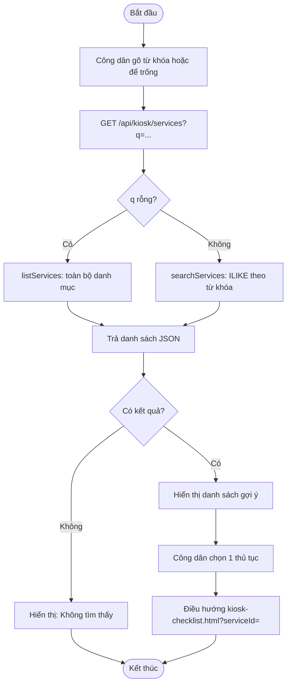

**Biểu đồ tuần tự:**

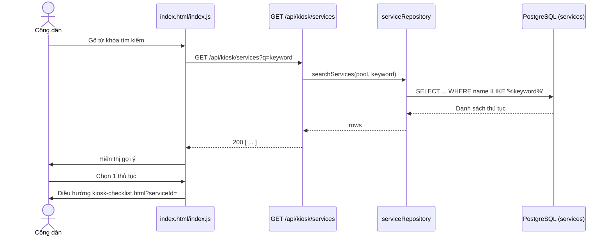

---

## UC-04 — Xem checklist giấy tờ của thủ tục

**Mô tả:** Hiển thị danh sách giấy tờ bắt buộc/không bắt buộc và mẫu tờ khai (nếu có) của
1 thủ tục cụ thể, để công dân đối chiếu hồ sơ trước khi lấy số (Pre-validation & Form
Resolution).

**Actor:** Công dân.

**Priority:** Cao.

**Trigger:** Công dân mở `kiosk-checklist.html?serviceId=X` (từ UC-03).

**Precondition:** `serviceId` truyền vào phải tương ứng 1 thủ tục tồn tại trong DB.

**Validate on form:** Không có input người dùng ở bước này; chỉ validate `serviceId` ở tầng server (tồn tại hay không).

**Post-condition:**
- *Thành công:* trả `{ service, requiredDocs, formTemplate }`; frontend render danh sách checkbox giấy tờ + link tải mẫu tờ khai (nếu `formTemplate` khác null).
- *Thất bại:* `serviceId` không tồn tại → 404, frontend hiển thị "Thủ tục không tồn tại" và gợi ý quay lại Trang chủ.

**Basic flow:**
1. Frontend đọc `serviceId` từ query string.
2. Gọi `GET /api/kiosk/services/:id/checklist`.
3. Server tìm `service` theo id; nếu có, tìm `formTemplate` liên kết.
4. Trả `{ service, requiredDocs (từ service.required_docs), formTemplate }`.
5. Frontend render danh sách checklist (đánh dấu rõ mục bắt buộc) + nút tải mẫu tờ khai nếu có.

**Alternative flow:**
- **3a.** Không tìm thấy `service` → trả 404 `Thu tuc khong ton tai.` → dừng luồng, không gọi tiếp `formTemplateRepo`.
- **3b.** `formTemplate` không tồn tại cho thủ tục này → vẫn trả `formTemplate: null`, frontend ẩn phần tải mẫu.

**Biểu đồ hoạt động:**

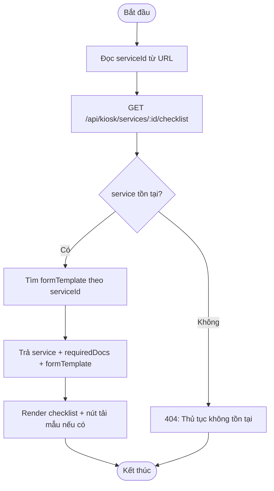

**Biểu đồ tuần tự:**

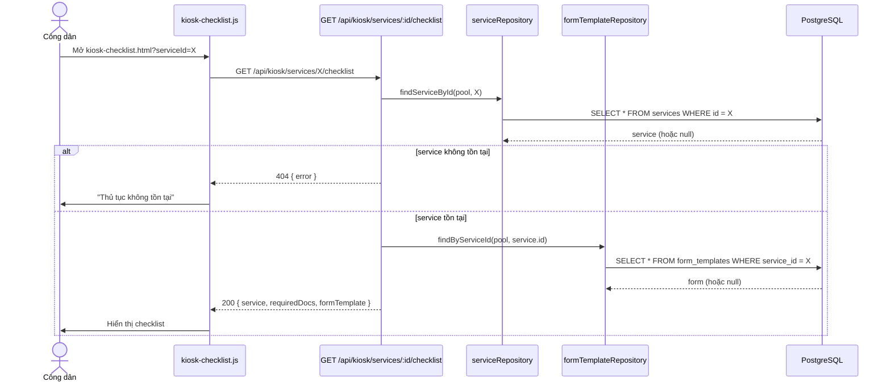

---

## UC-05 — Lấy số thứ tự (đăng ký hàng đợi)

**Mô tả:** Công dân xác nhận đã chuẩn bị đủ giấy tờ bắt buộc để được cấp số thứ tự
(STT), gán vào quầy `OPEN` cùng lĩnh vực đang có ít vé nhất (thuật toán Least Queue
Depth). Đây là "cổng tiền kiểm" (Two-way Branching tại Kiosk) — nếu thiếu giấy tờ bắt
buộc, hệ thống từ chối cấp số ngay từ bước này.

**Actor:** Công dân, Hệ thống (thuật toán Least Queue Depth).

**Priority:** Cao (chức năng lõi của toàn hệ thống).

**Trigger:** Công dân tick chọn các giấy tờ đã chuẩn bị trên `kiosk-checklist.html` và bấm "Nhận số thứ tự".

**Precondition:**
- Thủ tục (`serviceId`) tồn tại.
- Tồn tại ít nhất 1 quầy `OPEN` thuộc đúng lĩnh vực của thủ tục (nếu không, không thể cấp số).

**Validate on form:**
- `serviceId` bắt buộc, phải là số nguyên hợp lệ (`requireInt`).
- `citizenName` (họ tên) và `phone` **không bắt buộc** — Kiosk không hỏi tên/SĐT (xem `docs/KIEN-NGHI-LAY-SO-KHONG-NHAP-TEN.md`); nếu client vẫn gửi thì được trim, cắt tối đa 150/20 ký tự, rỗng → `NULL`. Số thứ tự là định danh duy nhất của vé.
- Giới hạn tốc độ: tối đa 30 lượt lấy số / 10 phút / IP (chống rút số ảo).
- `confirmedDocCodes` (mảng mã giấy tờ đã tick) được đối chiếu với `required_docs` có `mandatory = true` của thủ tục — thiếu bất kỳ mã bắt buộc nào đều bị từ chối.

**Post-condition:**
- *Thành công (đủ hồ sơ + có quầy):* tạo 1 dòng `tickets` trạng thái `QUEUED`, gán `counter_id` theo Least Queue Depth, sinh `ticket_number` theo tiền tố lĩnh vực (VD `A-101`); trả HTTP 201 `{ status: 'QUEUED', ticket, ... }`; frontend hiển thị số thứ tự + số người chờ phía trước + thời gian chờ ước tính + mã QR mở trang theo dõi `theo-doi.html?t=<ticketId>` (xem UC theo dõi vé bên dưới), broadcast realtime tới `display.html`/`counter.html` qua WebSocket.
- *Thất bại — thiếu hồ sơ:* trả HTTP 200 nhưng `status: 'REJECTED'` kèm danh sách `missing` (mã giấy tờ còn thiếu) + `formTemplate` để công dân bổ sung; **không** tạo vé nào.
- *Thất bại — không có quầy:* HTTP 409 `NO_COUNTER_AVAILABLE`; không tạo vé.
- *Thất bại — dữ liệu không hợp lệ:* HTTP 400 (thiếu/sai `serviceId`), hoặc `serviceId` không tồn tại → 404; vượt giới hạn tốc độ → 429.

**Basic flow:**
1. Công dân tick các giấy tờ đã chuẩn bị (không nhập họ tên/SĐT). Với giấy tờ là tờ khai, có nút "Xem cách điền tờ khai này" (xem UC hướng dẫn điền giấy tờ).
2. Bấm "Nhận số thứ tự" → frontend gọi `POST /api/kiosk/tickets` với `{ serviceId, confirmedDocCodes }`.
3. Server validate `serviceId`; tìm `service`.
4. Tính `mandatoryCodes` (giấy tờ bắt buộc) từ `service.required_docs`; so với `confirmedDocCodes` để tìm `missing`.
5. Nếu `missing` rỗng → gọi `queueEngine.createTicket()`.
6. `queueEngine` tìm quầy `OPEN` cùng lĩnh vực có ít vé `QUEUED` nhất (Least Queue Depth), sinh `ticket_number` theo tiền tố lĩnh vực, insert `tickets` (status `QUEUED`).
7. Trả 201 kèm thông tin vé; broadcast WebSocket sự kiện cập nhật hàng đợi.
8. Frontend hiển thị màn hình "Đã nhận số" (số thứ tự, quầy dự kiến, số người chờ trước).

**Alternative flow:**
- **3a.** Thiếu/sai `serviceId` → HTTP 400, dừng luồng.
- **3b.** `serviceId` không tồn tại trong DB → HTTP 404 `Thu tuc khong ton tai.`
- **4a.** `missing.length > 0` (thiếu giấy tờ bắt buộc) → trả `status: 'REJECTED'` kèm `missing` + `formTemplate`; frontend highlight các mục còn thiếu, **không** tạo vé, công dân có thể quay lại bổ sung và bấm lại.
- **6a.** Không có quầy `OPEN` nào cùng lĩnh vực → `queueEngine.createTicket()` ném lỗi `NO_COUNTER_AVAILABLE` → HTTP 409; frontend hiển thị "Hiện chưa có quầy phục vụ lĩnh vực này, vui lòng quay lại sau".

**Biểu đồ hoạt động:**

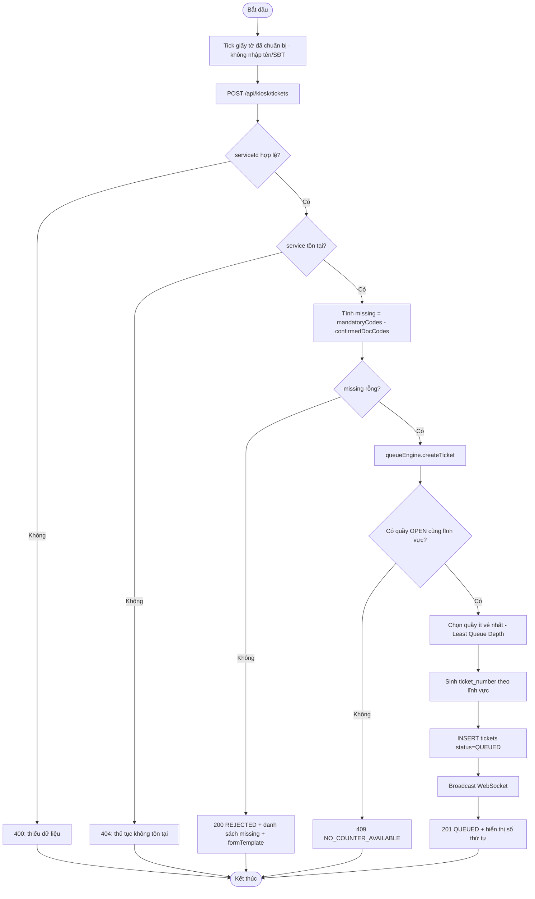

**Biểu đồ tuần tự:**

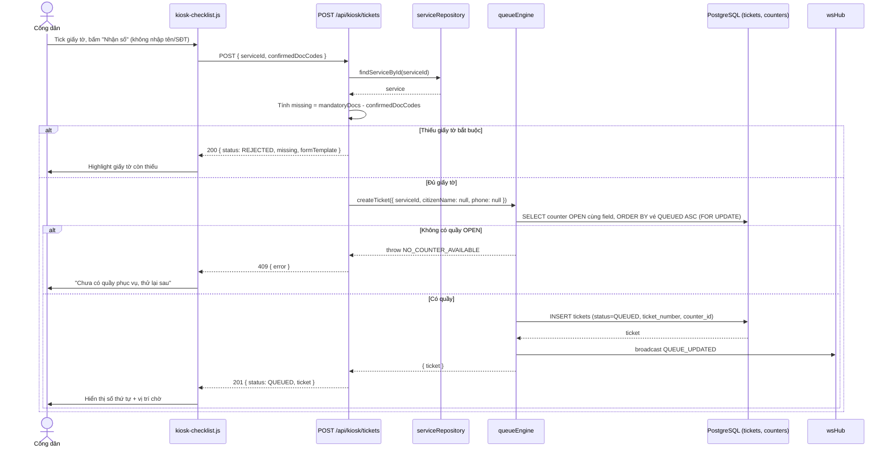

---

## UC-06 — Xem trạng thái quầy / số người chờ

**Mô tả:** Cho công dân xem nhanh tình trạng các quầy (đang mở/đóng, thuộc lĩnh vực
nào, ước tính số người chờ trước) để chủ động lựa chọn/theo dõi trước khi lấy số.

**Actor:** Công dân.

**Priority:** Thấp.

**Trigger:** Trang hiển thị bảng trạng thái quầy được tải hoặc tự làm mới định kỳ.

**Precondition:** Không yêu cầu đăng nhập; đọc từ VIEW `active_counters` (đã lọc quầy chưa xóa mềm).

**Validate on form:** Không có input.

**Post-condition:** Trả danh sách quầy kèm `waiting_count` (đếm vé `QUEUED` theo quầy); không có tác động ghi dữ liệu.

**Basic flow:**
1. Frontend gọi `GET /api/kiosk/counters/status`.
2. Server JOIN `active_counters` với `service_fields` và đếm `tickets` có `status IN ('QUEUED','CALLING','PROCESSING')` theo quầy.
3. Trả danh sách sắp xếp theo mã quầy.
4. Frontend hiển thị bảng/thẻ trạng thái từng quầy.

**Alternative flow:**
- **2a.** Không có quầy nào đang `OPEN` → trả danh sách rỗng hoặc toàn quầy `CLOSED`/`PAUSED` — frontend hiển thị "Hiện chưa có quầy phục vụ".

**Biểu đồ hoạt động:**

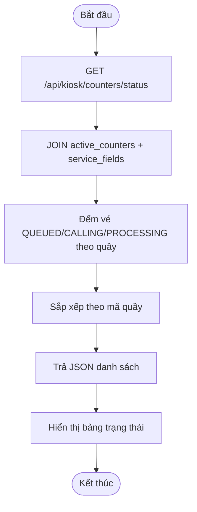

**Biểu đồ tuần tự:**

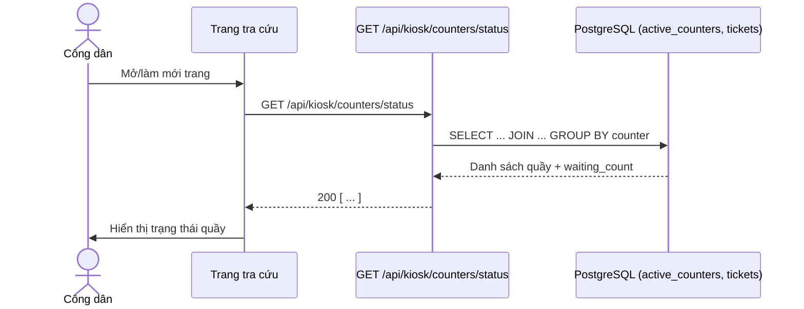

---

## UC-07 — Lấy mã QR Wi-Fi

**Mô tả:** Cung cấp mã QR kết nối Wi-Fi thật tại trụ sở để công dân quét bằng điện
thoại, tránh phải gõ tay SSID/mật khẩu.

**Actor:** Công dân.

**Priority:** Trung bình.

**Trigger:** Công dân bấm nút/hỏi chatbot "Wi-Fi" trên Kiosk hoặc widget chatbot.

**Precondition:** `WIFI_SSID`/`WIFI_PASSWORD` đã được Admin cấu hình trong `system_configs` (tab "Cấu hình Tham số"); giá trị này khớp với mạng Wi-Fi vật lý thật tại cơ sở (server chạy trên cloud nên không tự dò được).

**Validate on form:** Không có input người dùng; chỉ escape ký tự đặc biệt (`\ ; , :`) trong SSID/mật khẩu để không phá vỡ định dạng chuẩn payload QR Wi-Fi.

**Post-condition:** Trả `{ ssid, password, payload }` (payload chuẩn `WIFI:T:WPA;S:...;P:...;;`); frontend/chatbot render mã QR để quét bằng camera điện thoại.

**Basic flow:**
1. Công dân yêu cầu xem mã QR Wi-Fi (qua nút bấm hoặc chatbot).
2. Frontend gọi `GET /api/kiosk/wifi-qr`.
3. Server đọc `WIFI_SSID`/`WIFI_PASSWORD` từ `configService`.
4. Escape ký tự đặc biệt, ghép thành `payload` chuẩn QR Wi-Fi.
5. Trả `{ ssid, password, payload }`.
6. Frontend/chatbot render mã QR từ `payload` (dùng thư viện `qrcodejs`).

**Alternative flow:**
- **3a.** Chưa cấu hình `WIFI_SSID`/`WIFI_PASSWORD` (giá trị rỗng) → vẫn trả payload nhưng QR không dùng được thực tế → nên có cảnh báo ở tầng Admin (ngoài phạm vi UC này).

**Biểu đồ hoạt động:**

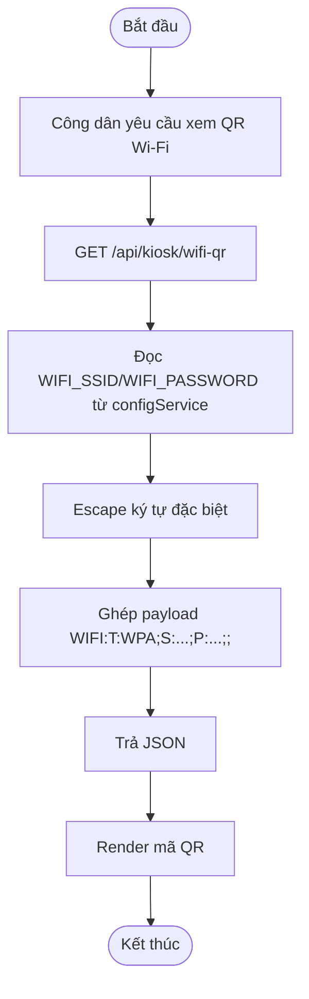

**Biểu đồ tuần tự:**

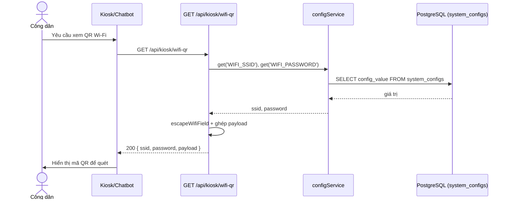

---

## UC-08 — Kiểm tra điều kiện nộp hồ sơ trực tuyến (DVC/VNeID)

**Mô tả:** Kiểm tra mức định danh điện tử VNeID của công dân để xác định có đủ điều
kiện nộp hồ sơ trực tuyến qua Cổng Dịch vụ công (DVC) hay phải nộp trực tiếp tại quầy.

**Actor:** Công dân.

**Priority:** Trung bình.

**Trigger:** Công dân hỏi chatbot hoặc bấm chức năng "Nộp hồ sơ trực tuyến", cung cấp mức định danh VNeID hiện có.

**Precondition:** Không có, đây là API stub kiểm tra điều kiện — không xác thực thật với hệ thống VNeID.

**Validate on form:** `vneidLevel` được ép kiểu số (`Number(vneidLevel)`); không có ràng buộc định dạng chặt chẽ khác (giá trị không hợp lệ/NaN sẽ bị coi như < 2, tức "chưa đủ điều kiện").

**Post-condition:**
- *Đủ điều kiện (`vneidLevel >= 2`):* trả `eligible: true` kèm `deeplink` tới Cổng DVC và các bước hướng dẫn (`guideSteps`).
- *Không đủ điều kiện:* trả `eligible: false` kèm thông điệp hướng dẫn chuyển sang nộp trực tiếp tại quầy.
- Không ghi dữ liệu nào vào DB.

**Basic flow:**
1. Công dân cung cấp mức định danh VNeID hiện có (qua chatbot hoặc form).
2. Frontend/chatbot gọi `POST /api/kiosk/dvc/check-vneid` với `{ vneidLevel }`.
3. Server kiểm tra `Number(vneidLevel) >= 2`.
4. Nếu đủ → trả `eligible: true` + deeplink + các bước hướng dẫn.
5. Frontend hiển thị hướng dẫn nộp hồ sơ trực tuyến qua VNeID.

**Alternative flow:**
- **3a.** `vneidLevel < 2` (hoặc không hợp lệ/NaN) → trả `eligible: false` kèm thông điệp "Chưa có VNeID Mức 2, vui lòng nộp trực tiếp tại quầy" → công dân được hướng dẫn quay lại luồng lấy số (UC-05).

**Biểu đồ hoạt động:**

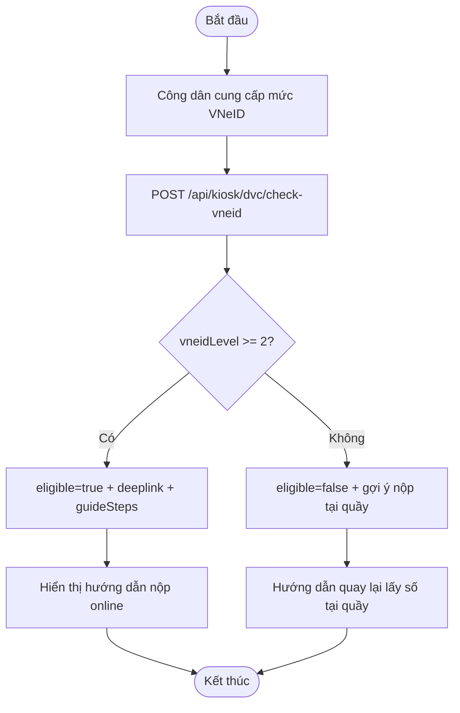

**Biểu đồ tuần tự:**

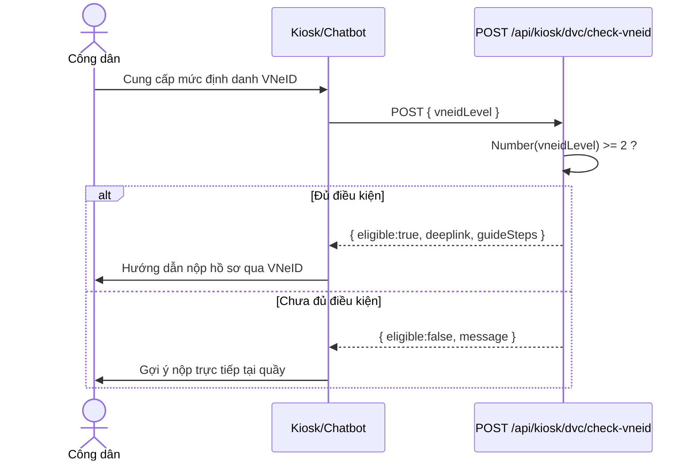

---

## UC-09 — Quét mã QR Re-entry (bổ sung hồ sơ)

**Mô tả:** Cho công dân đã bị yêu cầu bổ sung hồ sơ (vé ở trạng thái `SUPP_PENDING`,
xem UC-16) quay lại hệ thống bằng cách quét mã QR Re-entry, đưa vé trở lại hàng đợi
`QUEUED` mà không phải lấy số mới từ đầu.

**Actor:** Công dân.

**Priority:** Cao (đóng vòng lặp Two-way Branching, tránh công dân mất lượt/mất số cũ).

**Trigger:** Công dân quét mã QR Re-entry (nhận được khi bị yêu cầu bổ sung hồ sơ) bằng widget chatbot hoặc thiết bị quét tại Kiosk.

**Precondition:**
- `token` Re-entry hợp lệ, chưa hết hạn, chưa được sử dụng lại.
- Vé tương ứng đang ở trạng thái `SUPP_PENDING`.

**Validate on form:** `token` bắt buộc; nếu thiếu hoặc không khớp bất kỳ vé nào đang chờ bổ sung → từ chối.

**Post-condition:**
- *Thành công:* vé chuyển từ `SUPP_PENDING` → `QUEUED`, được gán lại vào hàng đợi (có thể theo Least Queue Depth như UC-05); trả `{ ticket }`; broadcast realtime cập nhật hàng đợi.
- *Thất bại:* `token` không hợp lệ/hết hạn/đã dùng → HTTP 400, vé giữ nguyên trạng thái `SUPP_PENDING`.

**Basic flow:**
1. Công dân quét mã QR Re-entry (đã bổ sung đủ giấy tờ còn thiếu ở nhà/ở quầy khai báo).
2. Thiết bị/chatbot gọi `POST /api/kiosk/reentry-scan` với `{ token }`.
3. `queueEngine.reentryScan(token)` xác thực token, tìm vé `SUPP_PENDING` tương ứng.
4. Chuyển trạng thái vé về `QUEUED`, gán lại quầy nếu cần.
5. Trả `{ ticket }`; broadcast WebSocket.
6. Công dân được thông báo số thứ tự (số cũ) đã quay lại hàng đợi.

**Alternative flow:**
- **3a.** `token` không tồn tại/không khớp vé nào → HTTP 400 "Mã Re-entry không hợp lệ".
- **3b.** `token` đã được dùng trước đó (vé không còn ở `SUPP_PENDING`) → HTTP 400, tránh Re-entry 2 lần cho cùng 1 vé.

**Biểu đồ hoạt động:**

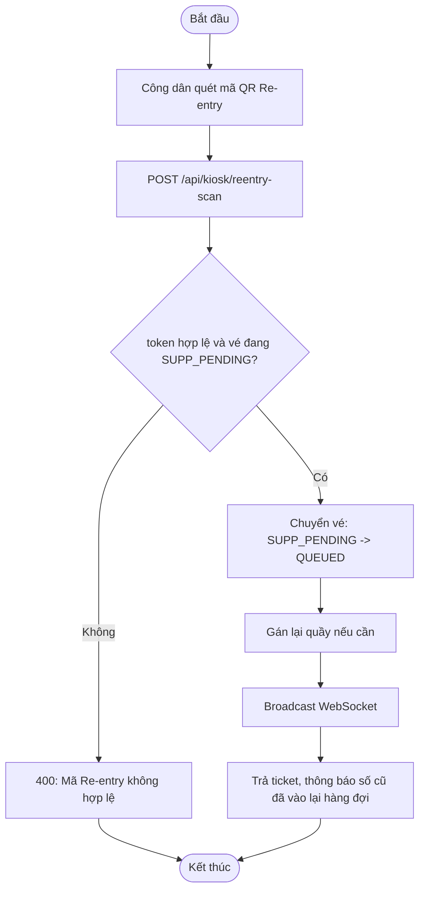

**Biểu đồ tuần tự:**

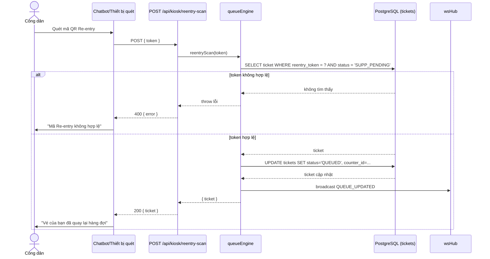

---

## UC-10 — Xem hướng dẫn điền giấy tờ (tờ khai)

**Actor:** Công dân.

**Priority:** Cao (giảm hồ sơ bị trả lại, giảm tải cho cán bộ hỗ trợ).

**Trigger:** Công dân bấm "Xem cách điền tờ khai này" ở bước đối chiếu giấy tờ, hoặc trong hộp thoại "Hướng dẫn Bổ sung Hồ sơ" khi thiếu giấy tờ, hoặc mở trang "Cách điền giấy tờ" trên thanh menu, hoặc hỏi Trợ lý AI ("cách điền tờ khai").

**Precondition:** Thủ tục có bản ghi `form_templates` với cột `fill_guide` (JSONB) khác NULL. Migration `addFormFillGuides` tự nạp nội dung mặc định cho 14 thủ tục từ `src/data/formGuides.js` (chỉ ghi vào dòng còn NULL — nội dung Admin đã sửa không bị ghi đè).

**Validate on form:** `serviceId` trên URL phải là thủ tục tồn tại.

**Post-condition:**
- *Thành công:* hiển thị tên tờ khai, nơi lấy phôi (kệ/khay/bàn viết), từng ô cần điền (nhãn ô + cách điền + ví dụ **dữ liệu giả**), thanh tiến độ tự đánh dấu, gợi ý giấy tờ đi kèm, lỗi thường gặp, các bước sau khi điền, quy tắc chung; nút "In hướng dẫn" và nút "Đã điền xong → lấy số".
- *Thủ tục chưa có hướng dẫn:* API trả 404 kèm lời nhắn hỏi cán bộ hỗ trợ; trang hiện thông báo và nút về Trang chủ.

**Basic flow:**
1. Frontend gọi `GET /api/kiosk/services/:id/form-guide` → `{ service, form, guide, generalRules, docHints }`.
2. Trang `huong-dan-dien-mau.html` render từng ô; công dân tick từng ô đã điền (chỉ lưu tạm trên trình duyệt, không gửi server).
3. Bấm "Đã điền xong" → quay về `kiosk-checklist.html?serviceId=` để lấy số.

**Alternative flow:**
- Không có `serviceId` trên URL → trang hiện danh sách các tờ khai có hướng dẫn (`GET /api/kiosk/form-guides`).
- Kiosk không thao tác 3 phút → tự về Trang chủ (bảo vệ riêng tư).

**Ghi chú nội dung:** hướng dẫn mang tính tham khảo chung, không thay thế biểu mẫu chính thức; vị trí kệ/khay là giá trị mẫu — Admin cập nhật đúng thực tế qua `PUT /api/admin/form-templates` (trường `fillGuide`, `shelfName`, ...).

---

## UC-11 — Tự theo dõi số thứ tự (không cần tên/SĐT)

**Actor:** Công dân.

**Priority:** Cao (bù đắp việc không thu thập tên/SĐT).

**Trigger:** Sau khi lấy số, công dân quét mã QR trên phiếu (hoặc bấm "Mở trang theo dõi").

**Precondition:** Vé tồn tại; `ticketId` là UUID ngẫu nhiên (đóng vai trò "chìa khóa" — ai giữ được liên kết/QR mới xem được).

**Post-condition:** Trang `theo-doi.html?t=<ticketId>` tự cập nhật mỗi 8 giây: số thứ tự, trạng thái bằng tiếng Việt dễ hiểu (đang chờ / **ĐẾN LƯỢT BẠN** / đang phục vụ / cần bổ sung / hoàn tất / bị hủy / hết hạn), quầy phụ trách, số người phía trước, thời gian chờ ước tính. API `GET /api/kiosk/tickets/:id/status` **chỉ** trả các trường công khai (không có tên, SĐT, mã Re-entry).

**Basic flow:**
1. API kiểm tra `id` đúng định dạng UUID (sai → 404 ngay, không chạm DB).
2. `ticketRepository.getTrackingInfo` đếm số vé `QUEUED` đứng trước theo đúng thứ tự gọi của quầy (ưu tiên → `queue_position` → `created_at`) và lấy thời gian xử lý trung bình thực tế trong ngày của quầy.
3. `ticketTracking.estimateWaitMinutes` = (số người trước + 1 nếu quầy đang phục vụ) × thời gian trung bình (không có dữ liệu → dùng SLA của thủ tục). Đây là **ước tính**, luôn ghi nhãn "ước tính".

**Alternative flow:** Mất mạng tạm thời → trang hiện "Đang kết nối lại..." và thử lại; sau 5 lần thất bại liên tiếp mới báo không tìm thấy vé.

---

## UC-12 — Chặn cấp số ngoài giờ làm việc (có công tắc)

**Actor:** Công dân, Hệ thống, Admin (cấu hình).

**Trigger:** Công dân mở Trang chủ/Kiosk, hoặc bấm "Xác nhận & Lấy số thứ tự" ngoài giờ làm việc.

**Precondition:** `KIOSK_HOURS_ENFORCED = 1` (mặc định) và biến môi trường `KIOSK_HOURS_ENFORCED` không đặt `false|0|off|no`.

**Post-condition:**
- `GET /api/kiosk/hours` → `{ open, enforced, hoursText, message, opensAt }` (công khai). Trang có `data-show-hours-banner="true"` hiện banner khi `open = false`.
- `POST /api/kiosk/tickets` (sau khi kiểm tra `serviceId` hợp lệ): ngoài giờ → HTTP 200 `{ status: 'CLOSED', message, hoursText, opensAt }`, **không tạo vé**, không kiểm tra giấy tờ. Thông báo nêu lý do (chưa mở cửa / hết giờ / hôm nay không làm việc), giờ làm việc, và ngày giờ mở cửa kế tiếp (hôm nay / ngày mai / thứ, ngày). Kiosk hiện màn hình "Chưa thể lấy số lúc này" và vẫn cho xem cách điền tờ khai.
- Lấy số của Admin (Chèn lượt ưu tiên) **không bị chặn**.

**Cấu hình (`system_configs`):** `KIOSK_HOURS_ENFORCED` (0/1), `KIOSK_OPEN_TIME`, `KIOSK_CLOSE_TIME` (`HH:MM`, giờ Việt Nam), `KIOSK_WORKING_DAYS` (`1,2,3,4,5`; 1 = Thứ Hai … 7 = Chủ nhật). Nhập sai định dạng, hoặc giờ mở ≥ giờ đóng → bị từ chối khi lưu. Cấu hình hỏng/không đọc được lúc chạy → **không chặn** (fail-open). Giờ mặc định là giá trị mẫu, cần Admin sửa. Hạn chế: chỉ 1 khung giờ/ngày.

---

## UC-13 — Kết nối Wi-Fi bằng mã QR (chatbot + trang `ket-noi-wifi.html`)

**Actor:** Công dân (thường là người lớn tuổi).

**Basic flow:**
1. Công dân hỏi chatbot "Kết nối Wi-Fi" (hoặc mở trang Wi-Fi). Chatbot trả 3 bước ngắn kèm biểu tượng, rồi hiện thẻ Wi-Fi có mã QR.
2. Nguồn dữ liệu mạng: ưu tiên `wifi-local-service` trên máy Kiosk (`http://localhost:5000/api/current-wifi`: SSID, mật khẩu, kiểu bảo mật); nếu không gọi được hoặc không đọc được → Wi-Fi Admin cấu hình (`GET /api/kiosk/wifi-qr`).
3. QR theo chuẩn `WIFI:T:<WPA|WEP|nopass>;S:<ssid>;P:<mật khẩu>;;` (ký tự `\ ; , : "` được escape).
4. Chatbot gợi ý: "Wi-Fi Android", "Wi-Fi iPhone", "Wi-Fi: điện thoại không quét được" → hướng dẫn từng bước (rule-based, không tốn AI). Trang `ket-noi-wifi.html#android|iphone|manual` có bản chữ to.

**Alternative flow:** Mạng doanh nghiệp/không có mật khẩu đọc được → không hiện QR, chỉ hiện tên mạng + mật khẩu và hướng dẫn nhập tay. Mật khẩu **không** được đưa vào ngữ cảnh gửi cho AI.

**Nguồn & mức xác thực từng bước:** `GET /api/kiosk/wifi-guide`, `src/data/wifiGuide.js`, `docs/HUONG-DAN-DVC-VA-WIFI-NGUON-DOI-CHIEU.md`.

---

## UC-14 — Hướng dẫn nộp hồ sơ trực tuyến (Cổng dịch vụ công quốc gia)

**Actor:** Công dân.

**Basic flow:** Công dân hỏi chatbot "Nộp hồ sơ trực tuyến (DVC)" → chatbot hỏi mức VNeID (1 / 2 / chưa có) → `POST /api/kiosk/dvc/check-vneid` trả thông báo phù hợp + 11 bước rút gọn + liên kết `nop-ho-so-truc-tuyen.html` (trang đầy đủ: điều kiện, các bước, lỗi thường gặp, mục chưa xác thực, hỗ trợ, danh sách nguồn). Dữ liệu ở `GET /api/kiosk/dvc-guide`.

**Quy tắc nội dung:** mỗi bước/lỗi ghi `sources` (URL) và `status` (VERIFIED / PARTIAL / UNVERIFIED); mục VERIFIED bắt buộc có nguồn (kiểm tra bằng `test/guides.test.js`); điều chưa xác thực nằm ở `UNVERIFIED_TOPICS` và được đưa vào chỉ dẫn cho AI để AI nói rõ "chưa xác thực" thay vì đoán.
