# Module 03 — Vận hành Quầy (Cán bộ Quầy / Officer)

Nguồn: `src/routes/counterRoutes.js`, `src/services/queueEngine/ticketLifecycle.js`,
`src/services/analyticsService.js`. Toàn bộ route thuộc nhóm quyền `COUNTER_OPS`
(`SUPER_ADMIN`, `OFFICER`) và yêu cầu `authenticate` (UC-01). Officer chỉ được thao tác
trên quầy mình phụ trách (`assertOwnCounterOrAdmin`); `SUPER_ADMIN` được thao tác mọi quầy.

---

## UC-10 — Xem hàng đợi của quầy

**Mô tả:** Hiển thị danh sách vé đang chờ (`QUEUED`) tại quầy mà Officer phụ trách, để
Officer nắm được số lượng và thứ tự công dân sắp được gọi.

**Actor:** Cán bộ Quầy.

**Priority:** Trung bình.

**Trigger:** `counter.html` tải lần đầu hoặc tự làm mới sau mỗi thao tác/khi nhận sự kiện WebSocket.

**Precondition:** Đã đăng nhập (UC-01); Officer đang phụ trách đúng `counterId` được truyền (hoặc là `SUPER_ADMIN`).

**Validate on form:** `counterId` trên URL phải là quầy tồn tại; kiểm tra quyền qua `assertOwnCounterOrAdmin`.

**Post-condition:** Trả danh sách vé đang chờ tại quầy, sắp theo thứ tự ưu tiên/thời gian tạo; không thay đổi dữ liệu.

**Basic flow:**
1. `counter.html` gọi `GET /api/counter/counters/:counterId/queue`.
2. Middleware `assertOwnCounterOrAdmin` kiểm tra `req.staff.role === 'SUPER_ADMIN'` hoặc `counter.officer_id === req.staff.staffId`.
3. Nếu hợp lệ, `ticketRepo.listQueueForCounter()` trả danh sách vé `QUEUED` của quầy.
4. Frontend hiển thị danh sách (băng chuyền).

**Alternative flow:**
- **2a.** Quầy không tồn tại → HTTP 404 "Quay khong ton tai."
- **2b.** Officer không phụ trách quầy này → HTTP 403 "Ban khong duoc phan cong phu trach quay nay."

**Biểu đồ hoạt động:**

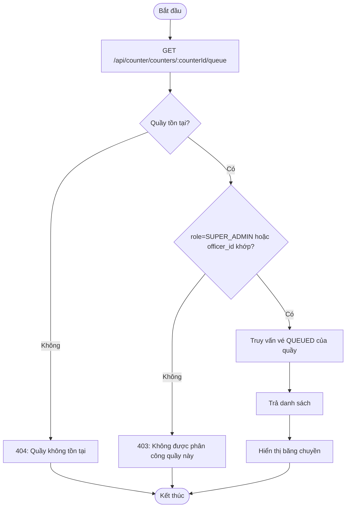

**Biểu đồ tuần tự:**

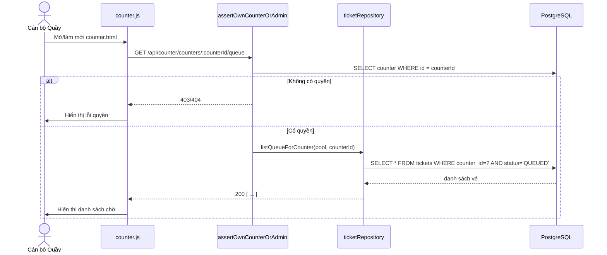

---

## UC-11 — Gọi số tiếp theo

**Mô tả:** Officer bấm gọi công dân tiếp theo trong hàng đợi của quầy mình; hệ thống
chuyển vé đầu hàng từ `QUEUED` sang `CALLING`, đồng thời khởi động đếm ngược
`CALL_TIMEOUT_SECONDS` (mặc định 45s) để chờ công dân có mặt.

**Actor:** Cán bộ Quầy, Hệ thống (đồng hồ đếm ngược).

**Priority:** Cao (thao tác lõi của vòng đời vé).

**Trigger:** Officer bấm nút "Gọi số tiếp theo" trên `counter.html`.

**Precondition:**
- Officer đang phụ trách quầy, quầy ở trạng thái `OPEN`.
- Có ít nhất 1 vé `QUEUED` tại quầy (nếu hàng đợi trống, trả thông báo, không lỗi).

**Validate on form:** Không có input; chỉ dựa vào `counterId` trên URL + quyền sở hữu quầy.

**Post-condition:**
- *Thành công:* vé đầu hàng chuyển `QUEUED → CALLING`, `active_ticket_id` của quầy được cập nhật, đồng hồ đếm ngược 45s bắt đầu (kích hoạt phía Display/PA để đọc loa/hiện LED); broadcast WebSocket tới `display.html`.
- *Hàng đợi trống:* trả `{ message: 'Hang doi trong.' }`, không thay đổi trạng thái nào.
- *Thất bại khác:* HTTP 400 (VD quầy không ở trạng thái `OPEN`).

**Basic flow:**
1. Officer bấm "Gọi số tiếp theo".
2. Frontend gọi `POST /api/counter/counters/:counterId/call-next`.
3. `assertOwnCounterOrAdmin` xác thực quyền.
4. `queueEngine.callNext(counterId, staffId)` lấy vé `QUEUED` đầu hàng (theo thứ tự ưu tiên/thời gian), chuyển sang `CALLING`, gán `active_ticket_id` cho quầy.
5. Trả về vé vừa gọi; broadcast WebSocket (`display.html` hiện số + phát loa TTS).
6. Frontend counter hiển thị vé đang gọi + nút "Xác nhận tiếp"/"Vắng mặt".

**Alternative flow:**
- **4a.** Hàng đợi quầy đang trống → trả `{ message: 'Hang doi trong.' }`, không tạo lỗi, Officer chờ có công dân mới.
- **4b.** Quầy đang có 1 vé ở trạng thái `CALLING` chưa xử lý xong → tùy chính sách nghiệp vụ, `queueEngine` có thể từ chối gọi số mới cho tới khi vé hiện tại được xử lý (Accept/No-show).

**Biểu đồ hoạt động:**

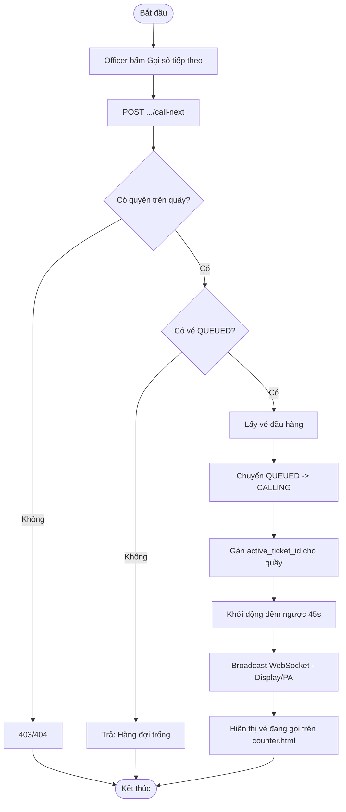

**Biểu đồ tuần tự:**

```mermaid
sequenceDiagram
    actor OF as Cán bộ Quầy
    participant FE as counter.js
    participant QE as queueEngine
    participant DB as PostgreSQL (tickets, counters)
    participant WS as wsHub
    participant DISP as display.html

    OF->>FE: Bấm "Gọi số tiếp theo"
    FE->>QE: POST call-next (qua route + middleware quyền)
    QE->>DB: SELECT vé QUEUED đầu hàng FOR UPDATE
    alt Hàng đợi trống
        DB-->>QE: không có vé
        QE-->>FE: { message: "Hàng đợi trống" }
    else Có vé
        DB-->>QE: vé đầu hàng
        QE->>DB: UPDATE tickets SET status='CALLING'; UPDATE counters SET active_ticket_id=...
        DB-->>QE: OK
        QE->>WS: broadcast TICKET_CALLING
        WS-->>DISP: Cập nhật LED + phát TTS
        QE-->>FE: { ticket }
    end
    FE->>OF: Hiển thị vé đang gọi
```

---

## UC-12 — Xác nhận tiếp công dân (Accept)

**Mô tả:** Khi công dân đã có mặt tại quầy sau khi được gọi số, Officer bấm xác nhận để
chuyển vé sang trạng thái đang xử lý (`PROCESSING`), dừng đồng hồ đếm ngược timeout.

**Actor:** Cán bộ Quầy.

**Priority:** Cao.

**Trigger:** Officer bấm "Xác nhận tiếp" khi thấy công dân đã có mặt tại quầy.

**Precondition:** Vé đang ở trạng thái `CALLING` tại đúng quầy của Officer.

**Validate on form:** `ticketId` trên URL phải tồn tại và đang `CALLING`.

**Post-condition:**
- *Thành công:* vé chuyển `CALLING → PROCESSING`; dừng đếm ngược timeout; trả `{ ticket }`.
- *Thất bại:* vé không ở trạng thái `CALLING` (VD đã bị No-show tự động do hết timeout) → HTTP 400.

**Basic flow:**
1. Công dân có mặt tại quầy.
2. Officer bấm "Xác nhận tiếp" trên `counter.html`.
3. Frontend gọi `POST /api/counter/tickets/:ticketId/accept`.
4. `queueEngine.acceptTicket(ticketId, staffId)` kiểm tra vé đang `CALLING`, chuyển sang `PROCESSING`.
5. Trả `{ ticket }`; frontend chuyển giao diện sang màn hình xử lý hồ sơ (nút Hoàn tất / Bổ sung hồ sơ).

**Alternative flow:**
- **4a.** Vé đã hết timeout và bị hệ thống tự động chuyển trạng thái trước khi Officer bấm (xem UC-45) → vé không còn ở `CALLING` → HTTP 400, Officer phải gọi số lại (UC-11) nếu vé vẫn còn trong hàng đợi.

**Biểu đồ hoạt động:**

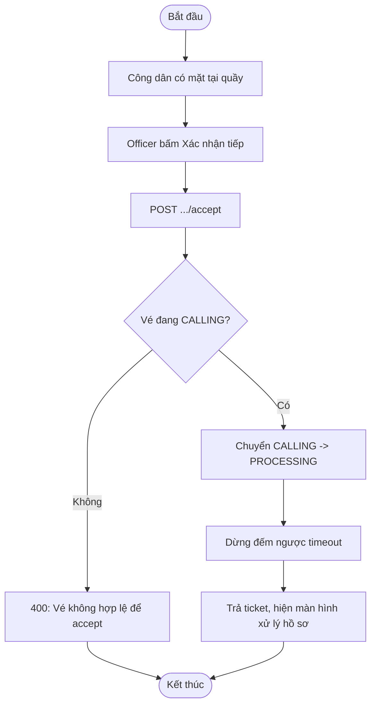

**Biểu đồ tuần tự:**

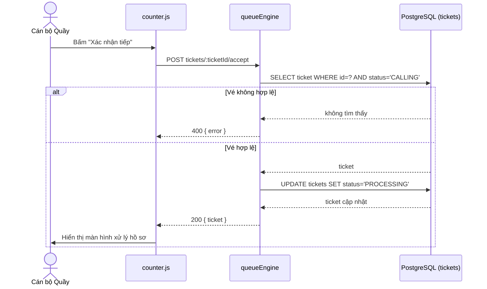

---

## UC-13 — Đánh dấu vắng mặt (No-show thủ công)

**Mô tả:** Cho phép Officer chủ động đánh dấu công dân vắng mặt (thay vì chờ hết 45s
timeout tự động), áp dụng cùng cơ chế `retry_count += 1` / 3-Strike Drop như No-show tự
động (UC-45).

**Actor:** Cán bộ Quầy.

**Priority:** Trung bình.

**Trigger:** Officer bấm "Vắng mặt" khi thấy rõ công dân không có mặt (không cần chờ đủ 45s).

**Precondition:** Vé đang ở trạng thái `CALLING` tại quầy của Officer.

**Validate on form:** `ticketId` phải tồn tại và đang `CALLING`.

**Post-condition:**
- *`retry_count` sau khi +1 vẫn `< MAX_RETRY_COUNT` (mặc định 3):* vé quay lại `QUEUED`, đẩy về cuối hàng đợi; quầy tự động gọi số tiếp theo (nếu còn vé).
- *`retry_count` đạt `MAX_RETRY_COUNT`:* vé chuyển `CANCELLED` vĩnh viễn (3-Strike Drop).
- *Thất bại:* vé không ở trạng thái `CALLING` → HTTP 400.

**Basic flow:**
1. Officer xác định công dân vắng mặt, bấm "Vắng mặt".
2. Frontend gọi `POST /api/counter/tickets/:ticketId/no-show`.
3. `queueEngine.manualNoShow(ticketId)` tăng `retry_count`, kiểm tra ngưỡng `MAX_RETRY_COUNT`.
4. Nếu chưa đạt ngưỡng → đẩy vé về cuối hàng đợi (`QUEUED`), tự động gọi số tiếp theo tại quầy.
5. Trả kết quả; frontend cập nhật giao diện.

**Alternative flow:**
- **3a.** `retry_count` sau khi +1 đạt `MAX_RETRY_COUNT` → vé chuyển `CANCELLED` vĩnh viễn, không quay lại hàng đợi; ghi nhận để công dân phải lấy số mới nếu muốn tiếp tục.
- **2a.** Vé không còn ở `CALLING` (VD đã tự động No-show trước đó) → HTTP 400.

**Biểu đồ hoạt động:**

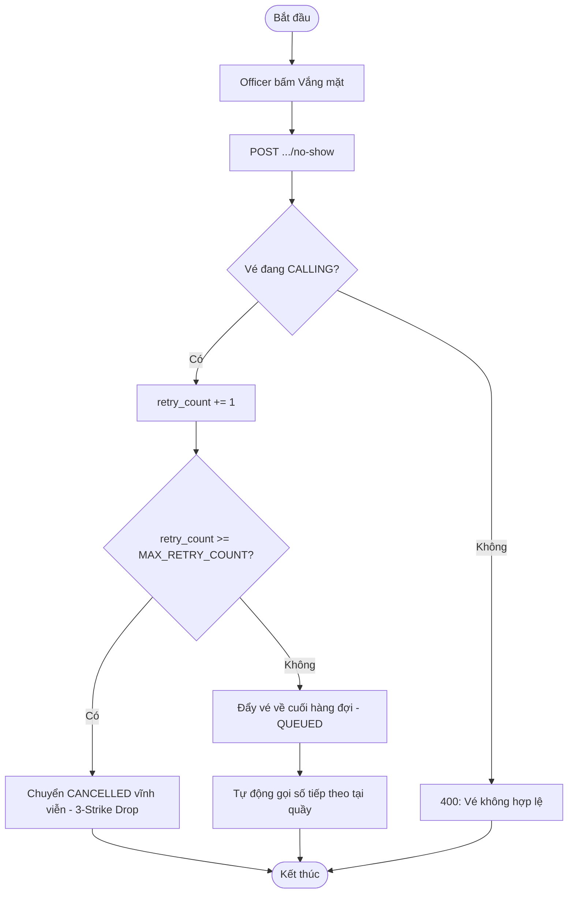

**Biểu đồ tuần tự:**

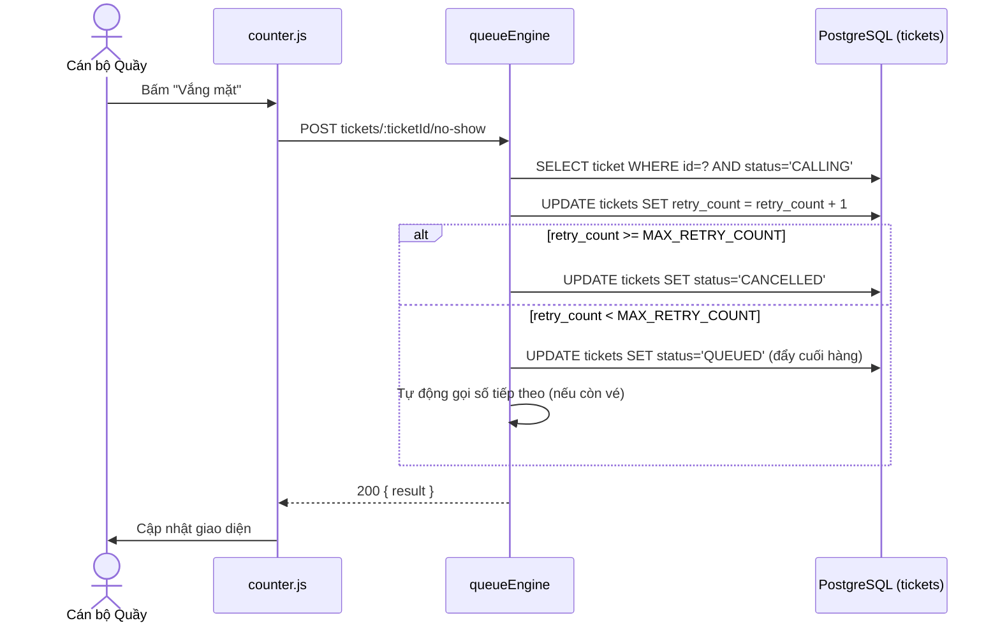

---

## UC-14 — Hoàn tất hồ sơ (Complete)

**Mô tả:** Officer đánh dấu đã xử lý xong hồ sơ của công dân, kết thúc vòng đời vé
thành công. Có "Undo Buffer" 5 giây cho phép hoàn tác nếu bấm nhầm (UC-15).

**Actor:** Cán bộ Quầy.

**Priority:** Cao.

**Trigger:** Officer bấm "Hoàn tất" sau khi xử lý xong hồ sơ tại quầy.

**Precondition:** Vé đang ở trạng thái `PROCESSING` tại quầy của Officer.

**Validate on form:** `ticketId` phải tồn tại và đang `PROCESSING`.

**Post-condition:**
- *Thành công:* vé chuyển `PROCESSING → COMPLETED`, giải phóng quầy (`active_ticket_id = null`); bắt đầu cửa sổ `UNDO_BUFFER_SECONDS` (mặc định 5s) cho phép hoàn tác; quầy có thể gọi số tiếp theo ngay.
- *Thất bại:* vé không ở trạng thái `PROCESSING` → HTTP 400.

**Basic flow:**
1. Officer xử lý xong hồ sơ, bấm "Hoàn tất".
2. Frontend gọi `POST /api/counter/tickets/:ticketId/complete`.
3. `queueEngine.completeTicket(ticketId, staffId)` chuyển vé sang `COMPLETED`, giải phóng quầy.
4. Trả kết quả; frontend hiện nút "Hoàn tác" trong 5 giây rồi tự ẩn.
5. Officer có thể bấm "Gọi số tiếp theo" (UC-11) ngay lập tức.

**Alternative flow:**
- **2a.** Vé không ở `PROCESSING` (VD đã hoàn tất trước đó) → HTTP 400.
- **4a.** Officer bấm "Hoàn tác" trong vòng 5 giây → xem UC-15.

**Biểu đồ hoạt động:**

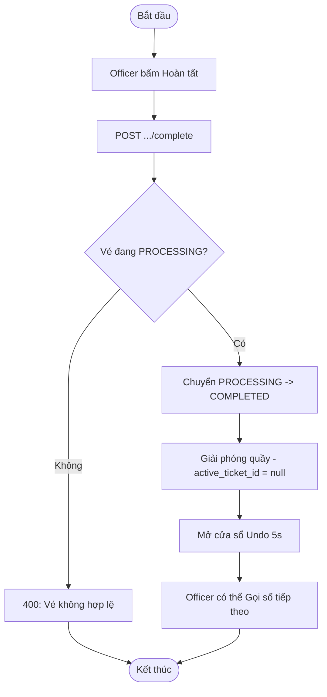

**Biểu đồ tuần tự:**

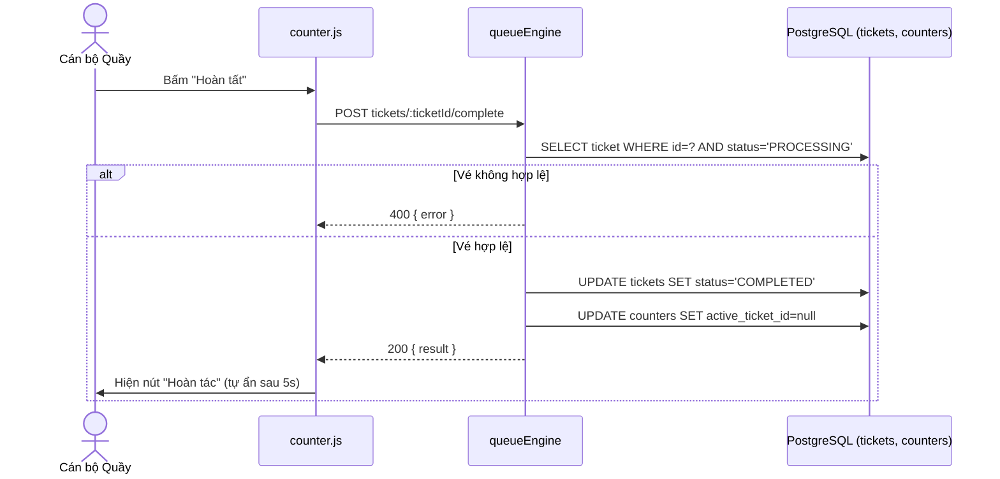

---

## UC-15 — Hoàn tác hoàn tất (Undo)

**Mô tả:** Cho phép Officer hoàn tác thao tác "Hoàn tất" (UC-14) nếu bấm nhầm, trong
khoảng thời gian đệm `UNDO_BUFFER_SECONDS` (mặc định 5 giây).

**Actor:** Cán bộ Quầy.

**Priority:** Trung bình.

**Trigger:** Officer bấm "Hoàn tác" trong vòng 5 giây sau khi hoàn tất vé.

**Precondition:**
- Vé đang ở trạng thái `COMPLETED`.
- Thời điểm hiện tại còn nằm trong cửa sổ `UNDO_BUFFER_SECONDS` kể từ lúc hoàn tất.

**Validate on form:** `ticketId` phải tồn tại, đang `COMPLETED`, và chưa vượt quá buffer time.

**Post-condition:**
- *Thành công:* vé quay lại `PROCESSING`; nếu quầy đã nhận vé mới trong lúc đó, cần xử lý xung đột (tùy nghiệp vụ, thường từ chối Undo nếu quầy đã bận).
- *Thất bại:* đã quá thời gian buffer → HTTP 400, không thể hoàn tác.

**Basic flow:**
1. Officer nhận ra bấm nhầm "Hoàn tất", bấm "Hoàn tác" trong 5 giây.
2. Frontend gọi `POST /api/counter/tickets/:ticketId/undo`.
3. `queueEngine.undoComplete(ticketId, staffId)` kiểm tra còn trong buffer time.
4. Nếu hợp lệ → chuyển vé `COMPLETED → PROCESSING`.
5. Trả kết quả; frontend quay lại màn hình xử lý hồ sơ.

**Alternative flow:**
- **3a.** Đã quá `UNDO_BUFFER_SECONDS` → HTTP 400 "Đã hết thời gian hoàn tác".
- **4a.** Quầy đã được gán vé mới khác trong lúc chờ Undo → nghiệp vụ cần quyết định giữ nguyên hoặc từ chối (tránh xung đột 2 vé trên 1 quầy).

**Biểu đồ hoạt động:**

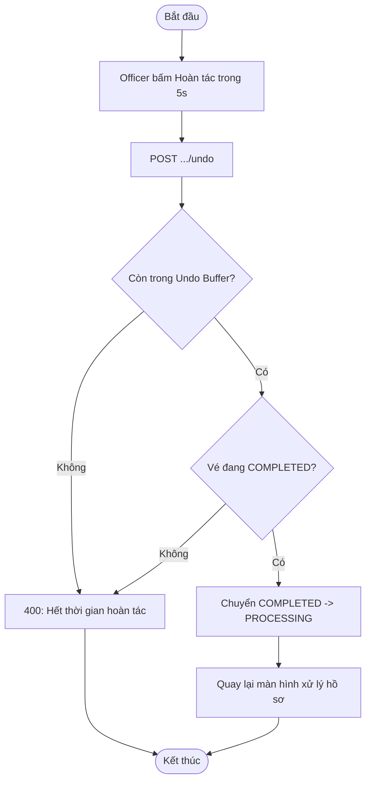

**Biểu đồ tuần tự:**

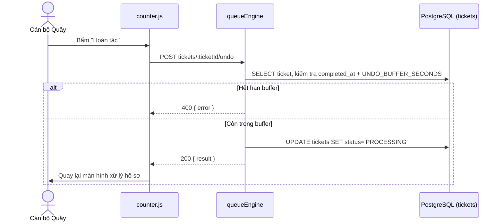

---

## UC-16 — Yêu cầu bổ sung hồ sơ (Supplement)

**Mô tả:** Khi phát hiện hồ sơ còn thiếu giấy tờ trong lúc xử lý, Officer chuyển vé
sang trạng thái `SUPP_PENDING`, cấp mã QR Re-entry cho công dân, đồng thời giải phóng
quầy ngay lập tức để phục vụ người tiếp theo (nhánh thứ 2 của Two-way Branching, đối
lập với UC-14).

**Actor:** Cán bộ Quầy.

**Priority:** Cao.

**Trigger:** Officer phát hiện thiếu giấy tờ trong lúc xử lý hồ sơ (đang ở `PROCESSING`), bấm "Yêu cầu bổ sung hồ sơ" và chọn các mã giấy tờ còn thiếu.

**Precondition:** Vé đang ở trạng thái `PROCESSING` tại quầy của Officer.

**Validate on form:** `missingDocCodes` (mảng mã giấy tờ còn thiếu) nên khớp với danh mục `required_docs` của thủ tục tương ứng (không có validate cứng ở tầng route ngoài truyền thẳng cho service).

**Post-condition:**
- *Thành công:* vé chuyển `PROCESSING → SUPP_PENDING`; sinh mã QR Re-entry (token) gắn với vé; giải phóng quầy ngay (`active_ticket_id = null`) để Officer gọi số tiếp theo; công dân nhận mã QR để quét lại sau khi bổ sung (UC-09).
- *Thất bại:* vé không ở `PROCESSING` → HTTP 400.

**Basic flow:**
1. Officer phát hiện thiếu giấy tờ, chọn các mã giấy tờ còn thiếu trên `counter.html`.
2. Frontend gọi `POST /api/counter/tickets/:ticketId/supplement` với `{ missingDocCodes }`.
3. `queueEngine.requestSupplement(ticketId, missingDocCodes, staffId)` chuyển vé sang `SUPP_PENDING`, sinh mã QR Re-entry.
4. Giải phóng quầy ngay lập tức.
5. Trả kết quả (kèm thông tin mã QR); frontend hiển thị/in mã QR để đưa cho công dân.
6. Officer có thể gọi số tiếp theo ngay (UC-11).

**Alternative flow:**
- **2a.** Vé không ở `PROCESSING` → HTTP 400.
- **3a.** Công dân sau đó không bao giờ quay lại quét mã Re-entry → vé nằm ở `SUPP_PENDING` vĩnh viễn cho tới khi bị dọn bởi Max Ticket Lifetime Sweep (UC-47).

**Biểu đồ hoạt động:**

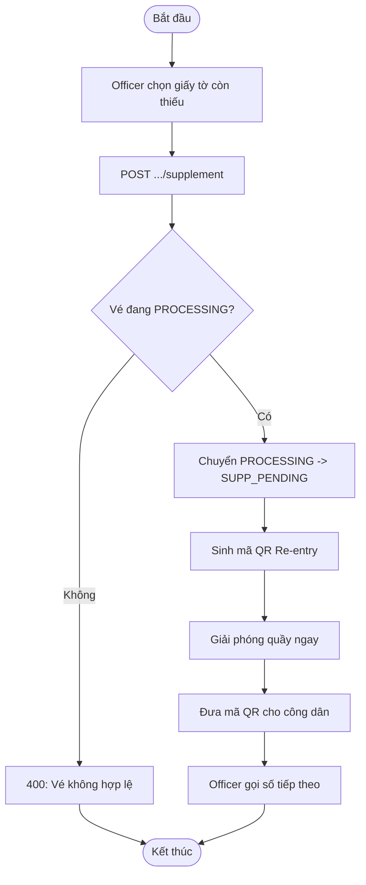

**Biểu đồ tuần tự:**

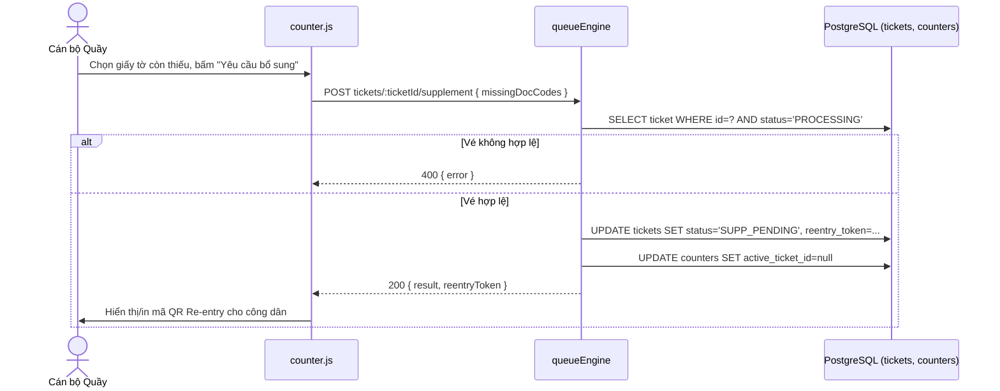

---

## UC-17 — Xem thống kê nhanh trong ca

**Mô tả:** Officer xem số liệu tóm tắt hiệu suất làm việc của chính mình trong ca hiện
tại (số vé đã xử lý, thời gian trung bình...) ngay trên `counter.html`.

**Actor:** Cán bộ Quầy.

**Priority:** Thấp.

**Trigger:** `counter.html` tải hoặc làm mới định kỳ.

**Precondition:** Đã đăng nhập; số liệu luôn tính theo `req.staff.staffId` của chính người gọi API (không nhận tham số URL) để tránh xem được số liệu của Officer khác.

**Validate on form:** Không có input.

**Post-condition:** Trả số liệu thống kê trong ca của chính Officer; không ghi dữ liệu.

**Basic flow:**
1. `counter.html` gọi `GET /api/counter/me/today-stats`.
2. `analyticsService.getOfficerTodayStats(req.staff.staffId)` tính toán số vé hoàn tất, thời gian xử lý trung bình... trong ngày.
3. Trả kết quả; frontend hiển thị ở khu vực thống kê.

**Alternative flow:**
- **2a.** Officer chưa xử lý vé nào trong ngày → trả số liệu 0/rỗng, không lỗi.

**Biểu đồ hoạt động:**

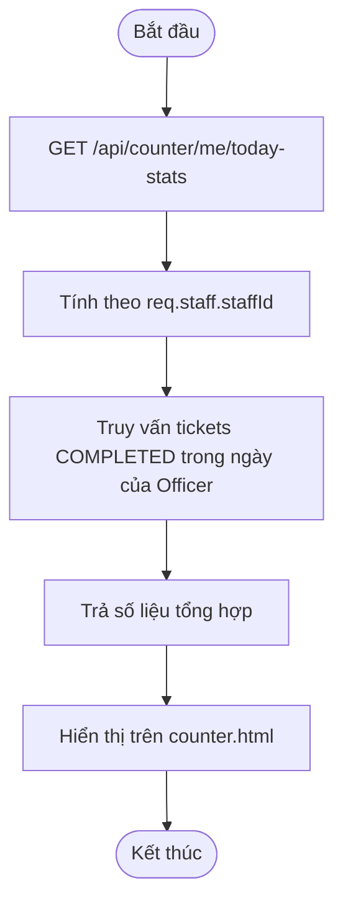

**Biểu đồ tuần tự:**

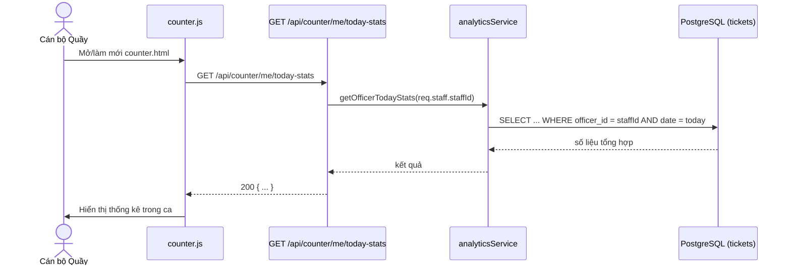
