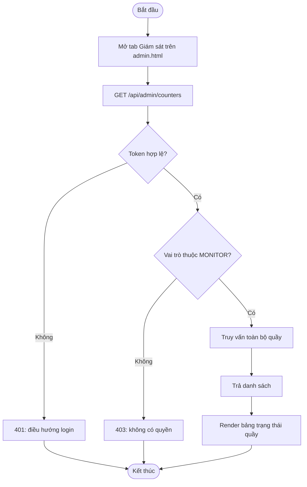
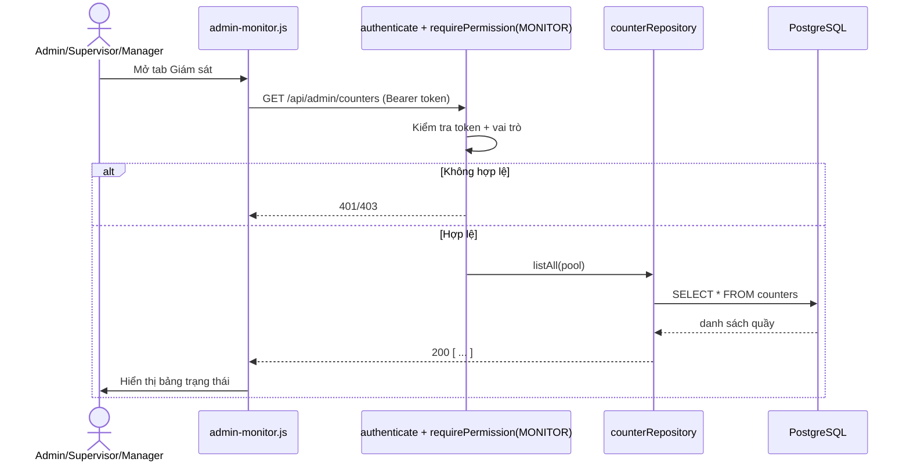
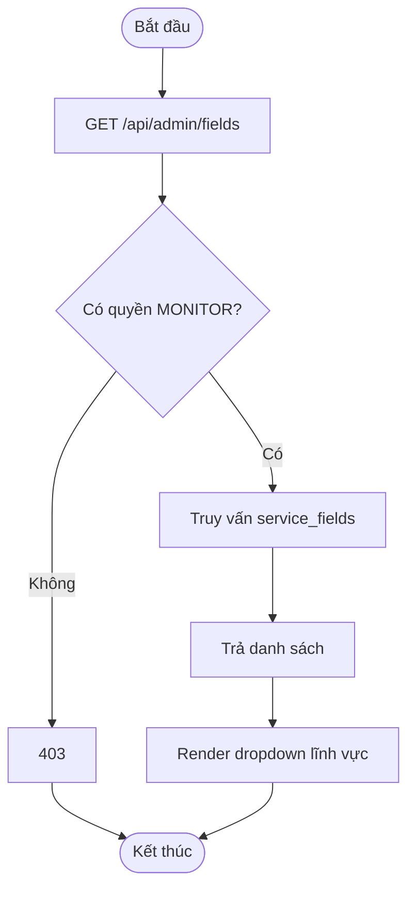
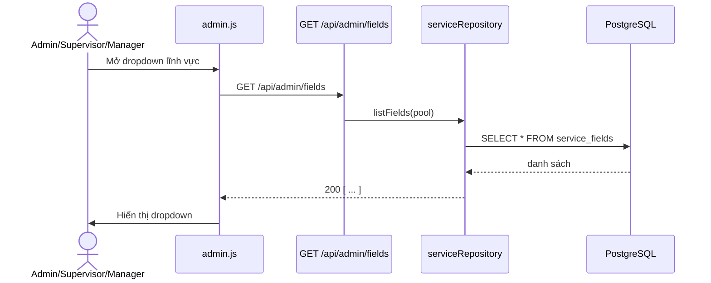
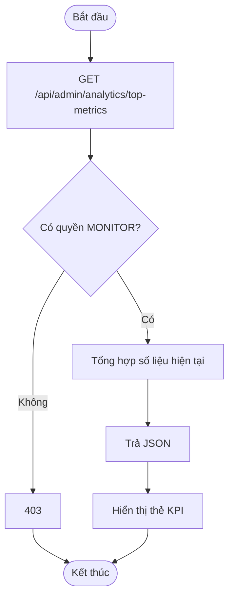
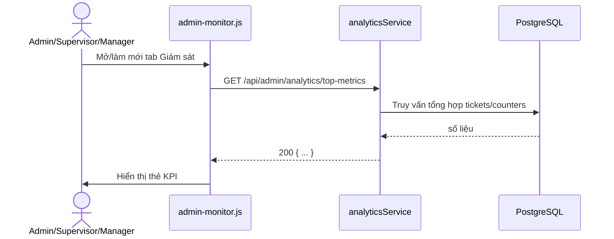
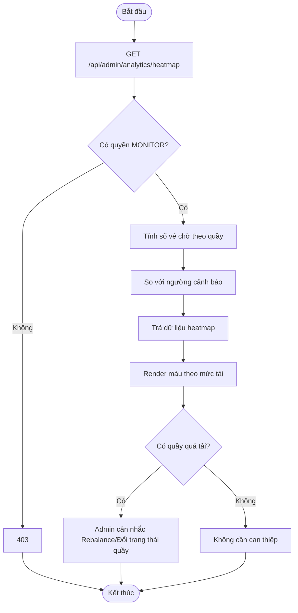
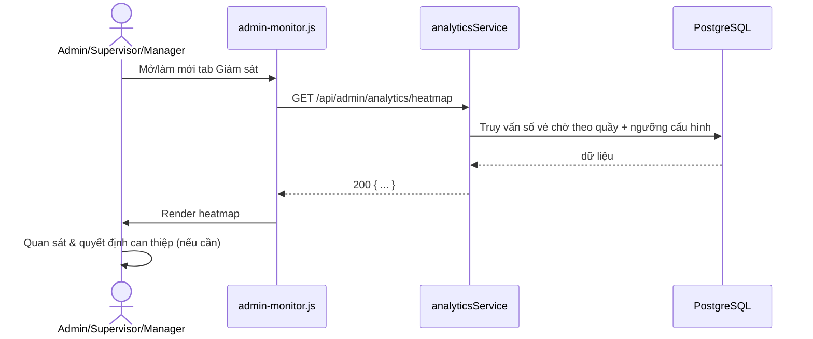

# Module 04 — Giám sát Realtime (Admin Control Tower / Monitor)

Nguồn: `src/routes/adminRoutes.js` (nhóm quyền `MONITOR`), `src/services/analyticsService.js`.
Actor: Cán bộ Điều phối (Supervisor), Trưởng Trung tâm (Manager), Quản trị viên (Super Admin) —
nhóm quyền `MONITOR` cho phép cả 3 vai trò này (Officer không có quyền).

---

## UC-18 — Xem danh sách quầy & trạng thái

**Mô tả:** Hiển thị toàn bộ quầy giao dịch (kể cả quầy chưa `OPEN`) cùng trạng thái,
lĩnh vực phụ trách, cán bộ đang trực — làm dữ liệu nền cho tab "Giám sát Realtime" trên
Admin Dashboard.

**Actor:** Cán bộ Điều phối, Trưởng Trung tâm, Quản trị viên.

**Priority:** Cao (dữ liệu nền để ra quyết định điều phối).

**Trigger:** Tab "Giám sát" trên `admin.html` được mở, hoặc tự làm mới định kỳ/qua WebSocket.

**Precondition:** Đã đăng nhập (UC-01) với vai trò thuộc nhóm `MONITOR`.

**Validate on form:** Không có input; chỉ kiểm tra quyền qua `requirePermission('MONITOR')`.

**Post-condition:** Trả toàn bộ danh sách quầy (`counterRepo.listAll`, không lọc soft-delete như UC-06 vì Admin cần thấy cả quầy đã xóa để tham chiếu lịch sử nếu cần); không ghi dữ liệu.

**Basic flow:**
1. Admin/Supervisor/Manager mở tab "Giám sát" trên `admin.html`.
2. Frontend gọi `GET /api/admin/counters`.
3. `requirePermission('MONITOR')` kiểm tra vai trò hợp lệ.
4. `counterRepo.listAll()` trả toàn bộ quầy.
5. Frontend render bảng/lưới trạng thái quầy.

**Alternative flow:**
- **3a.** Vai trò không thuộc `MONITOR` (VD `OFFICER`) → HTTP 403.
- **1a.** Token hết hạn/không hợp lệ → HTTP 401 (UC-01), frontend điều hướng về `login.html`.

**Biểu đồ hoạt động:**

**Biểu đồ tuần tự:**

---

## UC-19 — Xem danh mục lĩnh vực

**Mô tả:** Liệt kê các lĩnh vực dịch vụ (`service_fields`) hiện có trong hệ thống, dùng
để hiển thị bộ lọc/gán lĩnh vực khi điều phối quầy (UC-23) hoặc thêm quầy mới (UC-24).

**Actor:** Cán bộ Điều phối, Trưởng Trung tâm, Quản trị viên.

**Priority:** Trung bình.

**Trigger:** Tab "Giám sát"/"Điều phối" cần danh sách lĩnh vực để hiển thị dropdown.

**Precondition:** Đã đăng nhập với vai trò thuộc nhóm `MONITOR`.

**Validate on form:** Không có input.

**Post-condition:** Trả danh sách `service_fields`; không ghi dữ liệu.

**Basic flow:**
1. Frontend gọi `GET /api/admin/fields`.
2. `requirePermission('MONITOR')` xác thực quyền.
3. `serviceRepo.listFields()` trả danh sách lĩnh vực.
4. Frontend render dropdown/bộ lọc theo lĩnh vực.

**Alternative flow:**
- **2a.** Không có quyền → HTTP 403.

**Biểu đồ hoạt động:**

**Biểu đồ tuần tự:**

---

## UC-20 — Xem Top Metrics

**Mô tả:** Hiển thị các chỉ số tổng quan quan trọng nhất tại thời điểm hiện tại (VD:
tổng vé đang chờ, thời gian chờ trung bình, số quầy đang mở) trên đầu Admin Dashboard.

**Actor:** Cán bộ Điều phối, Trưởng Trung tâm, Quản trị viên.

**Priority:** Trung bình.

**Trigger:** Tab "Giám sát" được mở hoặc tự làm mới định kỳ.

**Precondition:** Đã đăng nhập với vai trò thuộc nhóm `MONITOR`.

**Validate on form:** Không có input.

**Post-condition:** Trả bộ chỉ số tổng hợp thời gian thực; không ghi dữ liệu.

**Basic flow:**
1. Frontend gọi `GET /api/admin/analytics/top-metrics`.
2. `analyticsService.getTopMetrics()` tổng hợp số liệu từ `tickets`/`counters` hiện tại.
3. Trả kết quả; frontend hiển thị dạng thẻ số liệu (KPI card).

**Alternative flow:**
- **2a.** Chưa có vé/hoạt động nào trong ngày → trả số liệu 0, không lỗi.

**Biểu đồ hoạt động:**

**Biểu đồ tuần tự:**

---

## UC-21 — Xem Heatmap tải hàng đợi

**Mô tả:** Trực quan hóa mức độ tải (số vé chờ) theo quầy/lĩnh vực dưới dạng heatmap,
giúp Admin phát hiện nhanh quầy quá tải để ra quyết định Force Re-balance (UC-28).

**Actor:** Cán bộ Điều phối, Trưởng Trung tâm, Quản trị viên.

**Priority:** Cao (đầu vào trực tiếp cho quyết định điều phối).

**Trigger:** Tab "Giám sát" được mở hoặc tự làm mới định kỳ/qua WebSocket khi có thay đổi hàng đợi.

**Precondition:** Đã đăng nhập với vai trò thuộc nhóm `MONITOR`.

**Validate on form:** Không có input.

**Post-condition:** Trả dữ liệu heatmap theo quầy/lĩnh vực; không ghi dữ liệu. Các ngưỡng cảnh báo (màu vàng/đỏ) được cấu hình qua UC-32.

**Basic flow:**
1. Frontend gọi `GET /api/admin/analytics/heatmap`.
2. `analyticsService.getHeatmap()` tính số vé chờ theo từng quầy, so với ngưỡng cảnh báo trong `system_configs`.
3. Trả kết quả; frontend render heatmap (màu sắc theo mức tải).
4. Admin quan sát quầy đang "đỏ" (quá tải) để quyết định can thiệp (UC-22/UC-28).

**Alternative flow:**
- **2a.** Không quầy nào vượt ngưỡng cảnh báo → heatmap toàn "xanh", không cần can thiệp.

**Biểu đồ hoạt động:**

**Biểu đồ tuần tự:**

