# Module 05 — Điều phối & Can thiệp Khẩn cấp (Dispatch)

Nguồn: `src/routes/adminRoutes.js` (nhóm quyền `DISPATCH`), `src/services/counterService.js`,
`src/services/queueEngine/priorityAndRebalance.js`. Actor: Cán bộ Điều phối (Supervisor),
Trưởng Trung tâm (Manager), Quản trị viên (Super Admin).

---

## UC-22 — Đổi trạng thái quầy (Mở/Đóng/Tạm dừng)

**Mô tả:** Cho phép Admin/Supervisor/Manager chuyển trạng thái 1 quầy giữa `OPEN`,
`PAUSED`, `CLOSED` để điều phối nhân lực theo tình hình thực tế (VD: quầy hết cán bộ trực → `PAUSED`).

**Actor:** Cán bộ Điều phối, Trưởng Trung tâm, Quản trị viên.

**Priority:** Cao.

**Trigger:** Admin bấm nút đổi trạng thái quầy trên tab "Điều phối".

**Precondition:** Quầy (`id`) tồn tại; người thực hiện thuộc nhóm quyền `DISPATCH`.

**Validate on form:**
- `status` phải thuộc tập `{OPEN, PAUSED, CLOSED}` (ràng buộc `CHECK` ở DB, service nên validate trước khi UPDATE).
- `reason` (lý do) nên bắt buộc khi chuyển sang `PAUSED`/`CLOSED` để phục vụ Audit Log (tùy nghiệp vụ cụ thể trong `counterService`).

**Post-condition:**
- *Thành công:* `counters.status` được cập nhật; nếu chuyển sang `CLOSED`/`PAUSED` khi quầy đang có vé `QUEUED`, cần xử lý san tải các vé đó (tùy chính sách — có thể yêu cầu Rebalance thủ công UC-28); ghi Audit Log; broadcast WebSocket.
- *Thất bại:* `status` không hợp lệ hoặc quầy không tồn tại → HTTP 400.

**Basic flow:**
1. Admin chọn quầy, chọn trạng thái mới (`OPEN`/`PAUSED`/`CLOSED`) và nhập lý do (nếu cần).
2. Frontend gọi `POST /api/admin/counters/:id/status` với `{ status, reason }`.
3. `requirePermission('DISPATCH')` xác thực quyền.
4. `counterService.setCounterStatus(id, status, adminId, reason)` cập nhật trạng thái, ghi Audit Log.
5. Trả kết quả (`outcome`); broadcast WebSocket cập nhật Display/Kiosk.
6. Frontend cập nhật giao diện trạng thái quầy.

**Alternative flow:**
- **3a.** Không có quyền `DISPATCH` → HTTP 403.
- **4a.** `status` không hợp lệ → HTTP 400.
- **4b.** Quầy đang có vé `QUEUED`/`CALLING` khi chuyển `CLOSED` → `counterService` có thể tự động đẩy các vé đó sang quầy khác cùng lĩnh vực hoặc yêu cầu Admin xử lý thủ công (Rebalance).

**Biểu đồ hoạt động:**

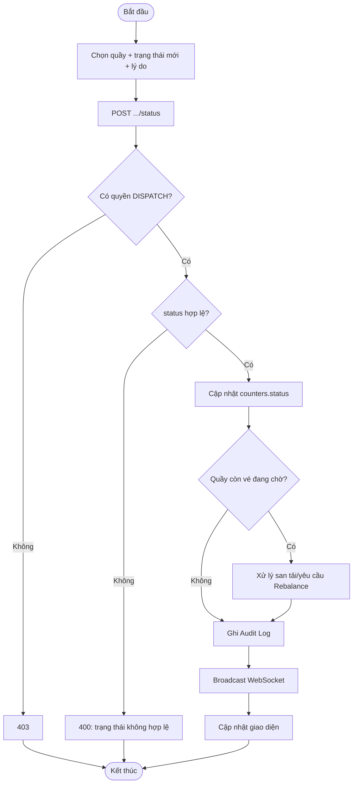

**Biểu đồ tuần tự:**

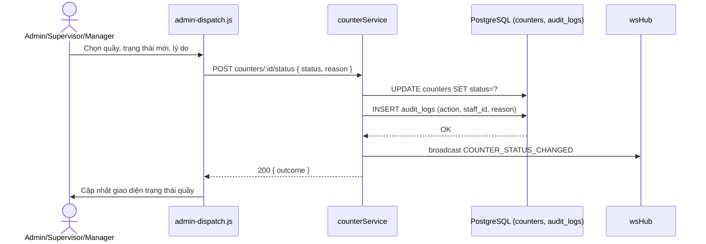

---

## UC-23 — Đổi lĩnh vực phụ trách của quầy

**Mô tả:** Chuyển 1 quầy sang phục vụ lĩnh vực khác (VD quầy A đang phục vụ lĩnh vực
"Hộ tịch" chuyển sang "Đất đai") khi cần điều chỉnh cơ cấu nhân lực theo nhu cầu thực tế.

**Actor:** Cán bộ Điều phối, Trưởng Trung tâm, Quản trị viên.

**Priority:** Trung bình.

**Trigger:** Admin chọn quầy và lĩnh vực mới trên tab "Điều phối".

**Precondition:** Quầy tồn tại; lĩnh vực mới (`fieldId`) tồn tại trong `service_fields`.

**Validate on form:** `fieldId` bắt buộc, phải là số nguyên hợp lệ (`requireInt`); tồn tại trong DB (ràng buộc khóa ngoại — lỗi `23503` nếu không).

**Post-condition:**
- *Thành công:* `counters.field_id` được cập nhật; các vé `QUEUED` cũ tại quầy (thuộc lĩnh vực cũ) cần được xử lý (có thể giữ nguyên tới khi xử lý xong, hoặc yêu cầu Admin điều chuyển); ghi Audit Log.
- *Thất bại:* `fieldId` không tồn tại → HTTP 400 "Linh vuc khong ton tai." (bắt lỗi SQLSTATE `23503`).

**Basic flow:**
1. Admin chọn quầy, chọn lĩnh vực mới từ dropdown (UC-19), nhập lý do.
2. Frontend gọi `POST /api/admin/counters/:id/field` với `{ fieldId, reason }`.
3. `counterService.changeCounterField(id, fieldId, adminId, reason)` cập nhật `field_id`, ghi Audit Log.
4. Trả thông tin quầy đã cập nhật.
5. Frontend cập nhật giao diện.

**Alternative flow:**
- **2a.** Thiếu `fieldId` hoặc không phải số → HTTP 400 (`requireInt`).
- **3a.** `fieldId` không tồn tại (vi phạm khóa ngoại `23503`) → HTTP 400 "Linh vuc khong ton tai."

**Biểu đồ hoạt động:**

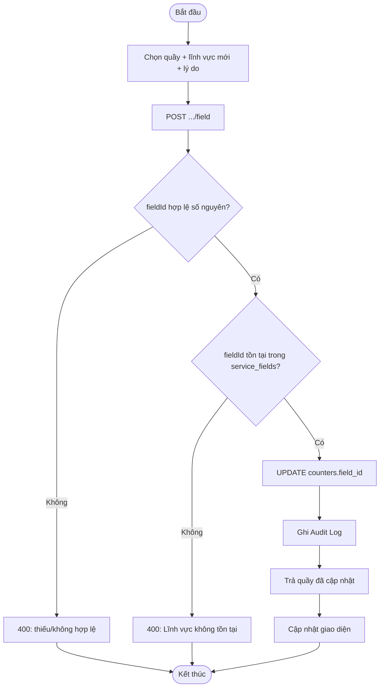

**Biểu đồ tuần tự:**

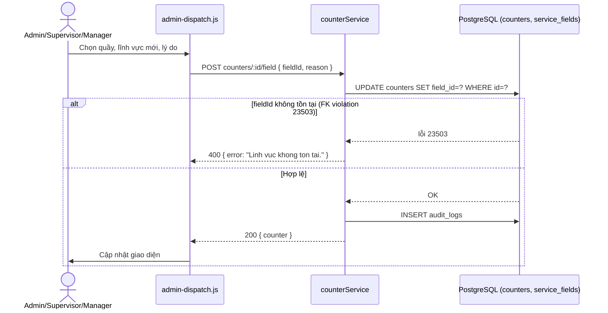

---

## UC-24 — Thêm quầy mới

**Mô tả:** Tạo mới 1 quầy giao dịch (mỗi cơ sở có số lượng quầy khác nhau nên không cố định như dữ liệu mẫu).

**Actor:** Cán bộ Điều phối, Trưởng Trung tâm, Quản trị viên.

**Priority:** Trung bình.

**Trigger:** Admin bấm "Thêm quầy" trên tab "Điều phối".

**Precondition:** Người thực hiện thuộc nhóm quyền `DISPATCH`; lĩnh vực (`fieldId`) đã tồn tại.

**Validate on form:**
- `code` (mã quầy) và `name` (tên quầy) bắt buộc, không rỗng.
- `code` được chuẩn hóa: `trim()` + `toUpperCase()`.
- `fieldId` bắt buộc, số nguyên hợp lệ (`requireInt`).
- `code` phải duy nhất (ràng buộc `UNIQUE` — lỗi `23505` nếu trùng).
- `fieldId` phải tồn tại (ràng buộc khóa ngoại — lỗi `23503` nếu không).

**Post-condition:**
- *Thành công:* tạo mới 1 dòng `counters` (mặc định `status = CLOSED`); trả HTTP 201 kèm thông tin quầy.
- *Thất bại:* thiếu `code`/`name` → HTTP 400; `code` trùng → HTTP 400 "Ma quay da ton tai."; `fieldId` không tồn tại → HTTP 400 "Linh vuc khong ton tai."

**Basic flow:**
1. Admin nhập mã quầy, tên quầy, chọn lĩnh vực.
2. Frontend gọi `POST /api/admin/counters` với `{ code, name, fieldId }`.
3. Server chuẩn hóa `code`/`name`, validate `fieldId`.
4. `counterService.createCounter()` insert quầy mới (mặc định `CLOSED`).
5. Trả 201 kèm thông tin quầy; frontend thêm quầy vào danh sách.

**Alternative flow:**
- **2a.** Thiếu `code` hoặc `name` → HTTP 400.
- **4a.** `code` đã tồn tại (unique violation `23505`) → HTTP 400 "Ma quay da ton tai."
- **4b.** `fieldId` không tồn tại (FK violation `23503`) → HTTP 400 "Linh vuc khong ton tai."

**Biểu đồ hoạt động:**

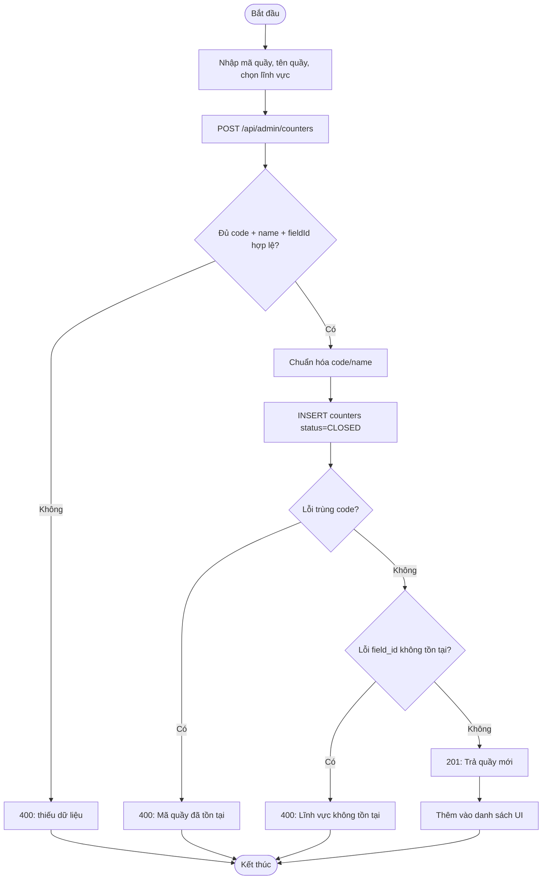

**Biểu đồ tuần tự:**

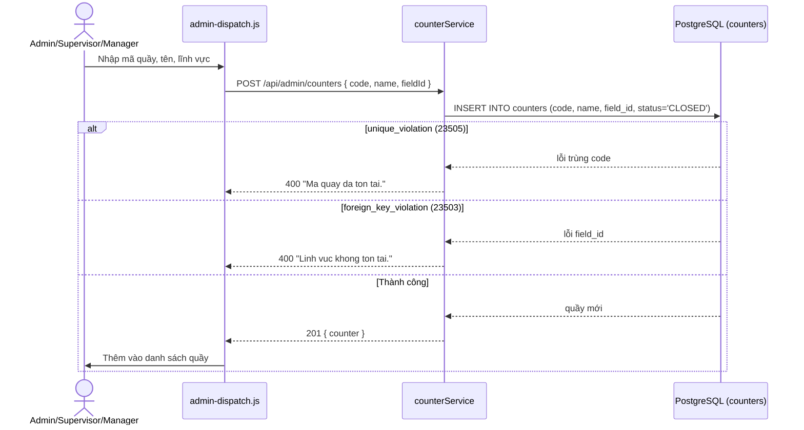

---

## UC-25 — Sửa thông tin quầy

**Mô tả:** Cập nhật mã/tên của 1 quầy đã tồn tại.

**Actor:** Cán bộ Điều phối, Trưởng Trung tâm, Quản trị viên.

**Priority:** Thấp.

**Trigger:** Admin bấm "Sửa" trên 1 quầy trong danh sách.

**Precondition:** Quầy (`id`) tồn tại.

**Validate on form:** `code` và `name` bắt buộc, không rỗng; `code` chuẩn hóa `trim()` + `toUpperCase()`; `code` mới phải duy nhất (trừ chính quầy đang sửa).

**Post-condition:**
- *Thành công:* `counters.code`/`counters.name` được cập nhật; trả thông tin quầy mới.
- *Thất bại:* thiếu dữ liệu → HTTP 400; `code` trùng với quầy khác → HTTP 400 "Ma quay da ton tai."

**Basic flow:**
1. Admin sửa mã quầy/tên quầy trên form.
2. Frontend gọi `PUT /api/admin/counters/:id` với `{ code, name }`.
3. `counterService.updateCounterDetails()` cập nhật thông tin.
4. Trả quầy đã cập nhật; frontend cập nhật danh sách.

**Alternative flow:**
- **2a.** Thiếu `code`/`name` → HTTP 400.
- **3a.** `code` trùng với quầy khác (unique violation `23505`) → HTTP 400 "Ma quay da ton tai."

**Biểu đồ hoạt động:**

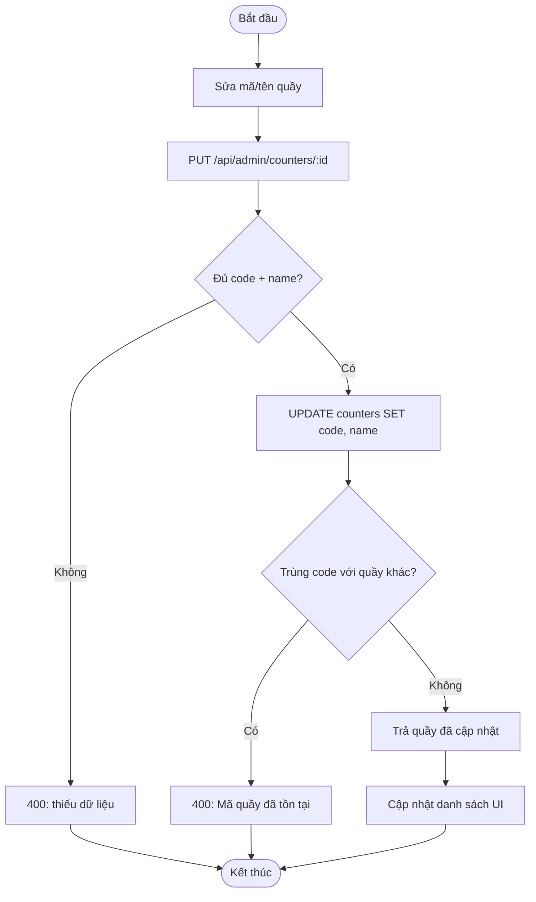

**Biểu đồ tuần tự:**

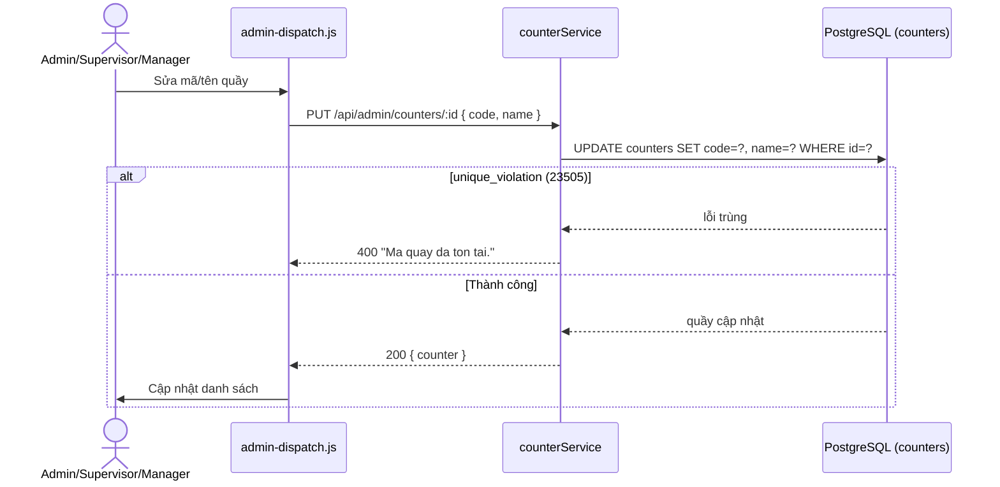

---

## UC-26 — Xóa quầy (soft-delete, san tải vé)

**Mô tả:** Xóa mềm 1 quầy (đánh dấu `is_deleted = 1`, không xóa vật lý để giữ toàn vẹn
dữ liệu lịch sử/Audit) — mọi vé đang chờ tại quầy này cần được san tải sang quầy khác
cùng lĩnh vực trước khi xóa.

**Actor:** Cán bộ Điều phối, Trưởng Trung tâm, Quản trị viên.

**Priority:** Trung bình.

**Trigger:** Admin bấm "Xóa quầy" và xác nhận lý do.

**Precondition:** Quầy (`id`) tồn tại; người thực hiện thuộc nhóm quyền `DISPATCH`.

**Validate on form:** `reason` (lý do xóa) nên bắt buộc để ghi Audit Log rõ ràng.

**Post-condition:**
- *Thành công:* `counters.is_deleted = 1`; toàn bộ vé `QUEUED` tại quầy được san tải sang quầy khác cùng lĩnh vực (nếu có); quầy không còn xuất hiện ở VIEW `active_counters` (không lộ ra Heatmap/Bảng LED); ghi Audit Log; trả `{ success: true, ...outcome }`.
- *Thất bại:* quầy không tồn tại hoặc lỗi nghiệp vụ khác → HTTP 400.

**Basic flow:**
1. Admin bấm "Xóa" trên 1 quầy, nhập lý do, xác nhận.
2. Frontend gọi `DELETE /api/admin/counters/:id` với `{ reason }`.
3. `counterService.deleteCounter(id, adminId, reason)` san tải các vé `QUEUED` còn lại sang quầy khác cùng lĩnh vực (nếu có), đặt `is_deleted = 1`.
4. Ghi Audit Log.
5. Trả `{ success: true, outcome }`; frontend loại quầy khỏi danh sách hiển thị.

**Alternative flow:**
- **3a.** Không còn quầy nào khác cùng lĩnh vực để san tải → các vé `QUEUED` có thể phải chuyển trạng thái đặc biệt hoặc chặn xóa cho tới khi xử lý xong (tùy triển khai cụ thể trong `counterService`).
- **2a.** Quầy không tồn tại → HTTP 400/404.

**Biểu đồ hoạt động:**

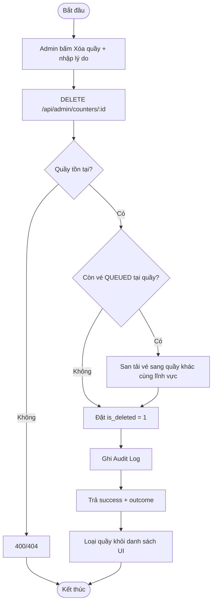

**Biểu đồ tuần tự:**

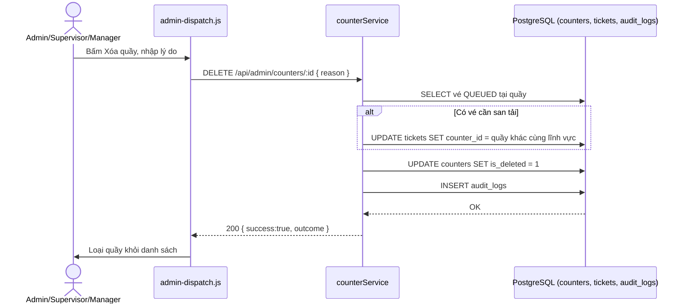

---

## UC-27 — Gán/Hủy gán cán bộ phụ trách quầy

**Mô tả:** Chỉ định 1 Officer phụ trách vận hành 1 quầy cụ thể, hoặc hủy gán (để trống
quầy) khi Officer nghỉ/đổi ca.

**Actor:** Cán bộ Điều phối, Trưởng Trung tâm, Quản trị viên.

**Priority:** Cao (quyết định ai được thao tác UC-10 → UC-17 trên quầy nào).

**Trigger:** Admin chọn quầy và Officer cần gán (hoặc chọn "Không gán ai") trên tab "Điều phối".

**Precondition:** Quầy tồn tại; nếu có `officerId`, tài khoản đó phải tồn tại và có vai trò `OFFICER`.

**Validate on form:** `officerId` là tùy chọn (`null` để hủy gán); nếu có, nên tồn tại trong `staff` với `role = 'OFFICER'`.

**Post-condition:**
- *Thành công:* `counters.officer_id` được cập nhật (hoặc đặt `null`); ghi Audit Log kèm lý do; trả thông tin quầy đã cập nhật.
- *Thất bại:* lỗi nghiệp vụ (VD gán 1 Officer đang phụ trách quầy khác cùng lúc, nếu nghiệp vụ không cho phép) → HTTP 400.

**Basic flow:**
1. Admin chọn quầy, chọn Officer từ danh sách (`GET /api/admin/officers`, quyền `DISPATCH`), nhập lý do.
2. Frontend gọi `POST /api/admin/counters/:id/officer` với `{ officerId, reason }`.
3. `counterService.assignOfficer(id, officerId, adminId, reason)` cập nhật `officer_id`, ghi Audit Log.
4. Trả quầy đã cập nhật; frontend cập nhật giao diện.

**Alternative flow:**
- **1a.** Admin chọn "Không gán ai" → `officerId = null` → hủy gán Officer khỏi quầy.
- **3a.** Lỗi nghiệp vụ (VD Officer đã được gán quầy khác) → HTTP 400.

**Biểu đồ hoạt động:**

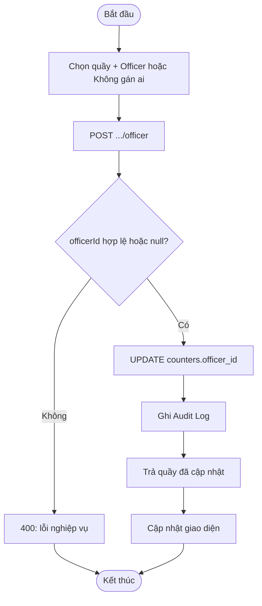

**Biểu đồ tuần tự:**

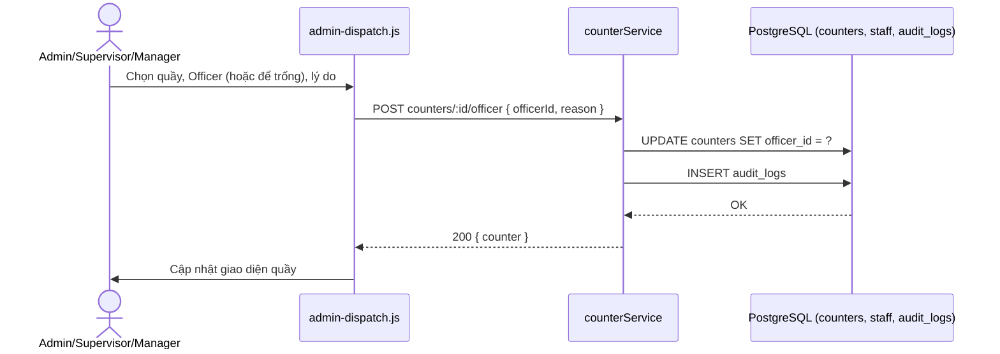

---

## UC-28 — Cân bằng tải hàng đợi (Force Re-balance)

**Mô tả:** Chuyển thủ công X% vé ở cuối hàng đợi của 1 quầy quá tải sang 1 quầy rảnh
khác **cùng lĩnh vực** (chặn san tải khác lĩnh vực để tránh công dân phải di chuyển hỗn
loạn giữa các khu vực khác nhau).

**Actor:** Cán bộ Điều phối, Trưởng Trung tâm, Quản trị viên.

**Priority:** Cao (công cụ can thiệp chính khi phát hiện quá tải qua Heatmap — UC-21).

**Trigger:** Admin quan sát Heatmap thấy 1 quầy quá tải, bấm "Cân bằng tải", chọn quầy nguồn/đích và tỷ lệ %.

**Precondition:**
- Quầy nguồn (`fromCounterId`) và quầy đích (`toCounterId`) đều tồn tại và **cùng lĩnh vực**.
- Quầy nguồn có vé `QUEUED` để san tải.

**Validate on form:**
- `fromCounterId`, `toCounterId`, `percent` đều bắt buộc, phải là số nguyên hợp lệ (`requireInt`).
- Nghiệp vụ kiểm tra `fromCounterId` và `toCounterId` phải cùng `field_id` (chặn san tải khác lĩnh vực).

**Post-condition:**
- *Thành công:* X% vé cuối hàng đợi (theo `percent`) tại quầy nguồn được chuyển `counter_id` sang quầy đích; trả `{ movedCount }`; broadcast WebSocket cập nhật hàng đợi cả 2 quầy.
- *Thất bại:* 2 quầy khác lĩnh vực, hoặc thiếu tham số → HTTP 400.

**Basic flow:**
1. Admin xem Heatmap (UC-21), phát hiện quầy quá tải.
2. Chọn quầy nguồn, quầy đích (cùng lĩnh vực), nhập tỷ lệ % cần chuyển.
3. Frontend gọi `POST /api/admin/rebalance` với `{ fromCounterId, toCounterId, percent }`.
4. `queueEngine.forceRebalance()` tính số vé cần chuyển (`percent` × số vé `QUEUED` tại quầy nguồn), lấy từ cuối hàng đợi, cập nhật `counter_id` sang quầy đích.
5. Trả `{ movedCount }`; broadcast WebSocket.
6. Frontend cập nhật Heatmap/hàng đợi cả 2 quầy.

**Alternative flow:**
- **3a.** Thiếu tham số hoặc không phải số nguyên → HTTP 400 (`requireInt`).
- **4a.** 2 quầy khác lĩnh vực → từ chối, HTTP 400 (chặn theo đúng nguyên tắc "không san tải khác lĩnh vực").
- **4b.** Quầy nguồn không có đủ vé để đạt `percent` yêu cầu → chuyển tối đa số vé hiện có, `movedCount` trả về nhỏ hơn kỳ vọng.

**Biểu đồ hoạt động:**

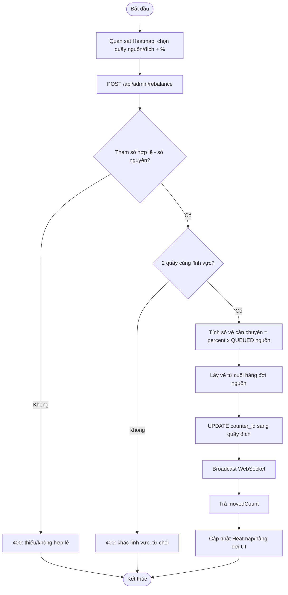

**Biểu đồ tuần tự:**

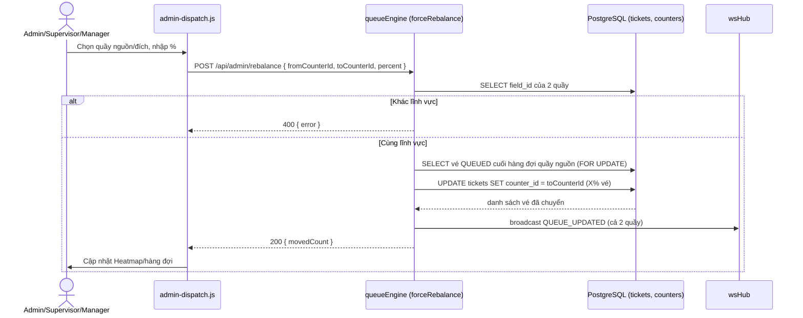
