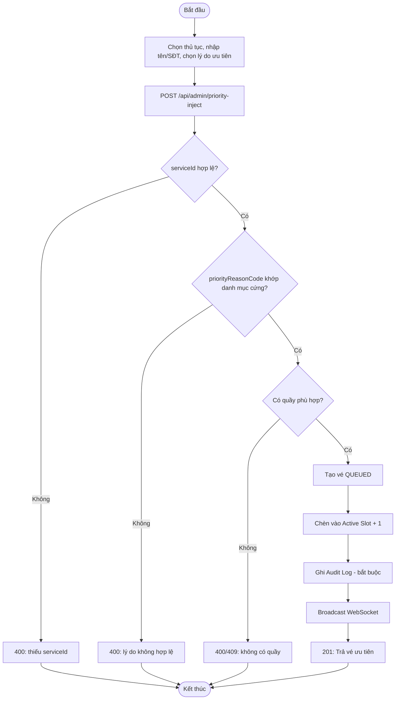
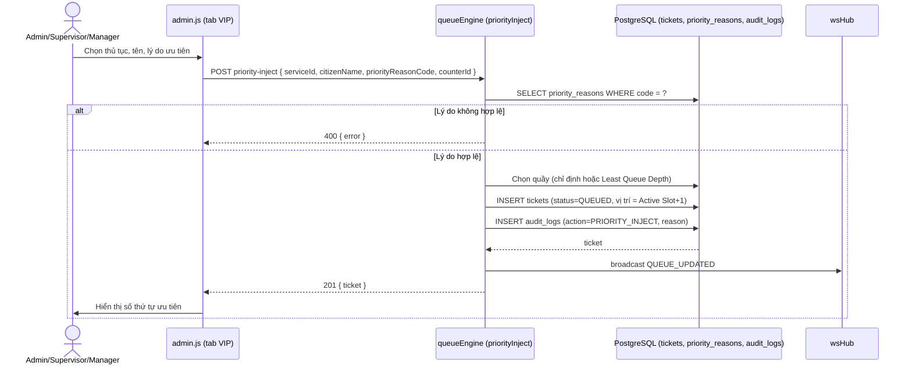
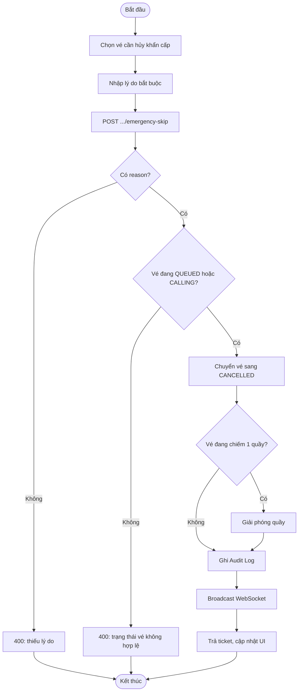
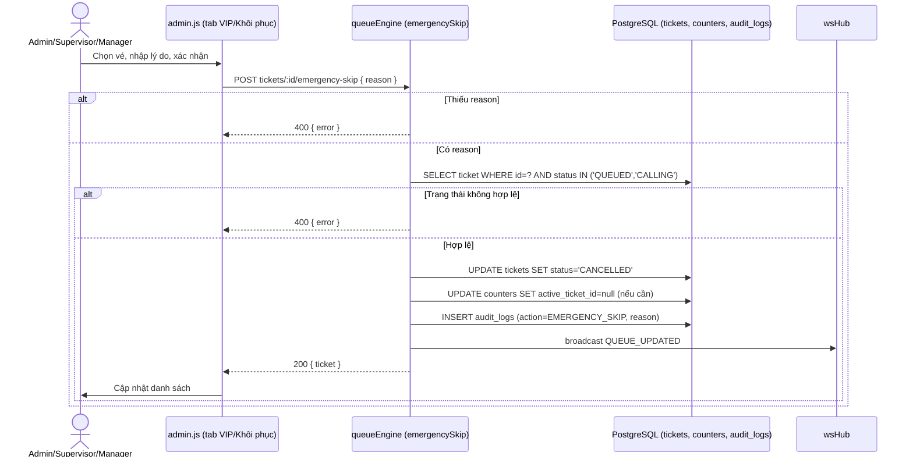
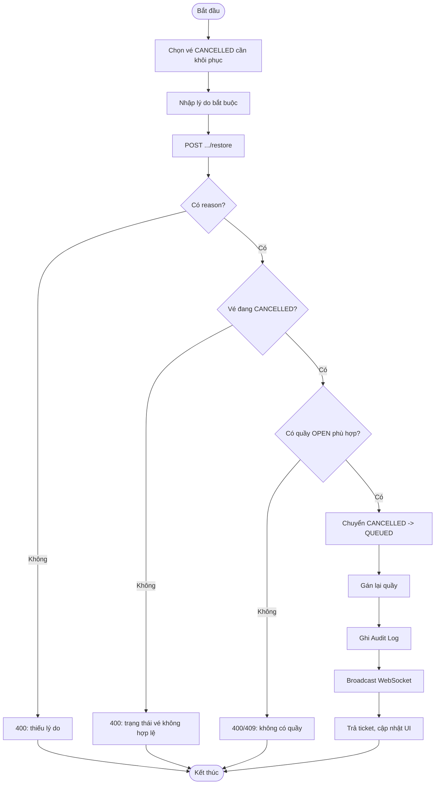
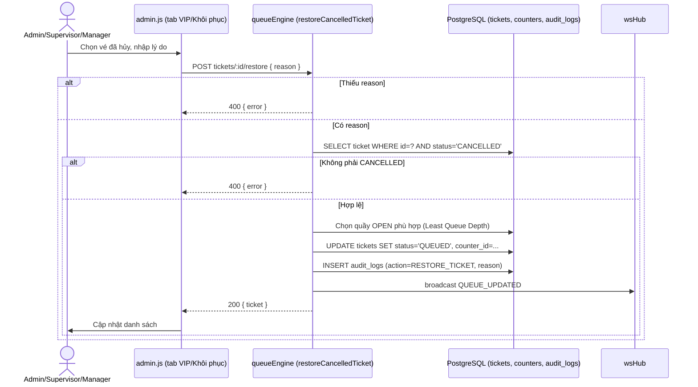

# Module 06 — Ưu tiên / VIP & Khôi phục (Priority & Restore)

Nguồn: `src/routes/adminRoutes.js` (nhóm quyền `PRIORITY_RESTORE`),
`src/services/queueEngine/priorityAndRebalance.js`, `src/services/queueEngine/adminActions.js`.
Actor: Cán bộ Điều phối (Supervisor), Trưởng Trung tâm (Manager), Quản trị viên (Super Admin).
Cả 3 UC trong module này đều **bắt buộc lý do hợp lệ + ghi Audit Log** — không có ngoại lệ.

---

## UC-29 — Chèn vé ưu tiên (VIP Injection)

**Mô tả:** Cấp số thứ tự ưu tiên cho 1 công dân đặc biệt (VD người khuyết tật, người
già, trường hợp khẩn cấp) và chèn thẳng vào vị trí kế tiếp trong hàng đợi (Active Slot +
1) thay vì xếp cuối hàng như quy trình lấy số thông thường (UC-05).

**Actor:** Cán bộ Điều phối, Trưởng Trung tâm, Quản trị viên.

**Priority:** Cao.

**Trigger:** Admin/Supervisor tiếp nhận yêu cầu ưu tiên hợp lệ tại quầy tiếp đón, thao tác trên tab "Khôi phục/VIP".

**Precondition:**
- Người thực hiện thuộc nhóm quyền `PRIORITY_RESTORE`.
- Lý do ưu tiên (`priorityReasonCode`) phải thuộc danh mục cứng đã cấu hình sẵn (`priority_reasons`), **không** được nhập tự do — tránh lạm dụng.

**Validate on form:**
- `serviceId` bắt buộc, số nguyên hợp lệ (`requireInt`).
- `citizenName` bắt buộc (không rỗng — theo cùng chuẩn với UC-05, dù không thấy `requireString` tường minh trong route thì service tầng dưới vẫn cần dữ liệu tối thiểu này).
- `priorityReasonCode` bắt buộc, phải khớp 1 mã trong bảng `priority_reasons`.
- `counterId` tùy chọn (nếu không chỉđịnh, hệ thống tự chọn theo Least Queue Depth như UC-05).

**Post-condition:**
- *Thành công:* tạo vé mới trạng thái `QUEUED`, chèn vào vị trí "Active Slot + 1" của quầy (ngay sau vé đang được xử lý/gọi, ưu tiên hơn mọi vé thường khác); ghi Audit Log kèm lý do; trả HTTP 201 `{ ticket, ... }`; broadcast WebSocket.
- *Thất bại:* thiếu `serviceId`, `priorityReasonCode` không hợp lệ, hoặc không có quầy phù hợp → HTTP 400.

**Basic flow:**
1. Admin/Supervisor tiếp nhận yêu cầu ưu tiên, chọn thủ tục, nhập tên/SĐT công dân, chọn lý do ưu tiên từ danh mục cứng (`GET /api/admin/priority-reasons`).
2. (Tùy chọn) chọn quầy cụ thể để chèn vé.
3. Frontend gọi `POST /api/admin/priority-inject` với `{ serviceId, citizenName, phone, priorityReasonCode, counterId }`.
4. `queueEngine.priorityInject()` xác thực `priorityReasonCode`, tạo vé mới, chèn vào vị trí Active Slot + 1 của quầy được chọn (hoặc tự chọn theo Least Queue Depth).
5. Ghi Audit Log (bắt buộc, kèm lý do).
6. Trả 201 kèm vé; broadcast WebSocket; frontend hiển thị số thứ tự vừa cấp.

**Alternative flow:**
- **3a.** Thiếu `serviceId` → HTTP 400.
- **4a.** `priorityReasonCode` không khớp danh mục cứng → HTTP 400, từ chối tạo vé ưu tiên.
- **4b.** Không chỉ định `counterId` và không có quầy `OPEN` phù hợp → tương tự lỗi `NO_COUNTER_AVAILABLE` như UC-05.

**Biểu đồ hoạt động:**

**Biểu đồ tuần tự:**

---

## UC-30 — Bỏ qua khẩn cấp (Emergency Skip)

**Mô tả:** Cho phép Admin/Supervisor hủy ngay lập tức 1 vé đang chờ (`QUEUED`) hoặc
đang được gọi (`CALLING`) trong tình huống khẩn cấp (VD công dân đã rời đi mà không báo,
sự cố tại quầy), khác với No-show tự động (UC-45) ở chỗ không cần chờ hết timeout/đủ 3 lần.

**Actor:** Cán bộ Điều phối, Trưởng Trung tâm, Quản trị viên.

**Priority:** Trung bình.

**Trigger:** Admin/Supervisor xác định cần hủy khẩn cấp 1 vé cụ thể, thao tác trên tab "Khôi phục/VIP" (chọn vé từ danh sách `GET /api/admin/tickets/actionable`).

**Precondition:** Vé (`id`) tồn tại và đang ở trạng thái có thể hủy (`QUEUED` hoặc `CALLING`); người thực hiện thuộc nhóm quyền `PRIORITY_RESTORE`.

**Validate on form:** `reason` (lý do) **bắt buộc** — không cho phép Emergency Skip mà không ghi rõ lý do.

**Post-condition:**
- *Thành công:* vé chuyển sang `CANCELLED`; nếu vé đang `CALLING` tại 1 quầy, giải phóng quầy đó; ghi Audit Log kèm lý do; broadcast WebSocket.
- *Thất bại:* thiếu `reason`, hoặc vé không ở trạng thái hợp lệ để hủy (VD đã `COMPLETED`) → HTTP 400.

**Basic flow:**
1. Admin/Supervisor chọn vé cần hủy khẩn cấp từ danh sách vé đang hoạt động.
2. Nhập lý do bắt buộc.
3. Frontend gọi `POST /api/admin/tickets/:id/emergency-skip` với `{ reason }`.
4. `queueEngine.emergencySkip(id, adminId, reason)` kiểm tra trạng thái vé hợp lệ, chuyển sang `CANCELLED`.
5. Ghi Audit Log; giải phóng quầy nếu cần.
6. Trả `{ ticket }`; broadcast WebSocket; frontend cập nhật danh sách.

**Alternative flow:**
- **3a.** Thiếu `reason` → HTTP 400, không thực hiện hủy.
- **4a.** Vé không ở trạng thái `QUEUED`/`CALLING` (VD đã `COMPLETED`/`CANCELLED`) → HTTP 400, từ chối thao tác.

**Biểu đồ hoạt động:**

**Biểu đồ tuần tự:**

---

## UC-31 — Khôi phục vé đã hủy nhầm

**Mô tả:** Đưa 1 vé đã ở trạng thái `CANCELLED` (do hủy nhầm, No-show 3-Strike quá tay,
hoặc Emergency Skip sai) quay trở lại hàng đợi `QUEUED`, tránh công dân phải lấy số mới.

**Actor:** Cán bộ Điều phối, Trưởng Trung tâm, Quản trị viên.

**Priority:** Trung bình.

**Trigger:** Admin/Supervisor phát hiện 1 vé bị hủy nhầm (qua phản ánh của công dân hoặc rà soát danh sách), thao tác khôi phục trên tab "Khôi phục/VIP".

**Precondition:** Vé (`id`) tồn tại và đang ở trạng thái `CANCELLED`; người thực hiện thuộc nhóm quyền `PRIORITY_RESTORE`.

**Validate on form:** `reason` (lý do khôi phục) **bắt buộc**, ghi rõ nguyên nhân hủy nhầm.

**Post-condition:**
- *Thành công:* vé chuyển `CANCELLED → QUEUED`, được gán lại vào 1 quầy (theo Least Queue Depth hoặc quầy cũ tùy triển khai); ghi Audit Log; broadcast WebSocket.
- *Thất bại:* thiếu `reason`, hoặc vé không ở trạng thái `CANCELLED` → HTTP 400.

**Basic flow:**
1. Admin/Supervisor chọn vé đã hủy cần khôi phục từ danh sách (`GET /api/admin/tickets/actionable`).
2. Nhập lý do khôi phục.
3. Frontend gọi `POST /api/admin/tickets/:id/restore` với `{ reason }`.
4. `queueEngine.restoreCancelledTicket(id, adminId, reason)` kiểm tra vé đang `CANCELLED`, chuyển về `QUEUED`, gán lại quầy.
5. Ghi Audit Log; trả `{ ticket }`; broadcast WebSocket; frontend cập nhật danh sách.

**Alternative flow:**
- **3a.** Thiếu `reason` → HTTP 400.
- **4a.** Vé không ở trạng thái `CANCELLED` (VD đã `COMPLETED`) → HTTP 400, từ chối khôi phục.
- **4b.** Không còn quầy `OPEN` phù hợp cùng lĩnh vực để gán lại → lỗi tương tự `NO_COUNTER_AVAILABLE`.

**Biểu đồ hoạt động:**

**Biểu đồ tuần tự:**

