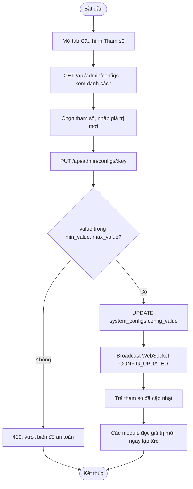
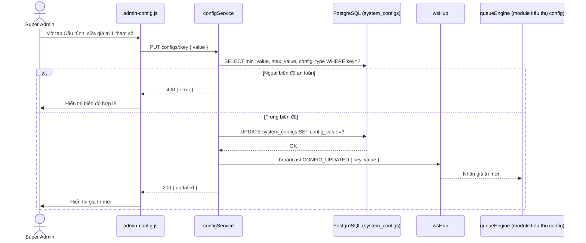
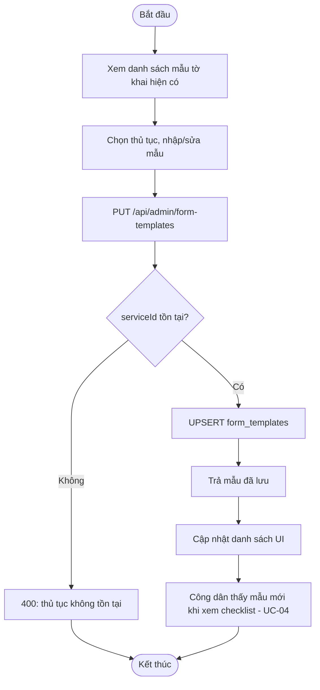
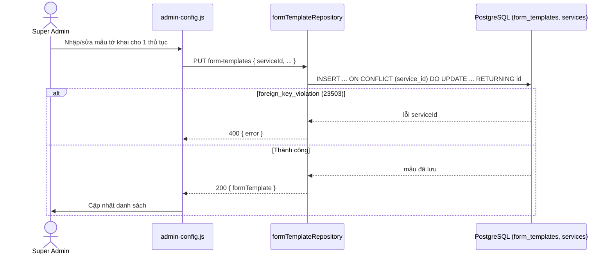

# Module 07 — Cấu hình Tham số Động (Dynamic Policy Engine)

Nguồn: `src/routes/adminRoutes.js` (nhóm quyền `CONFIG`, **chỉ `SUPER_ADMIN`**),
`src/config/configService.js`, `src/repositories/formTemplateRepository.js`.
Actor: Quản trị viên (Super Admin) — đây là nhóm quyền hẹp nhất trong hệ thống.

---

## UC-32 — Xem/Sửa tham số hệ thống (Dynamic Policy Engine)

**Mô tả:** Cho phép Super Admin xem và chỉnh trực tiếp mọi tham số nghiệp vụ lõi
(`CALL_TIMEOUT_SECONDS`, `MAX_RETRY_COUNT`, `MAX_TICKET_LIFETIME_MINUTES`,
`UNDO_BUFFER_SECONDS`, `EOD_PURGE_HOUR`, cấu hình Wi-Fi, TTS...) mà **không cần sửa
code / deploy lại**, có **Safe Limits Validation** (biên độ cứng `min_value`/`max_value`
lưu trong `system_configs`) chặn giá trị nguy hiểm.

**Actor:** Quản trị viên (Super Admin).

**Priority:** Cao (thay đổi trực tiếp hành vi của mọi thuật toán lõi trong `queueEngine`).

**Trigger:** Super Admin mở tab "Cấu hình Tham số" trên `admin.html`.

**Precondition:** Người thực hiện có vai trò `SUPER_ADMIN` (nhóm quyền `CONFIG` chỉ cho phép duy nhất vai trò này).

**Validate on form:**
- Giá trị mới (`value`) phải nằm trong khoảng `[min_value, max_value]` đã định nghĩa sẵn cho từng `key` trong `system_configs` (Safe Limits Validation) — VD `CALL_TIMEOUT_SECONDS` chỉ nhận 30–120, `MAX_RETRY_COUNT` chỉ nhận 1–5.
- Kiểu dữ liệu (`NUMBER`/`STRING`...) phải khớp `config_type` đã khai báo.

**Post-condition:**
- *Thành công:* `system_configs.config_value` được cập nhật (trigger `set_updated_at` tự cập nhật `updated_at`); broadcast WebSocket sự kiện `CONFIG_UPDATED` để các module khác (queueEngine, display) áp dụng ngay lập tức, không cần khởi động lại server.
- *Thất bại:* giá trị vượt biên độ an toàn hoặc sai kiểu → HTTP 400, giữ nguyên giá trị cũ.

**Basic flow:**
1. Super Admin mở tab "Cấu hình Tham số", xem danh sách tham số hiện tại (`GET /api/admin/configs`).
2. Chọn 1 tham số, nhập giá trị mới.
3. Frontend gọi `PUT /api/admin/configs/:key` với `{ value }`.
4. `configService.set(key, value, adminId)` kiểm tra `value` nằm trong `[min_value, max_value]` của `key` đó (Safe Limits Validation).
5. Cập nhật `system_configs`; broadcast WebSocket `CONFIG_UPDATED`.
6. Trả tham số đã cập nhật; frontend hiển thị giá trị mới, các module liên quan (VD `queueEngine`) đọc giá trị mới ngay ở lần dùng tiếp theo.

**Alternative flow:**
- **4a.** `value` nằm ngoài `[min_value, max_value]` → HTTP 400, từ chối cập nhật, hiển thị biên độ hợp lệ cho Super Admin biết.
- **4b.** `key` không tồn tại trong `system_configs` → HTTP 400/404.

**Biểu đồ hoạt động:**

**Biểu đồ tuần tự:**

---

## UC-33 — Cấu hình mẫu tờ khai / biểu mẫu theo thủ tục

**Mô tả:** Quản lý mẫu tờ khai (`form_templates`) gắn với từng thủ tục hành chính, để
công dân tải về tại bước xem checklist (UC-04) và Officer tham chiếu khi xử lý hồ sơ.

**Actor:** Quản trị viên (Super Admin).

**Priority:** Trung bình.

**Trigger:** Super Admin mở tab "Cấu hình Tham số" → mục "Mẫu Tờ khai", chọn thủ tục cần gắn/sửa mẫu.

**Precondition:** Thủ tục (`serviceId`) tương ứng đã tồn tại trong `services`.

**Validate on form:** Dữ liệu mẫu tờ khai (tên file, đường dẫn/nội dung, `serviceId`) phải hợp lệ; `serviceId` phải tồn tại (ràng buộc khóa ngoại).

**Post-condition:**
- *Thành công:* upsert 1 dòng `form_templates` (`INSERT ... ON CONFLICT` dùng `RETURNING id` — điểm đặc thù Postgres khác `insertId` của MySQL); công dân xem checklist thủ tục đó (UC-04) sẽ thấy mẫu tờ khai mới ngay lập tức.
- *Thất bại:* `serviceId` không tồn tại (vi phạm khóa ngoại) → HTTP 400.

**Basic flow:**
1. Super Admin mở danh sách mẫu tờ khai hiện có (`GET /api/admin/form-templates`).
2. Chọn thủ tục, nhập/cập nhật thông tin mẫu tờ khai.
3. Frontend gọi `PUT /api/admin/form-templates` với dữ liệu mẫu.
4. `formTemplateRepo.upsert()` insert mới hoặc cập nhật nếu đã tồn tại cho `serviceId` đó.
5. Trả mẫu tờ khai đã lưu; frontend cập nhật danh sách.

**Alternative flow:**
- **4a.** `serviceId` không tồn tại (FK violation) → HTTP 400.
- **2a.** Thủ tục chưa có mẫu tờ khai nào → form trống, Super Admin nhập mới hoàn toàn (tạo mới thay vì cập nhật).

**Biểu đồ hoạt động:**

**Biểu đồ tuần tự:**

