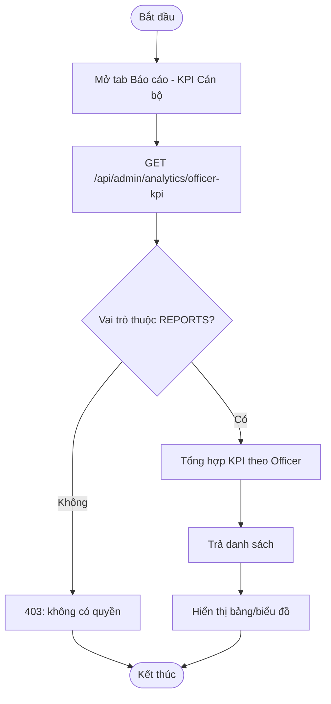
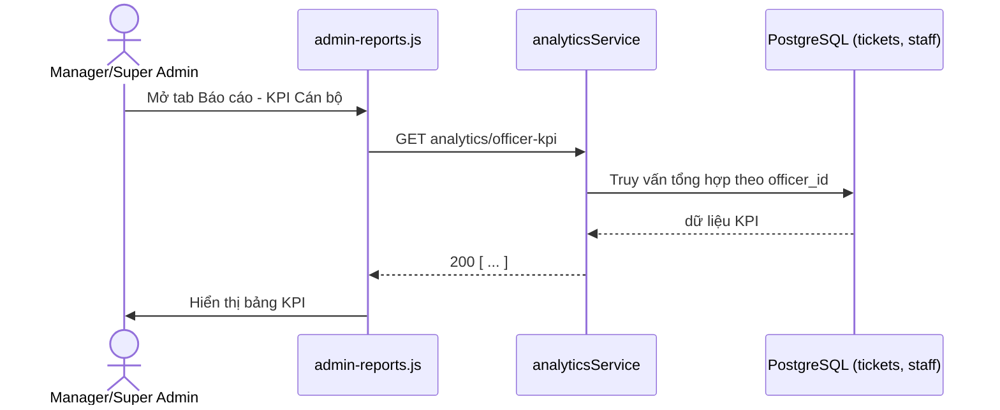
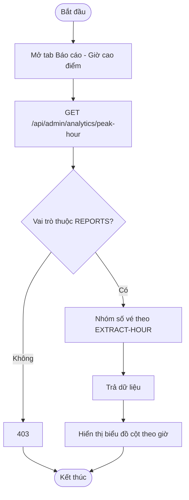
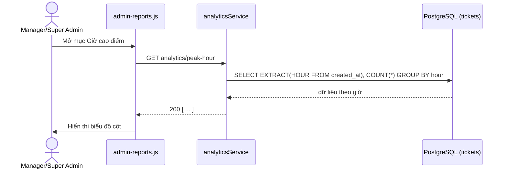
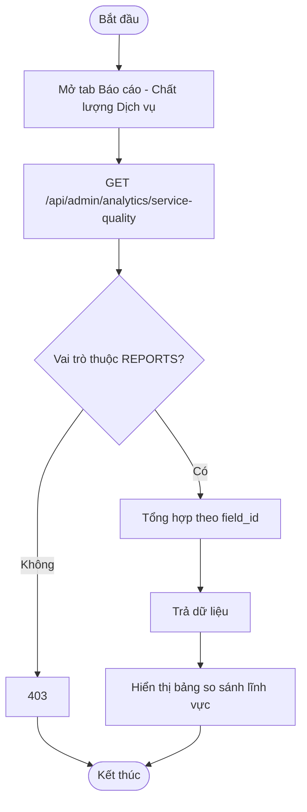
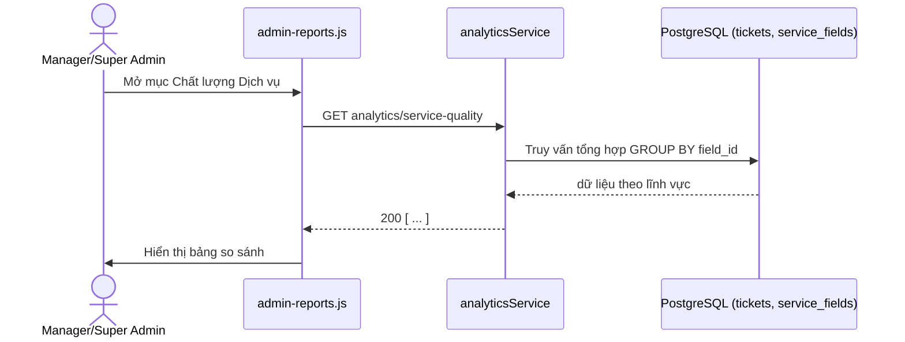
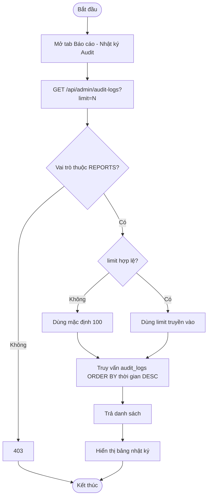
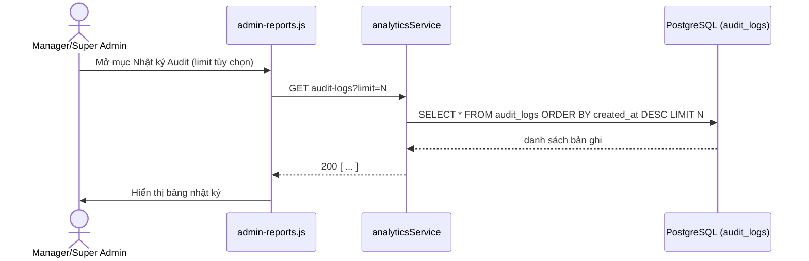

# Module 08 — Báo cáo & Audit (Reports)

Nguồn: `src/routes/adminRoutes.js` (nhóm quyền `REPORTS`, chỉ `SUPER_ADMIN` và `MANAGER`),
`src/services/analyticsService.js`. Actor: Trưởng Trung tâm (Manager), Quản trị viên
(Super Admin) — Supervisor **không** có quyền xem module này.

---

## UC-34 — Xem KPI cán bộ

**Mô tả:** Thống kê hiệu suất từng Officer (số hồ sơ xử lý, thời gian trung bình mỗi hồ
sơ, tỷ lệ No-show...) để Manager đánh giá năng suất và phân bổ nhân lực.

**Actor:** Trưởng Trung tâm, Quản trị viên.

**Priority:** Trung bình.

**Trigger:** Mở tab "Báo cáo" trên `admin.html`, mục "KPI Cán bộ".

**Precondition:** Người thực hiện thuộc nhóm quyền `REPORTS` (`SUPER_ADMIN` hoặc `MANAGER`).

**Validate on form:** Không có input bắt buộc (có thể có tham số khoảng thời gian tùy UI, không bắt buộc theo route hiện tại).

**Post-condition:** Trả danh sách KPI theo từng Officer; không ghi dữ liệu.

**Basic flow:**
1. Manager/Super Admin mở tab "Báo cáo" → "KPI Cán bộ".
2. Frontend gọi `GET /api/admin/analytics/officer-kpi`.
3. `requirePermission('REPORTS')` xác thực quyền.
4. `analyticsService.getOfficerKpi()` tổng hợp số liệu theo từng Officer.
5. Trả kết quả; frontend hiển thị bảng/biểu đồ KPI.

**Alternative flow:**
- **3a.** Vai trò `SUPERVISOR`/`OFFICER` gọi API này → HTTP 403 (không thuộc nhóm `REPORTS`).
- **4a.** Chưa có dữ liệu (hệ thống mới triển khai) → trả danh sách rỗng.

**Biểu đồ hoạt động:**

**Biểu đồ tuần tự:**

---

## UC-35 — Xem phân tích giờ cao điểm

**Mô tả:** Phân tích lưu lượng vé theo khung giờ trong ngày để xác định giờ cao điểm,
phục vụ lập kế hoạch bố trí nhân sự theo ca.

**Actor:** Trưởng Trung tâm, Quản trị viên.

**Priority:** Thấp.

**Trigger:** Mở tab "Báo cáo" → mục "Giờ cao điểm".

**Precondition:** Người thực hiện thuộc nhóm quyền `REPORTS`.

**Validate on form:** Không có input bắt buộc.

**Post-condition:** Trả dữ liệu phân bố vé theo giờ (`EXTRACT(HOUR FROM ...)`); không ghi dữ liệu.

**Basic flow:**
1. Manager/Super Admin mở mục "Giờ cao điểm".
2. Frontend gọi `GET /api/admin/analytics/peak-hour`.
3. `analyticsService.getPeakHourAnalysis()` nhóm số vé theo giờ trong ngày.
4. Trả kết quả; frontend hiển thị biểu đồ cột theo giờ.

**Alternative flow:**
- **3a.** Chưa đủ dữ liệu lịch sử (hệ thống mới) → biểu đồ hiển thị rất ít cột/rỗng.

**Biểu đồ hoạt động:**

**Biểu đồ tuần tự:**

---

## UC-36 — Xem chất lượng dịch vụ theo lĩnh vực

**Mô tả:** So sánh chất lượng phục vụ (thời gian chờ trung bình, tỷ lệ hoàn tất, tỷ lệ
No-show...) giữa các lĩnh vực dịch vụ khác nhau, hỗ trợ Manager xác định lĩnh vực cần
cải thiện.

**Actor:** Trưởng Trung tâm, Quản trị viên.

**Priority:** Trung bình.

**Trigger:** Mở tab "Báo cáo" → mục "Chất lượng Dịch vụ".

**Precondition:** Người thực hiện thuộc nhóm quyền `REPORTS`.

**Validate on form:** Không có input bắt buộc.

**Post-condition:** Trả số liệu chất lượng theo từng lĩnh vực; không ghi dữ liệu.

**Basic flow:**
1. Manager/Super Admin mở mục "Chất lượng Dịch vụ".
2. Frontend gọi `GET /api/admin/analytics/service-quality`.
3. `analyticsService.getServiceQualityByField()` tổng hợp theo `field_id`.
4. Trả kết quả; frontend hiển thị bảng so sánh giữa các lĩnh vực.

**Alternative flow:**
- **3a.** 1 lĩnh vực chưa từng phát sinh vé nào → dòng dữ liệu tương ứng hiển thị 0/rỗng.

**Biểu đồ hoạt động:**

**Biểu đồ tuần tự:**

---

## UC-37 — Xem nhật ký Audit

**Mô tả:** Tra cứu lịch sử mọi thao tác nhạy cảm trong hệ thống (đổi trạng thái quầy,
VIP Injection, Emergency Skip, khôi phục vé, đổi cấu hình, quản lý tài khoản...) kèm
người thực hiện, lý do, thời điểm — phục vụ truy vết trách nhiệm.

**Actor:** Trưởng Trung tâm, Quản trị viên.

**Priority:** Cao (yêu cầu bắt buộc về minh bạch/truy vết cho mọi thao tác có ghi Audit Log ở các module khác).

**Trigger:** Mở tab "Báo cáo" → mục "Nhật ký Audit".

**Precondition:** Người thực hiện thuộc nhóm quyền `REPORTS`.

**Validate on form:** `limit` (số dòng tối đa) tùy chọn qua query string, mặc định 100 nếu không truyền hoặc không phải số hợp lệ (`Number(req.query.limit) || 100`).

**Post-condition:** Trả danh sách bản ghi Audit gần nhất (giới hạn theo `limit`); không ghi dữ liệu.

**Basic flow:**
1. Manager/Super Admin mở mục "Nhật ký Audit", có thể chỉnh số lượng bản ghi muốn xem.
2. Frontend gọi `GET /api/admin/audit-logs?limit=N`.
3. `analyticsService.getAuditLogs(limit)` truy vấn `audit_logs` sắp theo thời gian giảm dần.
4. Trả danh sách; frontend hiển thị bảng nhật ký (thời gian, người thực hiện, hành động, lý do).

**Alternative flow:**
- **2a.** Không truyền `limit` hoặc truyền giá trị không hợp lệ (VD chữ) → mặc định lấy 100 bản ghi gần nhất.
- **3a.** Chưa có bản ghi Audit nào → trả danh sách rỗng.

**Biểu đồ hoạt động:**

**Biểu đồ tuần tự:**

