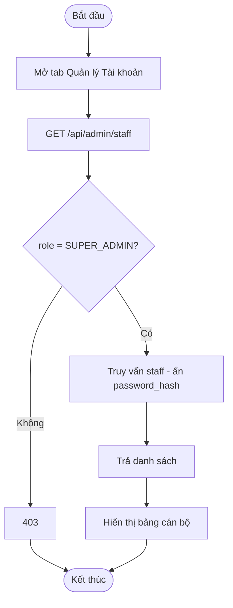
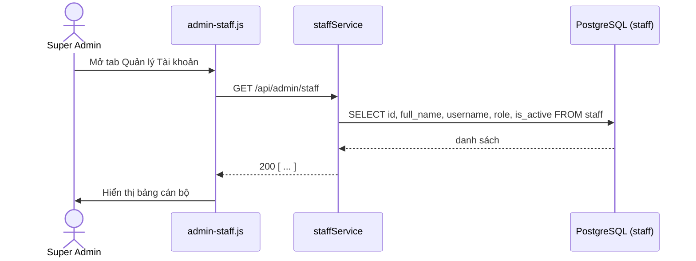
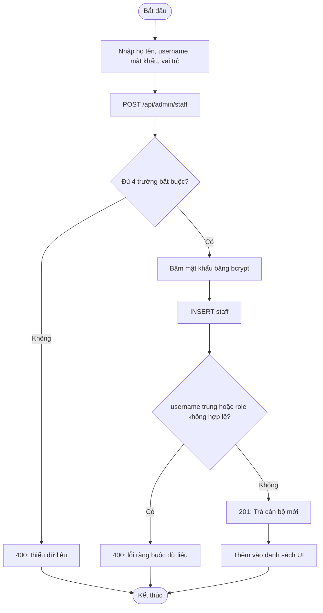
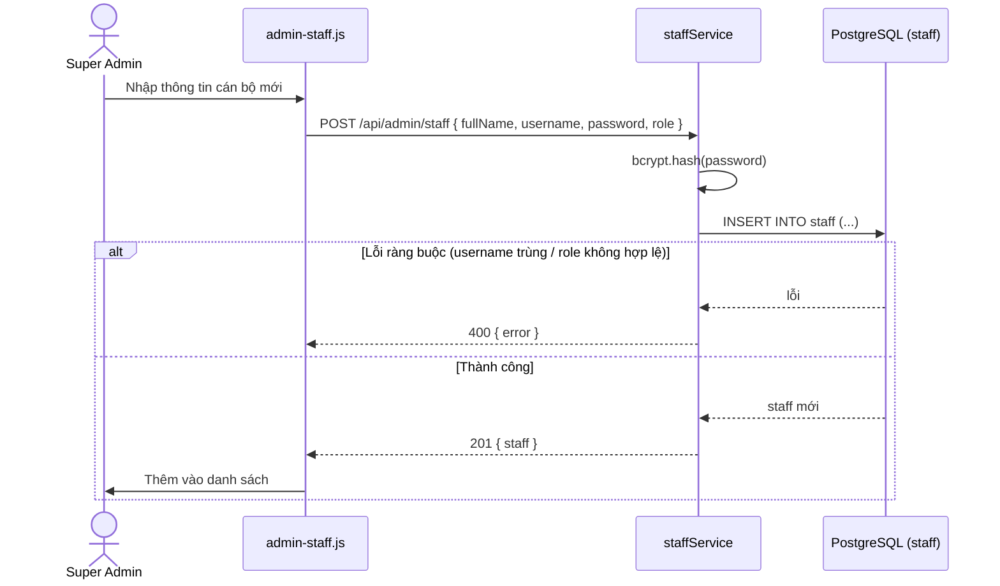
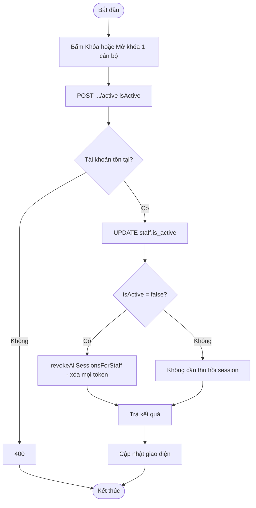
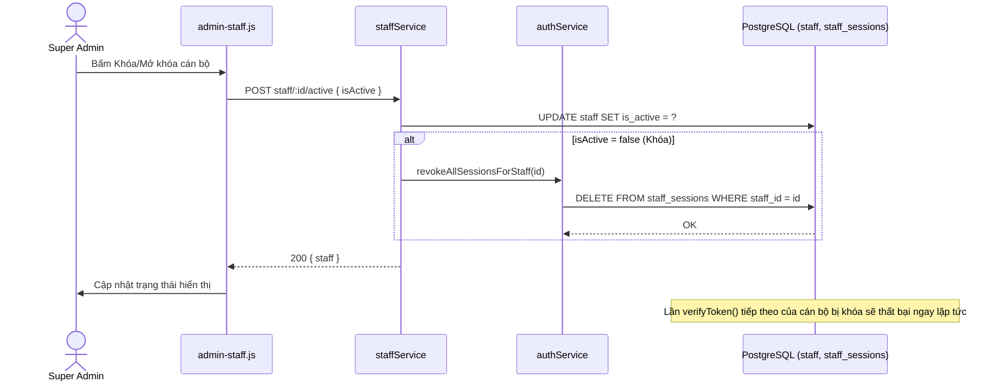
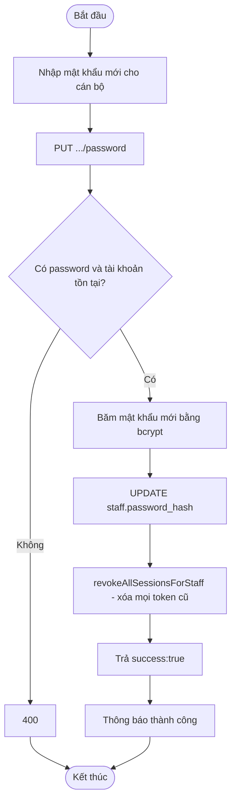
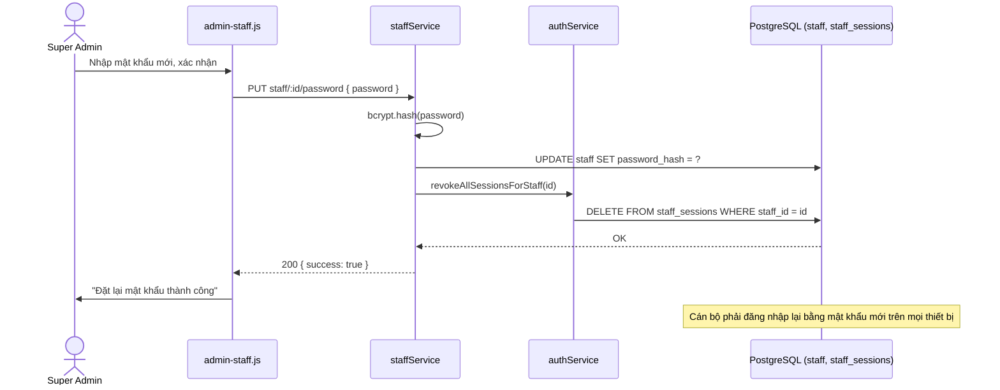

# Module 09 — Quản lý Tài khoản Cán bộ (Staff Management)

Nguồn: `src/routes/adminRoutes.js` (nhóm quyền `STAFF_MANAGEMENT`, **chỉ `SUPER_ADMIN`**),
`src/services/staffService.js`, `src/services/authService.js` (thu hồi phiên).
Actor: Quản trị viên (Super Admin) — nhóm quyền hẹp nhất cùng với `CONFIG` (module 07).

---

## UC-38 — Xem danh sách cán bộ

**Mô tả:** Liệt kê toàn bộ tài khoản cán bộ trong hệ thống (Officer, Supervisor,
Manager, Super Admin khác) kèm trạng thái hoạt động.

**Actor:** Quản trị viên (Super Admin).

**Priority:** Trung bình.

**Trigger:** Mở tab "Quản lý Tài khoản" trên `admin.html`.

**Precondition:** Người thực hiện có vai trò `SUPER_ADMIN`.

**Validate on form:** Không có input.

**Post-condition:** Trả danh sách cán bộ (không trả `password_hash` ra ngoài); không ghi dữ liệu.

**Basic flow:**
1. Super Admin mở tab "Quản lý Tài khoản".
2. Frontend gọi `GET /api/admin/staff`.
3. `staffService.listStaff()` trả danh sách cán bộ (loại bỏ trường nhạy cảm).
4. Frontend hiển thị bảng danh sách kèm nút Khóa/Mở khóa, Đặt lại mật khẩu.

**Alternative flow:**
- **3a.** Vai trò không phải `SUPER_ADMIN` → HTTP 403.

**Biểu đồ hoạt động:**

**Biểu đồ tuần tự:**

---

## UC-39 — Tạo tài khoản cán bộ mới

**Mô tả:** Khởi tạo 1 tài khoản cán bộ mới (Officer/Supervisor/Manager/Super Admin) với
mật khẩu được băm bằng bcrypt trước khi lưu.

**Actor:** Quản trị viên (Super Admin).

**Priority:** Trung bình.

**Trigger:** Super Admin bấm "Thêm cán bộ" trên tab "Quản lý Tài khoản".

**Precondition:** Người thực hiện có vai trò `SUPER_ADMIN`.

**Validate on form:**
- `fullName`, `username`, `password`, `role` đều bắt buộc.
- `role` phải thuộc tập `{SUPER_ADMIN, MANAGER, SUPERVISOR, OFFICER}` (ràng buộc `CHECK` ở DB).
- `username` phải duy nhất trong hệ thống.
- Mật khẩu nên tuân theo chính sách độ mạnh tối thiểu (độ dài, không phải mật khẩu mặc định `changeme` khi lên production — khuyến nghị vận hành, không phải ràng buộc cứng trong code hiện tại).

**Post-condition:**
- *Thành công:* tạo dòng mới trong `staff` với `password_hash` (bcrypt), `is_active = 1` mặc định; trả HTTP 201 kèm thông tin cán bộ (không trả `password_hash`).
- *Thất bại:* `username` đã tồn tại, thiếu trường bắt buộc, hoặc `role` không hợp lệ → HTTP 400.

**Basic flow:**
1. Super Admin nhập họ tên, username, mật khẩu, chọn vai trò.
2. Frontend gọi `POST /api/admin/staff` với `{ fullName, username, password, role }`.
3. `staffService.createStaff()` băm mật khẩu bằng bcrypt, insert vào `staff`.
4. Trả 201 kèm thông tin cán bộ mới; frontend thêm vào danh sách.

**Alternative flow:**
- **2a.** Thiếu 1 trong 4 trường bắt buộc → HTTP 400.
- **3a.** `username` đã tồn tại (unique violation) → HTTP 400.
- **3b.** `role` không thuộc danh sách hợp lệ → HTTP 400 (vi phạm `CHECK` constraint).

**Biểu đồ hoạt động:**

**Biểu đồ tuần tự:**

---

## UC-40 — Khóa/Mở khóa tài khoản

**Mô tả:** Vô hiệu hóa (khóa) hoặc kích hoạt lại (mở khóa) 1 tài khoản cán bộ. Khi khóa,
mọi phiên đăng nhập hiện có của cán bộ đó bị thu hồi **ngay lập tức** (không chờ token
tự hết hạn sau 8 giờ) — khắc phục lỗ hổng đã từng xảy ra: tài khoản vừa bị khóa vẫn
thao tác được tiếp tối đa 8 giờ bằng token cũ.

**Actor:** Quản trị viên (Super Admin).

**Priority:** Cao (liên quan trực tiếp tới bảo mật — hiệu lực khóa tài khoản tức thời).

**Trigger:** Super Admin bấm nút "Khóa"/"Mở khóa" trên 1 dòng cán bộ trong danh sách.

**Precondition:** Tài khoản (`id`) tồn tại; người thực hiện có vai trò `SUPER_ADMIN`.

**Validate on form:** `isActive` (boolean) bắt buộc trong body.

**Post-condition:**
- *Khóa (`isActive = false`):* `staff.is_active = 0`; gọi `authService.revokeAllSessionsForStaff()` xóa **toàn bộ** dòng trong `staff_sessions` của cán bộ đó → mọi token cũ lập tức vô hiệu (do `verifyToken()` cũng đối chiếu `is_active` ngay trong câu SELECT).
- *Mở khóa (`isActive = true`):* `staff.is_active = 1`; cán bộ cần đăng nhập lại (UC-01) để có token mới.
- *Thất bại:* tài khoản không tồn tại → HTTP 400.

**Basic flow:**
1. Super Admin bấm "Khóa" trên 1 cán bộ đang hoạt động.
2. Frontend gọi `POST /api/admin/staff/:id/active` với `{ isActive: false }`.
3. `staffService.setStaffActive(id, false, adminId)` cập nhật `is_active = 0`.
4. Gọi `authService.revokeAllSessionsForStaff(id)` xóa toàn bộ session của cán bộ đó.
5. Trả kết quả; frontend cập nhật trạng thái hiển thị.
6. (Nếu cán bộ đó đang có phiên mở ở thiết bị khác) lần gọi API tiếp theo của họ sẽ nhận HTTP 401 do session đã bị xóa.

**Alternative flow:**
- **1a.** Super Admin bấm "Mở khóa" cho tài khoản đang bị khóa → `isActive: true` → chỉ cập nhật `is_active = 1`, không cần thu hồi session (vì đang không có session hợp lệ).
- **3a.** Tài khoản không tồn tại → HTTP 400.

**Biểu đồ hoạt động:**

**Biểu đồ tuần tự:**

---

## UC-41 — Đặt lại mật khẩu cán bộ

**Mô tả:** Super Admin đặt mật khẩu mới cho 1 cán bộ (khi họ quên mật khẩu hoặc theo
chính sách bảo mật định kỳ), đồng thời thu hồi toàn bộ phiên cũ để buộc đăng nhập lại
bằng mật khẩu mới ngay lập tức.

**Actor:** Quản trị viên (Super Admin).

**Priority:** Cao (cùng lý do bảo mật như UC-40 — hiệu lực tức thời, không chờ token hết hạn).

**Trigger:** Super Admin bấm "Đặt lại mật khẩu" trên 1 dòng cán bộ, nhập mật khẩu mới.

**Precondition:** Tài khoản (`id`) tồn tại; người thực hiện có vai trò `SUPER_ADMIN`.

**Validate on form:** `password` (mật khẩu mới) bắt buộc, không rỗng; nên tuân theo chính sách độ mạnh tối thiểu do tổ chức quy định.

**Post-condition:**
- *Thành công:* `staff.password_hash` được cập nhật (băm mới bằng bcrypt); `authService.revokeAllSessionsForStaff()` xóa toàn bộ session cũ; trả `{ success: true }`; cán bộ phải đăng nhập lại (UC-01) bằng mật khẩu mới trên mọi thiết bị.
- *Thất bại:* thiếu `password` hoặc tài khoản không tồn tại → HTTP 400.

**Basic flow:**
1. Super Admin bấm "Đặt lại mật khẩu" trên 1 cán bộ, nhập mật khẩu mới.
2. Frontend gọi `PUT /api/admin/staff/:id/password` với `{ password }`.
3. `staffService.resetStaffPassword(id, password, adminId)` băm mật khẩu mới, cập nhật `staff.password_hash`.
4. Gọi `authService.revokeAllSessionsForStaff(id)` xóa toàn bộ session cũ.
5. Trả `{ success: true }`; frontend thông báo đã đặt lại thành công.

**Alternative flow:**
- **2a.** Thiếu `password` → HTTP 400.
- **3a.** Tài khoản không tồn tại → HTTP 400.

**Biểu đồ hoạt động:**

**Biểu đồ tuần tự:**

