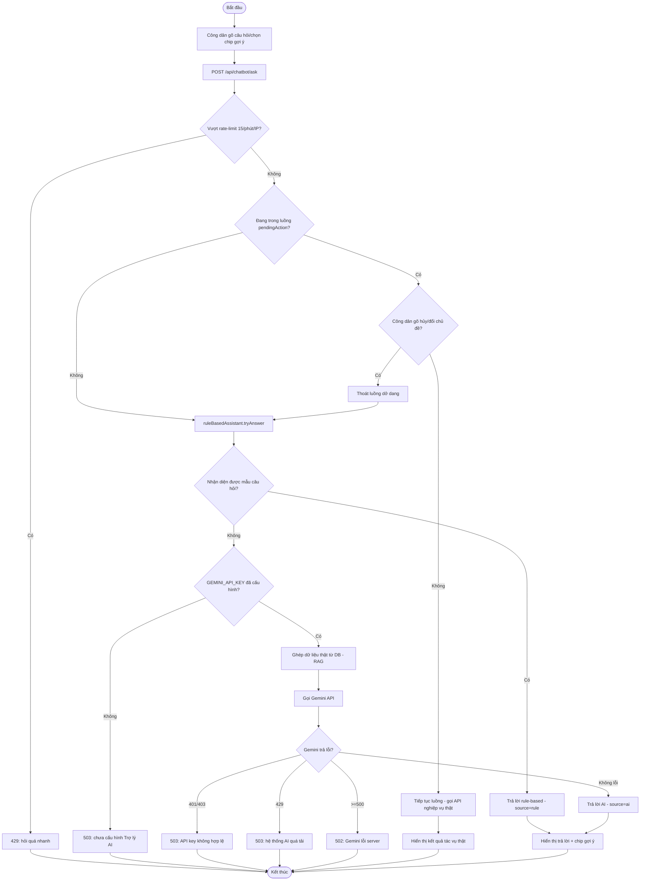
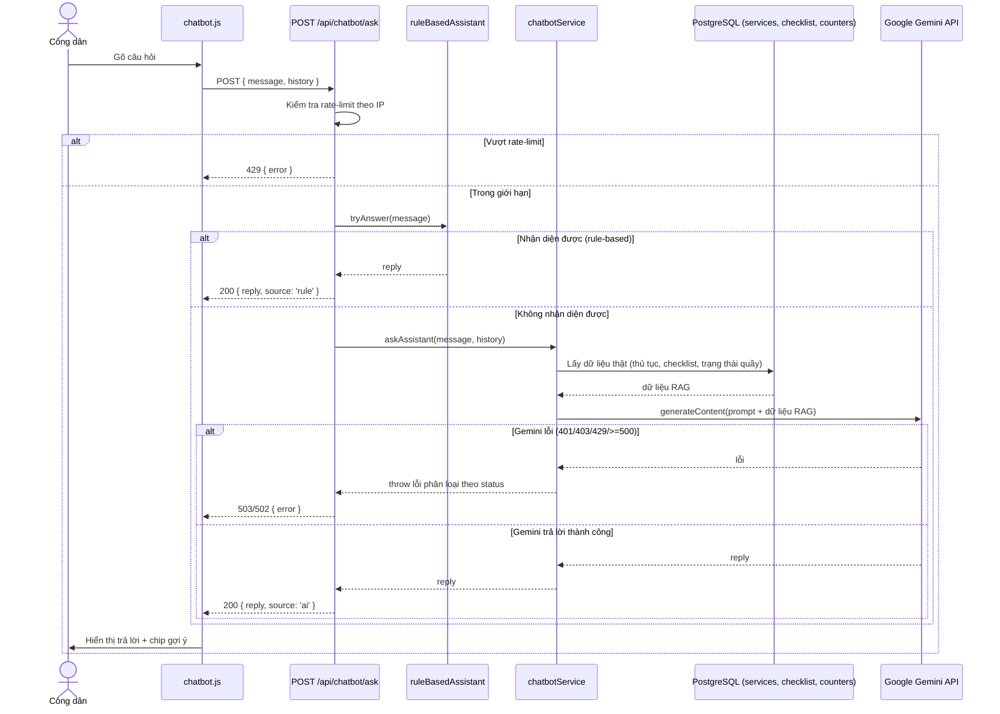

# Module 10 — Trợ lý AI (Chatbot)

Nguồn: `src/routes/chatbotRoutes.js`, `src/services/chatbotService.js`,
`src/services/ruleBasedAssistant.js`, `src/services/kioskFeatureGuide.js`,
`public/js/chatbot.js`. Public route, không yêu cầu đăng nhập, có rate-limit 15
câu/phút/IP.

---

## UC-42 — Hỏi đáp Trợ lý AI (Rule-based + Gemini fallback/RAG)

**Mô tả:** Cho phép công dân đặt câu hỏi tự do (thủ tục, giấy tờ, Wi-Fi, DVC,
Re-entry...) qua widget chatbot nổi trên mọi trang công khai. Hệ thống ưu tiên trả lời
bằng bộ rule-based (miễn phí, không giới hạn, không bao giờ "bịa") — chỉ khi không nhận
diện được mẫu câu hỏi phổ biến mới gọi tới Gemini API, kèm dữ liệu thật từ DB làm căn cứ
bắt buộc (RAG) để tránh AI tự bịa thông tin thủ tục không có thật.

**Actor:** Công dân, Trợ lý AI (Chatbot).

**Priority:** Trung bình (hỗ trợ, không phải luồng nghiệp vụ bắt buộc).

**Trigger:** Công dân gõ câu hỏi vào widget chatbot (nút 💬 nổi góc phải mọi trang), hoặc widget tự mở kèm gợi ý trên Trang chủ sau 1.2s (1 lần/phiên trình duyệt).

**Precondition:**
- Không yêu cầu đăng nhập.
- Nếu câu hỏi rơi vào nhánh cần gọi Gemini API, biến môi trường `GEMINI_API_KEY` phải được cấu hình hợp lệ (nếu không, trả lỗi thân thiện thay vì crash).

**Validate on form:**
- `message` (nội dung câu hỏi) bắt buộc.
- `history` (lịch sử hội thoại) tùy chọn, dùng làm ngữ cảnh khi gọi Gemini.
- Giới hạn tốc độ: tối đa 15 request/phút/IP (đếm trong bộ nhớ, theo cửa sổ trượt 60s) — vượt quá bị từ chối ngay, không tính vào chi phí API.

**Post-condition:**
- *Trả lời bằng rule-based:* trả `{ reply, source: 'rule' }`, không tốn chi phí API.
- *Trả lời bằng Gemini (RAG):* câu hỏi được ghép kèm dữ liệu thật (danh mục thủ tục, checklist giấy tờ, trạng thái quầy hiện tại) trước khi gửi cho Gemini; trả `{ reply, source: 'ai' }`.
- *Tác vụ tương tác thật (Wi-Fi QR / DVC / Re-entry):* chatbot có thể hỏi lại 1 thông tin cần thiết trước khi gọi API thật tương ứng (UC-07/UC-08/UC-09) — trạng thái đang hỏi lưu ở `pendingAction` phía frontend; công dân có thể gõ "hủy" hoặc đổi chủ đề bất kỳ lúc nào để thoát luồng dở dang (đã từng là lỗi: tin nhắn tiếp theo bị luồng cũ "nuốt" hết, không lối thoát — nay đã sửa).
- *Thất bại — rate limit:* HTTP 429, thông báo "hỏi quá nhanh, thử lại sau".
- *Thất bại — chưa cấu hình `GEMINI_API_KEY`:* HTTP 503, thông báo liên hệ quản trị viên; **không làm sập server**.
- *Thất bại — API key sai/hết quyền (401/403 từ Gemini):* HTTP 503, thông báo cấu hình sai.
- *Thất bại — Gemini quá tải (429 từ Gemini):* HTTP 503, thông báo hệ thống AI đang quá tải.
- *Thất bại — lỗi Gemini phía server (>=500):* HTTP 502.
- *Thất bại khác:* HTTP 400 kèm thông báo lỗi chung.

**Basic flow:**
1. Công dân gõ câu hỏi vào widget chatbot (hoặc chọn 1 chip gợi ý có sẵn).
2. Frontend gọi `POST /api/chatbot/ask` với `{ message, history }`.
3. Server kiểm tra rate-limit theo IP (tối đa 15 req/phút).
4. `ruleBasedAssistant.tryAnswer(message)` thử nhận diện mẫu câu hỏi phổ biến.
5. Nếu nhận diện được → trả ngay `{ reply, source: 'rule' }` (bỏ qua bước gọi Gemini).
6. Nếu không nhận diện được → `chatbotService.askAssistant(message, history)` ghép dữ liệu thật từ DB (RAG) rồi gọi Gemini API.
7. Trả `{ reply, source: 'ai' }`; widget hiển thị câu trả lời + các chip gợi ý tiếp theo (không mất hẳn sau câu hỏi đầu).

**Alternative flow:**
- **3a.** Vượt quá 15 request/phút từ cùng 1 IP → HTTP 429, dừng luồng ngay, không chạm tới `ruleBasedAssistant`/Gemini.
- **1a.** Câu hỏi thuộc 1 trong 3 tác vụ tương tác thật (Wi-Fi/DVC/Re-entry) → chatbot hỏi lại thông tin cần thiết (VD mức VNeID, mã QR Re-entry) → khi công dân trả lời, chatbot gọi thẳng API nghiệp vụ tương ứng (UC-07/UC-08/UC-09) thay vì trả lời tĩnh.
- **1b.** Giữa lúc đang trong luồng hỏi lại (`pendingAction`), công dân gõ "hủy" hoặc hỏi hẳn 1 chủ đề khác → chatbot thoát luồng dở dang, xử lý câu hỏi mới bình thường (không bị "giam" trong luồng cũ).
- **6a.** `GEMINI_API_KEY` chưa cấu hình → ném `ChatbotConfigError` → HTTP 503, thông báo thân thiện, log lỗi phía server.
- **6b.** Gemini trả lỗi 401/403 → HTTP 503 "API key không hợp lệ".
- **6c.** Gemini trả lỗi 429 → HTTP 503 "hệ thống AI đang quá tải".
- **6d.** Gemini trả lỗi ≥500 → HTTP 502.

**Biểu đồ hoạt động:**

**Biểu đồ tuần tự:**

