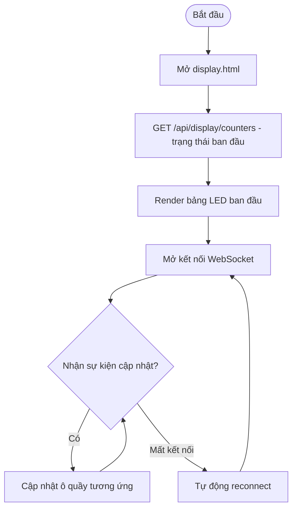
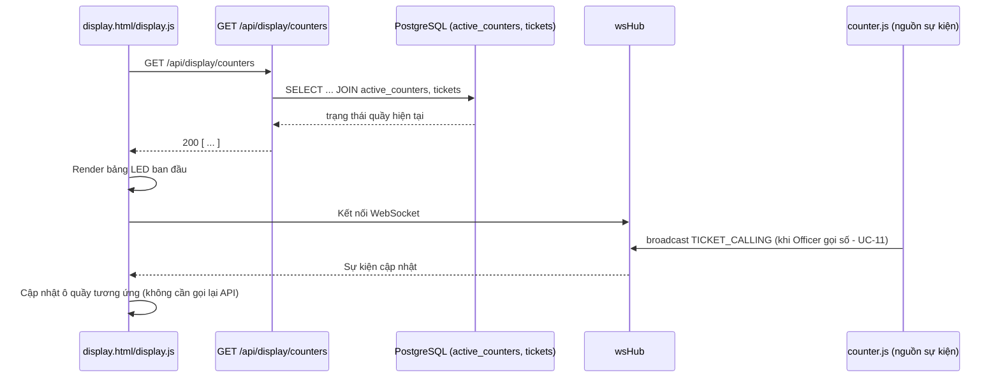
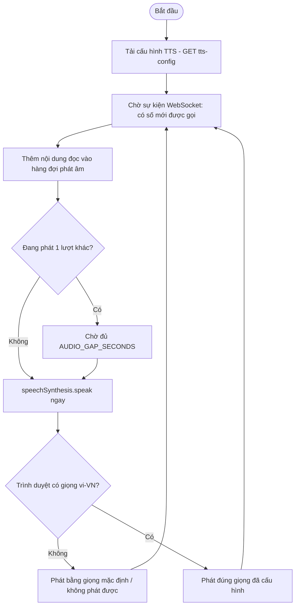
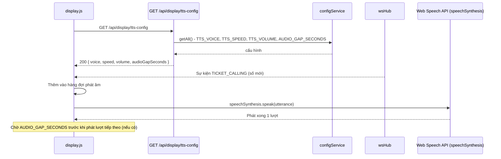

# Module 11 — Bảng LED / Loa PA (Display)

Nguồn: `src/routes/displayRoutes.js`, `public/display.html`, `public/js/display.js`,
`src/websocket/wsHub.js`, Web Speech API (`speechSynthesis`). Public route, không yêu
cầu đăng nhập — thiết bị hiển thị công khai đặt tại sảnh chờ.

---

## UC-43 — Hiển thị số đang gọi trên Bảng LED

**Mô tả:** Hiển thị realtime số thứ tự đang được gọi/đang xử lý tại từng quầy trên màn
hình LED công khai, giúp công dân theo dõi tiến độ hàng đợi mà không cần hỏi lễ tân.

**Actor:** Bảng LED (Display), Hệ thống (WebSocket broadcast).

**Priority:** Cao (kênh thông tin công khai chính, ảnh hưởng trực tiếp trải nghiệm chờ).

**Trigger:** Trang `display.html` được mở tại màn hình LED; tự cập nhật khi nhận sự kiện WebSocket từ các thao tác Gọi số (UC-11), Hoàn tất (UC-14), v.v.

**Precondition:** Không yêu cầu đăng nhập; đọc dữ liệu qua VIEW `active_counters` (đã lọc quầy xóa mềm, tránh quầy đã xóa vẫn rò rỉ lên Bảng LED — sự cố từng xảy ra trước khi áp dụng VIEW này).

**Validate on form:** Không có input.

**Post-condition:** Hiển thị bảng số quầy + số thứ tự đang gọi/đang xử lý tại từng quầy `OPEN`; tự động cập nhật realtime, không cần tải lại trang.

**Basic flow:**
1. `display.html` tải lần đầu, gọi `GET /api/display/counters` để lấy trạng thái ban đầu.
2. Server JOIN `active_counters` với `tickets` (qua `active_ticket_id`) để lấy số đang gọi/xử lý tại từng quầy.
3. Trả danh sách; frontend render bảng LED.
4. `display.html` mở kết nối WebSocket, lắng nghe sự kiện cập nhật hàng đợi/quầy.
5. Khi có sự kiện (VD Officer gọi số mới — UC-11), frontend cập nhật ngay ô tương ứng mà không cần gọi lại API.

**Alternative flow:**
- **2a.** Không có quầy nào `OPEN` → bảng hiển thị trống hoặc thông báo "Hiện chưa có quầy phục vụ".
- **4a.** Mất kết nối WebSocket (mạng chập chờn) → frontend nên tự động reconnect (`wsClient.js`) để không bị "đứng hình" số liệu.

**Biểu đồ hoạt động:**

**Biểu đồ tuần tự:**

---

## UC-44 — Phát loa gọi số (TTS)

**Mô tả:** Đọc to số thứ tự vừa được gọi qua loa PA bằng Web Speech API
(`speechSynthesis`), theo cấu hình giọng đọc/tốc độ/âm lượng/khoảng lặng do Admin thiết
lập (UC-32).

**Actor:** Loa PA (Display), Hệ thống.

**Priority:** Trung bình (phụ thuộc trình duyệt/OS có cài voice `vi-VN` hay không).

**Trigger:** `display.html` nhận sự kiện WebSocket báo có số mới được gọi (UC-11).

**Precondition:**
- Trình duyệt hỗ trợ Web Speech API và đã cài giọng đọc `vi-VN` (nếu không, giọng đọc có thể không đúng ngôn ngữ hoặc không phát được).
- Cấu hình TTS (`TTS_VOICE`, `TTS_SPEED`, `TTS_VOLUME`, `AUDIO_GAP_SECONDS`) đã được thiết lập qua `system_configs`.

**Validate on form:** Không có input người dùng trực tiếp; chỉ đọc cấu hình đã lưu.

**Post-condition:** Phát ra chuỗi âm thanh đọc số thứ tự + tên quầy; nếu có nhiều số được gọi liên tiếp, cách nhau `AUDIO_GAP_SECONDS` để tránh chồng tiếng.

**Basic flow:**
1. `display.html` tải cấu hình TTS lần đầu qua `GET /api/display/tts-config`.
2. Khi nhận sự kiện WebSocket "có số mới được gọi" (từ UC-11), frontend đưa nội dung cần đọc (VD "Mời số A101 đến quầy 1") vào hàng đợi phát âm thanh.
3. `speechSynthesis` phát âm thanh theo `voice`/`speed`/`volume` đã cấu hình.
4. Nếu có số tiếp theo cần đọc trong lúc đang phát, chờ đủ `AUDIO_GAP_SECONDS` sau khi phát xong lượt trước rồi mới phát tiếp (tránh chồng tiếng).

**Alternative flow:**
- **3a.** Trình duyệt/OS không có giọng đọc `vi-VN` → phát bằng giọng mặc định khác hoặc không phát được — nên có phương án dự phòng (TTS server-side) nếu cần chất lượng ổn định hơn.
- **2a.** Nhiều sự kiện gọi số dồn dập → xếp hàng đọc tuần tự theo `AUDIO_GAP_SECONDS`, không đọc chồng lên nhau.

**Biểu đồ hoạt động:**

**Biểu đồ tuần tự:**

