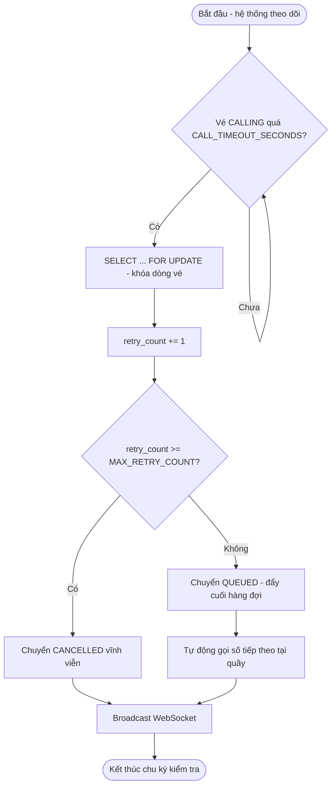
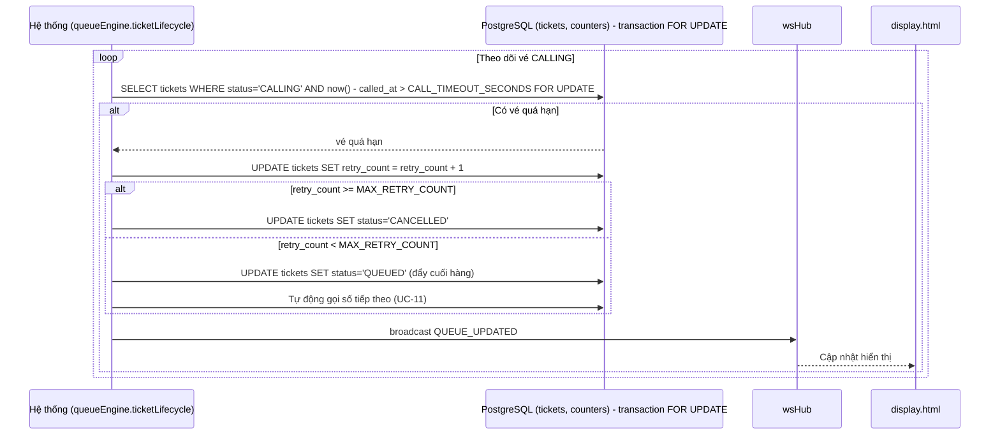
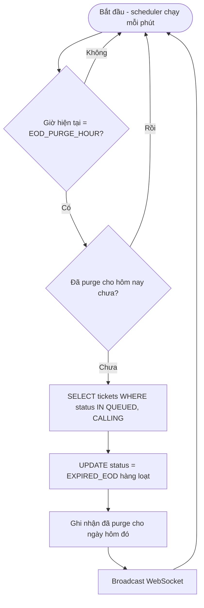
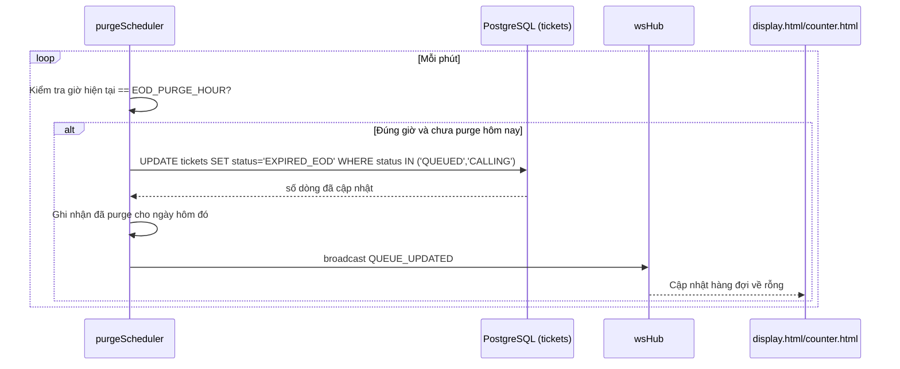
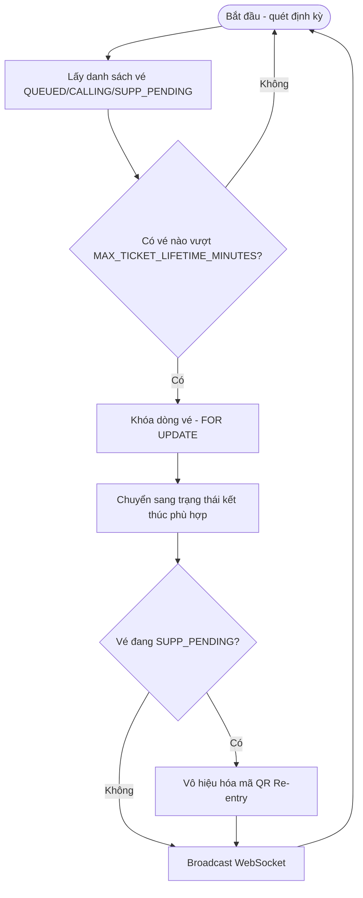
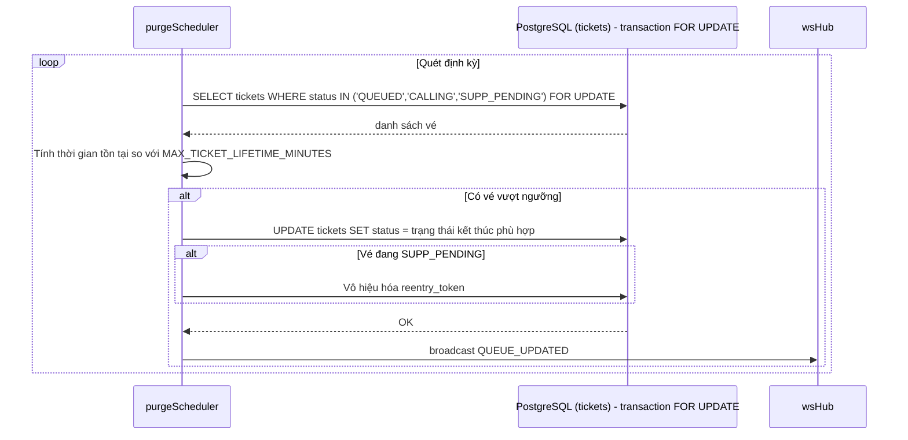

# Module 12 — Tiến trình nền Tự động (Hệ thống)

Nguồn: `src/services/queueEngine/ticketLifecycle.js`, `src/services/purgeScheduler.js`.
Actor duy nhất: **Hệ thống** — các UC trong module này không do người dùng kích hoạt
trực tiếp mà chạy tự động theo lịch/điều kiện đã cấu hình (UC-32).

---

## UC-45 — Tự động chuyển vé về cuối hàng khi vắng mặt (No-show 3-Strike + Dynamic Shift)

**Mô tả:** Khi 1 vé được gọi (`CALLING`) nhưng công dân không xuất hiện trong vòng
`CALL_TIMEOUT_SECONDS` (mặc định 45 giây), hệ thống tự động coi là vắng mặt: tăng
`retry_count`, nếu chưa đạt `MAX_RETRY_COUNT` (mặc định 3) thì đẩy vé về cuối hàng đợi
và tự động gọi số tiếp theo; nếu đã đủ 3 lần thì hủy vé vĩnh viễn (3-Strike Drop). Đây
là phiên bản tự động của UC-13 (No-show thủ công).

**Actor:** Hệ thống.

**Priority:** Cao (đảm bảo hàng đợi không bị "kẹt cứng" bởi công dân vắng mặt).

**Trigger:** Tự động, khi đồng hồ đếm ngược 45 giây (khởi động từ UC-11) hết hạn mà vé vẫn ở trạng thái `CALLING`.

**Precondition:** Vé đang ở trạng thái `CALLING` và đã quá `CALL_TIMEOUT_SECONDS` kể từ lúc được gọi mà Officer chưa bấm "Xác nhận tiếp" (UC-12) hoặc "Vắng mặt" (UC-13).

**Validate on form:** Không có input người dùng; điều kiện kích hoạt hoàn toàn dựa trên thời gian và trạng thái vé trong DB.

**Post-condition:**
- *`retry_count` sau khi +1 vẫn `< MAX_RETRY_COUNT`:* vé chuyển `CALLING → QUEUED`, đẩy về cuối hàng đợi của quầy; quầy tự động gọi số tiếp theo (lặp lại UC-11 mà không cần Officer bấm).
- *`retry_count` đạt `MAX_RETRY_COUNT`:* vé chuyển `CALLING → CANCELLED` vĩnh viễn.
- Toàn bộ thao tác chạy trong 1 transaction Postgres dùng `SELECT ... FOR UPDATE` để tránh race condition khi nhiều tiến trình cùng xử lý 1 vé.

**Basic flow:**
1. Hệ thống định kỳ (hoặc qua cơ chế hẹn giờ theo từng vé) kiểm tra các vé `CALLING` đã quá `CALL_TIMEOUT_SECONDS`.
2. Với mỗi vé quá hạn, khóa dòng bằng `SELECT ... FOR UPDATE` trong 1 transaction.
3. Tăng `retry_count += 1`.
4. Nếu `retry_count < MAX_RETRY_COUNT` → chuyển vé về `QUEUED`, đẩy xuống cuối hàng đợi.
5. Tự động gọi số tiếp theo tại quầy đó (nếu còn vé chờ) — lặp lại logic UC-11.
6. Broadcast WebSocket cập nhật Display/counter.html.

**Alternative flow:**
- **4a.** `retry_count` đạt `MAX_RETRY_COUNT` → chuyển vé sang `CANCELLED` vĩnh viễn thay vì quay lại `QUEUED`; công dân muốn tiếp tục phải lấy số mới (UC-05) hoặc chờ Admin khôi phục thủ công (UC-31) nếu xác định đây là trường hợp đặc biệt.
- **1a.** Officer bấm "Xác nhận tiếp" (UC-12) hoặc "Vắng mặt" thủ công (UC-13) trước khi hết 45 giây → UC-45 không được kích hoạt cho vé đó.

**Biểu đồ hoạt động:**

**Biểu đồ tuần tự:**

---

## UC-46 — Purge cuối ngày (End-of-Day Batch Purge)

**Mô tả:** Vào đúng giờ cấu hình (`EOD_PURGE_HOUR`, mặc định 17h), hệ thống tự động
chuyển toàn bộ vé còn `QUEUED`/`CALLING` sang trạng thái `EXPIRED_EOD` và đóng phiên làm
việc trong ngày — tránh vé "mồ côi" tồn đọng sang ngày hôm sau.

**Actor:** Hệ thống.

**Priority:** Trung bình (vệ sinh dữ liệu cuối ngày, không ảnh hưởng trải nghiệm realtime trong giờ hành chính).

**Trigger:** Tự động, `purgeScheduler` kiểm tra mỗi phút, kích hoạt khi giờ hiện tại khớp `EOD_PURGE_HOUR`.

**Precondition:** Đang trong khung giờ kích hoạt (kiểm tra mỗi phút để không bỏ lỡ nếu server vừa khởi động lại đúng lúc).

**Validate on form:** Không có input; hoàn toàn tự động theo tham số `EOD_PURGE_HOUR` (cấu hình qua UC-32).

**Post-condition:**
- Toàn bộ vé đang `QUEUED` hoặc `CALLING` tại thời điểm chạy được chuyển sang `EXPIRED_EOD`.
- Đóng phiên làm việc trong ngày (tùy triển khai: có thể kèm reset trạng thái quầy về `CLOSED` hoặc giữ nguyên cho ca sau, xem `purgeScheduler.js`).
- Không ảnh hưởng vé đã `COMPLETED`/`CANCELLED` từ trước.

**Basic flow:**
1. `purgeScheduler` chạy kiểm tra mỗi phút (thường qua `setInterval`).
2. Khi giờ hiện tại khớp `EOD_PURGE_HOUR` (và chưa chạy purge cho ngày hôm đó).
3. Truy vấn toàn bộ vé có `status IN ('QUEUED','CALLING')`.
4. Cập nhật hàng loạt `status = 'EXPIRED_EOD'`.
5. Ghi nhận đã purge cho ngày hôm đó (tránh chạy lặp nhiều lần trong cùng khung giờ).
6. Broadcast WebSocket cập nhật Display/counter.html (hàng đợi về trạng thái rỗng).

**Alternative flow:**
- **2a.** Server khởi động lại đúng lúc gần giờ purge (VD do free-tier Render "ngủ" rồi thức dậy) → cơ chế kiểm tra mỗi phút đảm bảo không bỏ lỡ khung giờ.
- **3a.** Không có vé nào ở trạng thái `QUEUED`/`CALLING` tại thời điểm chạy → purge không có tác dụng thực tế, vẫn ghi nhận đã chạy cho ngày đó.

**Biểu đồ hoạt động:**

**Biểu đồ tuần tự:**

---

## UC-47 — Dọn vé quá hạn tối đa (Max Ticket Lifetime Sweep)

**Mô tả:** Quét định kỳ để phát hiện các vé bị "kẹt" quá lâu ở trạng thái vắng mặt/chờ
bổ sung (VD `SUPP_PENDING` mà công dân không bao giờ quay lại quét mã Re-entry — UC-09),
tự động dọn dẹp sau `MAX_TICKET_LIFETIME_MINUTES` (mặc định 120 phút) để tránh dữ liệu
"mồ côi" tồn đọng.

**Actor:** Hệ thống.

**Priority:** Thấp (vệ sinh dữ liệu, không ảnh hưởng trực tiếp trải nghiệm realtime).

**Trigger:** Tự động, `purgeScheduler` (hoặc tiến trình quét riêng trong `queueEngine`) chạy định kỳ.

**Precondition:** Tồn tại vé có thời gian tồn tại (kể từ `created_at` hoặc thời điểm chuyển sang trạng thái chờ) vượt quá `MAX_TICKET_LIFETIME_MINUTES`.

**Validate on form:** Không có input; tham số `MAX_TICKET_LIFETIME_MINUTES` cấu hình qua UC-32.

**Post-condition:** Vé quá hạn được chuyển sang trạng thái kết thúc phù hợp (VD `EXPIRED_EOD` hoặc `CANCELLED`, tùy trạng thái nguồn — xem `purgeScheduler.js` để biết ánh xạ chính xác); giải phóng tài nguyên liên quan (mã QR Re-entry không còn hiệu lực).

**Basic flow:**
1. `purgeScheduler` quét định kỳ các vé chưa kết thúc (`QUEUED`, `CALLING`, `SUPP_PENDING`).
2. Tính thời gian tồn tại của từng vé so với `MAX_TICKET_LIFETIME_MINUTES`.
3. Với vé vượt ngưỡng, chuyển sang trạng thái kết thúc tương ứng.
4. Vô hiệu hóa mã QR Re-entry liên quan (nếu vé đang ở `SUPP_PENDING`).
5. Broadcast WebSocket cập nhật hàng đợi (nếu vé đó vẫn hiển thị ở đâu đó).

**Alternative flow:**
- **3a.** Không có vé nào vượt ngưỡng tại thời điểm quét → không có thay đổi.
- **1a.** Công dân quét mã Re-entry (UC-09) đúng lúc vé sắp bị quét dọn → cần đảm bảo tính nhất quán (transaction `FOR UPDATE`) để tránh xung đột giữa 2 tiến trình xử lý cùng 1 vé.

**Biểu đồ hoạt động:**

**Biểu đồ tuần tự:**

